----
## Questão 1

# Texto 1

"Afinal, depois de ver todas as coisas daquele museu, acabei me perguntando se os brancos ja não teriam começado a adquirir tambem tantas de nossas coisas só porque nos, Yanomami, já estamos começando tambem a desaparecer. Por que ficam nos pedindo nossos cestos, nossos arcos e nossos adornos de penas, enquanto gapimpeiros e fazendeiros invadem nossa terra?"

KOPENAWA, Davi; ALBERT, Bruce. Queda do céu: palavras de um xamã yanomami. São Paulo: Companhia das Letras, 2015. p.429.

# Texto 2

"Em seu trabalho, Gliceria debruga- se sobre a artesania do manto tupinambá, símbolo das tradícões ancestrais de seu povo. A artista chama de cosmo- técnica a feitura do manto, e hoje busca compreender qual era sua função cultural e social em sua comunidade. Recentemente, a artista esteve na Europa e encontrou mantos datados do século XVII, que foram levados do Brasil ao longo da colonização, na Dinamarca. Segundo Gliceria, 'hoje, as pessoas entendem o manto como arte, arte contemporânea, mas eu vejo muito além. É um ancestral nosso'."

Instituto Pipa. Ocupação dos artistas premiados do Pipa 2023: Gliceria Tupinambá. Disponível em: https://www.premiopipa.com/2023/10/ (Adaptado).

A reflexão de Davi Kopenawa sobre a apropriação de objetos indígenas por museus e a pesquisa de Gliceria Tupinambá sobre o manto tupinambá em contextos europeus permitem explorar diversas dimensões da arte indígena.

  
Gliceria Tupinambá, Assojaba Tupinambá, 2021. Disponível em: https://dasartes.com.br/de-arte-a-z/.

Com base nos textos e na imagem, assimale a alternativa que relaciona corretamente as reflexões apresentadas à importância da arte e dos artefatos culturais na discussão sobre questiones indígenas no Brasil.

(A) A arte indígena, ao ser exposta em museus europeus, perde seu significado original e se transforma apenas em objeto de decoração, desvinculando-se completamente de suas raízes culturais e simbólicas, de acordo com David Kopenawa. 
(B) Gliceria Tupinambá, ao retomar elementos tradicionais em suas obras, busca uma representação autôntica que resiste à domesticação cultural imposta pelos colonizadores, valorizando o aspecto utilizado desses objetos. 
(C) O trabalho de Gliceria Tupinambá, ao redescorrir os mantos tupinambá na Europa, revela como a arte indígena pode servir como uma ponte para o entendimento e a valorização das culturas indígenas por sociedades que historicamente as marginalizaram. 
(D) Para David Kopenawa, a guarda de artefatos indígenas em museus da Europa é uma forma eficaz de preservação e valorização da cultura indígena, pois demonstrar reconhecimento da sua importância e esforço, por parte da sociedade, para proteger os direitos territoriais desses povos. 
(E) A arte, como mostrado por Gliceria Tupinambá, atua como um meio de resistência cultural, em que elementos tradicionais são recontextualizados para contentar narrativas coloniais e reafirmar identidades indígenas em face de processos de desapropriação e desaparecimento.
----
## Questão 2

Analise, na figura a seguir, os dados referentes a áreas de garimpo ilegal localizadas em terras indigenas na Amazônia brasileira e sua distância em relação o corpos d'água.

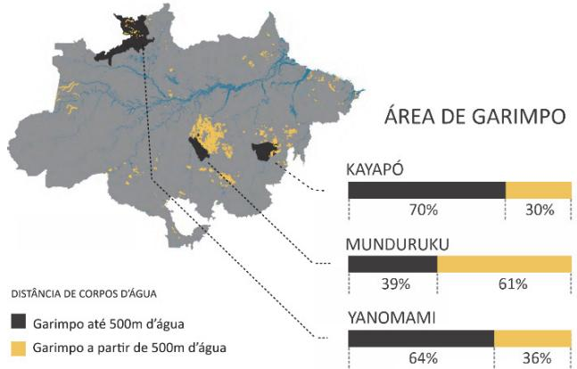  
MapBiomas. 2024. Proximidade de Garimpos, Rios e Lagos na Amazônia (Adaptado).

A partir dos dados apresentados e da realidade socioambiental da Amazônia, é correto afirmar:

(A) Os territorios indigenas encontram-se nas áreas mais desmatadas da Amazônia; como o garimpo ilegal produz forte impacto ambiental pelo intenso uso da água em seus processos, tal atividade colabora com a desertificação do bioma. 
(B) O garimpo ilegal representa alto risco a populaçãoes humanas e animais em geral, pela colataminação das águas e dos alimentos por substâncias usadas na garimpagem e porque tal atividade ocorre em áreas ainda muito preservadas, aumentando o impacto ambiental. 
(C) O garimpo ilegal na Amazônia não produz tanto impacto para os corpos d'água, uma vez que as atividades encontram-se distantes do rio Amazonas e de seus afluentes, os maiores rios da região; seu maior impacto ocorre devido ao desmatamento de extensas áreas de floresta nativa. 
(D) A proximidade dos corpos d'água deve-se a questiones estrategicas, e não ao garimpo ilegal propriamente, pois este é de baixo impacto; porém tra: conflitos territoriais com as comunidades indigenas, e os rios constituem rotas de fuga rápidas e eficientes para os garimpeiros. 
(E) A relação entre garimpos e corpos d'água ocorre de forma indireta, pois o garimpo amazônico não depende da água em seus processos; os garimpeiros buscamos esses territorios porque as populaçãoes indigenas sabem onde existeouro e se desenvolvem proximas a rios e lagos.
----
## Questão 3

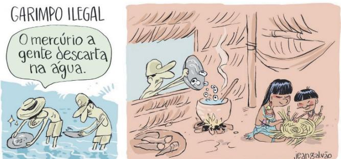  
Jean Galvão. Disponível em https://cartum.folha.uol.com.br/.

Considerando a charge, é correto afirmar:

(A) Há uma incoerência entre a imagem do segundo quadro e o enunciado verbal do primeiro quadro, uma vez que a posposição do adjunto adverbial "na água" anula qualquer ambiguidade. 
(B) Ao antecipar o objeto direto "o mercúrio" para o começo da oração, o chargista chama a atenção para esse elemento, estimulando o leitor a buscá-lo visualmente no segundo quadro. 
(C) Por meio da escolha do verbo "descartar", mostra-se, de forma crítica, a necessidade da criação de um local correto para o depósito dos rejelitos provenientes do garimpo ilegal. 
(D) O uso da forma pronominal informal "a gente", em detrimento do pronome "nós", empregado em situação mais formais e sérias, atenua o teor crítico, o que colabora para gerar efeito humorístico. 
(E) O significado negativo do prefixo que aparece na palavra "ilegal" reforça a precariedade do atendimento à saúde nas comunidades indigenas.
----
## Questão 4

"E assim como o branco e os mamelucos se aproveitaram não raro das veredas dos índios, há motivo para pensar que estes, por sua vez, foram, em muitos casos, simples sucessores dos animais selvagens, do tapir especialmente, cujos carreiros ao longo dos rios e riachos, ou em direção a nascentes de águas, se adaptavam perfeitamente às necessidades e hábitos daquelas populaçãoes."

HOLANDA, Sergio Buauque de. Caminhos e fronteiras. Rio de Janeiro: José Olympio, 1975. p.35.

De acordo com o excerto, a ocupação territorial da América portuguesa pelos colonizadores foi inicialmente marcada

(A) pela construção de caminhos que os afastassem dos cursos dos rios. 
(B) pela desconsideração das rotas de deslocamento abertas pelos animais. 
(C) pela utilização de picadas abertas pelas comunidades indigenas. 
(D) pelo emprego de tropas de muares, responsáveis por abrir trilhas nas matas. 
(E) pela exploração do transporte fluvial e marítimo por meio de pirogas.
----
## Questão 5

Os quadrinhos a seguir sao parte da obra Dois irmas, de Fabio Moon e Gabriel Ba (2015), uma adaptação do romance Dois irmas, de Milton Hatoum, para o universo das novelas graficas (graphic novels).

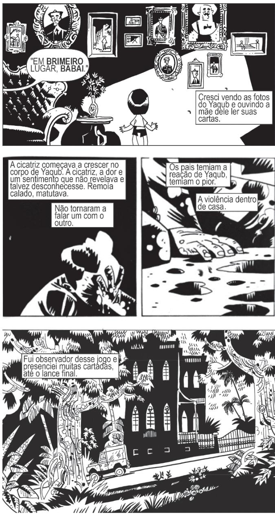

Considerando as características visuais dos quadrinhos e os tragos narrativos do romance Dois irmas, de Milton Hatoum, e correto afirmar:

(A) O uso dos contrastes claro x escuro na novela grafica confere enfase visual ao conflito entre diferentes formas de privilégio e marginalização presentes no romance de Hatoum, explicitadas pelo ponto de vista do narrador. 
(B) Ao trabalho com os contrastes claro x escuro em suas imagens, a novela grafica enfatiza a diferenca etnica e social que fundamenta a rivalidade fatalerna entre Yaqub e Omar, um dos eixos estruturais do romance. 
(C) Ao utilizar procedimentos como a aproximação (zoom-in) e a fragmentação das imagens, a novela grafica recria o fluxo de consciência e a atmosfera orírica da narrativa de Hatoum. 
(D) A novela grafica demonstra, por meio de imagens, que o romance Dois irmas reinventa a tradição da literatura

regionalista do Brasil, retratando a opulência da cidade de Manaus ao longo do século XX.

(E) Por meio de recursos estéticos como a fragmentação das imagens, a novela grafica recuperara o ponto de vista fraturado do romance de Hatoum, composto por vários narradores ao longo da história.
----
## Questão 6

Leia o texto e analise a charge a seguir.

"Se, compreendendo um outro ser humano, penetro profundamente no horizonte do que lhe é próprio, então logo meepararei com o fato de que, assim como o seu corpo se encontra no meu campo de percepção, também o meu corpo se encontra no dele, e que, em geral, ele me experiencia sem mais como um outro para ele, tal como eu o experiencio como outro para mim."

HUSERL, E. Meditações cartesianas. Rio de Janeiro: Forense Universitária, 2013.

Bira Dantas. Disponível em https://facebook.com/.

O filósofo Edmund Husserl propõe uma reflexão sobre como cada pessoa estabelece relações com as outras. Ocorre uma equiparação dos pontos de vista, de modo que cada uma aparecerá às demais não como uma consciência incomparável, mas justamente como uma outra pessoa. Essa ideia ajuda a entender a perspectiva crítica contraína charge: certas condições ou características que percebemos como depreciativas em outras pessoas também podem ser percebidas da mesma水面ira pelos outros em nós.

Qual situação reproduz essa estrutura de equiparação exibida na charge?

(A) Torcedores de diversos times de futebol se reúnem desanimados para assistir a um jogo da seleção. 
(B) Religiosos conservadores sugerem banir livros eróticos doados por desconhecidos para a sua comunidade. 
(C) Com medo da violência, um homem passa a andar armado na rua e assusta os transeuntes. 
(D) Um homem acusa uma mulher de racismo e algumas testemunhas confirmam a versão dele para a polícia. 
(E) Um trabalhador denuncia ao chefe um colega por assédio moral, mas esse último não é punido.
----
## Questão 7

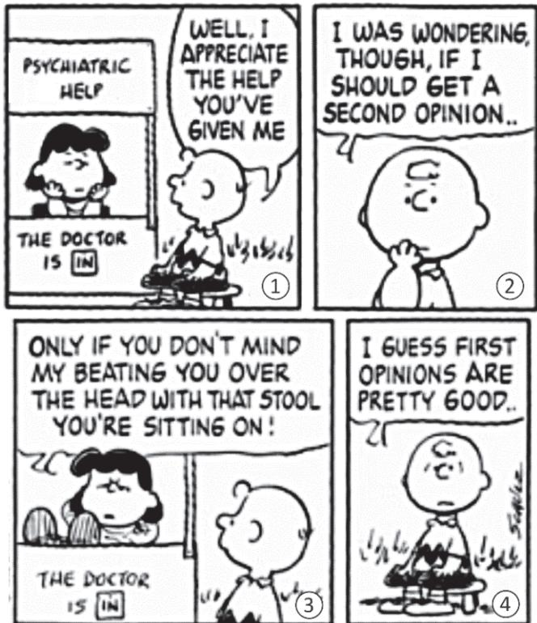  
Disponível em https://screenrant.com/funniest-peanuts-comics-charlie-brown-vs-lucy/.

Falacias sao argumentos que podem até parecer a primeira vista bem construidos logicamente, mas sao falhos, seja em termos do uso da linguagem, de pertinência temática ou de correção formal. Os primeiros estudos sistemáticos das falacias foram feitos pelo filósofo Aristoteles, que classificou alguns dos argumentos falacios mais comuns.

No terceiro quadrinho da história, uma personagem se serve de um argumento falacioso bastante conhecido a fim de persuadir o outro. Esse argumento pode ser classificado como um caso de qual tipo de falacia?

(A) Ataque à pessoa. 
(B) Apelo à piedade. 
(C) Apelo à fora. 
(D) Ambiguidade. 
(E) Apelo à ignorância.
----
## Questão 8

"Eu não venera a criação mais do que o Criador, mas venera criatura criada como eu sou, adotando a criação de maneira livre e espontânea, de modo que Ele possa elevar nossa natureza e nos tornar participes de Sua natureza divina. Sendo assim, eu me atrevo a fazer uma imagem do Deus invisível não como invisível, mas como tendo se tornado visível por nossa causa, tornando-se carne e sangue. Eu não fago uma imagem da divindade imortal. Eu pinto a carne visível de Deus, pois é impossível representar o espírito e ainda mais Deus, que dá vida ao espírito."

John Damascene. On holy images. Disponível em https://www.gutenberg.org/files/49917/ (Adaptado).

Nessa citação, João Damasceno (675- 749), monge e teólogo cristão do período medieval, dirige- se contra o movimento iconoclasta ao

(A) colocar a criatura no mesmo nível do Criador. 
(B) reduzir a divindade a seus elementos materiais. 
(C) identificar a imagem visível com a natureza divina. 
(D) negar o dogma da divindade de Jesus Cristo. 
(E) justificar a veneração de imagens sagradas.
----
## Questão 9

"A média digital é uma média da presença. A sua temporalidade é o presente imediato. A comunicação digital se caracteriza pelo fato de que informações são produzidas, enviadas e recebidas sem mediação por meio de intermediários. Mediação e representação são interpretadas como não transparência e ineficiência, como congestionamento de tempo e de informação.

Uma média electronica de massa clássica como o rádio só permite uma comunicação unilateral. O destinatário da mensagem é condensado à passividade.

Hoje não somos mais destinatários e consumidores passivos de informação, mas sim remetentes e produtores ativos. Não nos contentamos mais em consumir informações passivamente, mas sim queremos produzi- las e comunicá- las ativamente nos mesmos. Somos simultaneamente consumidores e produtores."

HAN, Byung- Chul. No enxame: Perspectivas do digital. São Paulo: Editora Vozes, 2018. p.35- 36 (Adaptado).

Segundo o texto, a média digital distingue- se da média de massa tradicional por

(A) reforçar a separação entre consumidor e produtor, resultante da ampliação da comunicação unilateral na internet. 
(B) apostar na passividade do público, que precisa de um mediador para poder comuncar informações ativamente. 
(C) gerar excesso de informação, que consolida estrutura capaz de condentar todos os consumidores à passividade. 
(D) provocar presentificação, decorrente da dissolução dos intermediários e da combinação dos papéis de consumidor e produtor. 
(E) dissolver a distingção entre produtor e consumidor, causadora de congestionamento de tempo e de informação.
----
## Questão 10

"O que torna possivel o surgimento de uma 'cultura do cancelamento' é um cenário em que os detentores de poder econômico e/ou politico vislumbram a utilização de valores morais como valores de mercado, seja no campo da publicidade, seja no campo da responsabilidade social da empresa.

O conjunto de valores defendidos pelos movimentos sociais que lutam por reconhecimento e respeito à diversidade tornam- se atributos exigidos por dvversas empresas como elemento fundamental nas suas escolhas de investimento.

Sendo assim, a sangão especifica realizada pelos agentes do 'cancelamento' procura atingir não a liberdade do sujeito que supostamente ofende valores morais redevantes, que seria o instrumento coercitivo tradicionalmente previsto no direito penal, ou mesmo buscar reparações indenizatorias, instrumento de resposta a atos ilicios no direito civil, mas sim impedir, restringir ou inflagir danos na trajetória econômica e/ou profissional do sujeito 'cancelado'.

Nesse contexto, a 'cultura do cancelamento' representa um mecanismo de eliminação do mercado, em casos considerados graves, ou, em outros casos, de mera diminuição relativa do capital, de sujeitos ineficientes em fator competitivo específico, como inadequação de valores morais ostentados, por atos e/ou palavras, em determinados ambientes sociais."

MARTINS, Tamires de Assis Lima; CORDEILIO, Ana Paula. A cultura do cancelamento: contribuições de um olhar socialista. Extraprensa, v.15, n. esp., p.39, mai.2022 (Adaptado).

Segundo o texto, a cultura do "cancelamento"

(A) busca punir transgressões a valores morais caros aos canceladores com danos à vida econômica do cancelado. 
(B) aplica os instrumentos coercitivos do direito penal ao contexto da internet para impedir o crescimento profissional do cancelado. 
(C) é uma resposta natural à emergência de movimentos sociais que lutam por respeito à diversidade e por mais poder econômico. 
(D) elimina profissionais do mercado com o objetivo de desmoralizar as empresas contratantes, causando-lhes prejuízos. 
(E) visa a aumentar a competição entre as empresas, que se valem do cancelamento para eliminar valores morais que consideram irresponsáveis.
----
## Questão 11

"O que torna possivel o surgimento de uma 'cultura do cancelamento' é um cenário em que os detentores de poder econômico e/ou politico vislumbram a utilização de valores morais como valores de mercado, seja no campo da publicidade, seja no campo da responsabilidade social da empresa.

O conjunto de valores defendidos pelos movimentos sociais que lutam por reconhecimento e respeito à diversidade tornam- se atributos exigidos por dvversas empresas como elemento fundamental nas suas escolhas de investimento.

Sendo assim, a sangão especifica realizada pelos agentes do 'cancelamento' procura atingir não a liberdade do sujeito que supostamente ofende valores morais redevantes, que seria o instrumento coercitivo tradicionalmente previsto no direito penal, ou mesmo buscar reparações indenizatorias, instrumento de resposta a atos ilicios no direito civil, mas sim impedir, restringir ou inflagir danos na trajetória econômica e/ou profissional do sujeito 'cancelado'.

Nesse contexto, a 'cultura do cancelamento' representa um mecanismo de eliminação do mercado, em casos considerados graves, ou, em outros casos, de mera diminuição relativa do capital, de sujeitos ineficientes em fator competitivo específico, como inadequação de valores morais ostentados, por atos e/ou palavras, em determinados ambientes sociais."

MARTINS, Tamires de Assis Lima; CORDEILIO, Ana Paula. A cultura do cancelamento: contribuições de um olhar socialista. Extraprensa, v.15, n. esp., p.39, mai.2022 (Adaptado).

Em relação aos conectivos sublinhados no texto, é correto afirmar:

(A) seja...seja evidencia a dúvida das autoras quanto aos campos afetados pelo cancelamento. 
(B) que é utilizado para intensificar o valor dos movimentos sociais na luta pela diversidade. 
(C) sendo assim indica adesão autoral diante das formas de sangão aplicadas pelos agentes do cancelamento. 
(D) mas sim ressalta a diferença entre como se pune na cultura do cancelamento e no direito penal. 
(E) como introduz uma comparação entre distintas ações passíveis de gerar cancelamento.
----
## Questão 12

# Texto 1

"Em Big Tech: a ascesção dos dados e a morte da política, Morozov estabelece 'um paralelo com os setores extrativistas de recursos naturais, como o petróleo', colocando 'no centro da discussão o modo de produção dessa economia, que ele chama de 'extrativismo de dados'. Apesar de a frase 'os dados são o novo petróleo' ser um chavão fraco em termos conceituais, Morozov理事长 o modismo útil para debatermos a matriz extrativista desde modo de produção, em especial a forma como as grandes empresas de tecnologia 'continuam escavando a nossa píque tal como as empresas de petróleo escavam o solo'."

ZANATTA, Rafael. "Extrativismo Digital". Quatro Cinco Um, 01/04/2019. Disponível em: https://quatrocincoum.com.br/resenhas/ (Adaptado).

# Texto 2

"Colonialismo de dados é um modo de configurar o mundo inteiro, de tal forma que um recurso novo possa ser extraído - e esse recurso é a vida humana a partir da qual se pode extrair um valor econômico. Sustentamos que os modos nos quais este novo colonialismo opera, as escalas nas quais opera diferem do colonialismo histórico que tão bem entendemos. Mas a função, a finálidade subjacente, o núcleo deste novo colonialismo é exatamente o mesmo do colonialismo histórico. É o de despessoúir, apropriar- se dos recursos do mundo para o bem de uns poucos, de uma parte do mundo."

COULDRY, Nick. Colonialismo de Dados e Esvazamento da Vida Social Antes e Pós Pandemia de Covid- 19. In: Homo Digitalis. A Escalada da Argentina:Revisão da Viña em Tempo de Revolucion. Anais de VIII Simpócia Internacional Instituto Humanitas Unisinos (Adaptado).

Considerando os excelertos apresentados, é corroto afirmar que extrativismo de dados e colonialismo de dados são conceitos desenvolvedos por Morozov e Couldry para nomear e descrever fenômenos

(A) baseados em mecanismos inéditos de acumulação de dados na história, de ampolo alcance, complementares e centrais para diferenciar a atual fase do modo de produção capitalista. 
(B) essencialmente diferentes, pois, enquanto o extrativismo trata de uma relação das empresas de tecnologia com a psique, o colonialismo trata de uma relação dessas empresas com a vida humana. 
(C) cuja logica de apropriação é diferente daquela verificada em relação ao petróleo, o que explicará os limites da comparação entre os dados produzidos por usuários da internet e o petróleo. 
(D) correspondentes a duas formas análogas de apreender transformações do capitalismo contemporâneo, referindo-se a práticas que surgiram no passado, colonização e extrativismo, e com os quais compartilham finalidades. 
(E) que abrem possibilidades para que alguns países desprovidos de recursos naturais valiosos se apropriem de dados produzidos por usuários, sem autorização prévia destes, para extrair lucros.
----
## Questão 13

As formas de colonização ibérica e inglesa na América foram, durante muito tempo, consideradas processos isolados, estruturados em dois modelos opositos: as colónias de exploração e as de povoamento, respectivamente. No entanto, elas constituiram um emaranhado de experiências compartilhadas pelos impérios atlânticos. Os aspectos comuns a essas formas de colonização foram a

(A) partida dos colonizadores da metrópole, da qual saíram por fatores religiosos, e a adoção do trabalho livre como base da produção. 
(B) dominação e a exploração dos povos originários e o emprego sistemático do trabalho forçado dessas populações. 
(C) introdução de colonos sem interesse na ocupação demográfica e o objetivo exclusivo da extração de riquezas minerais. 
(D) produção local organizada em pequenas propriedades e a utilização primordial da força de trabalho familiar. 
(E) falta de interesse metropolitano pela exploração comercial e a inexistência de benefícios financeiros para a metrópole.
----
## Questão 14

"Brasileiros! (...) está conhecida nossa fusão ou engano em adotarmos um sistema de governo defeituoso em sua origem, e mais defeituoso em suas partes componentes. As constituicões, as leis e todas as constituicões humanas são feitas para os povos e não os povos para elas. Eia, pois, brasileiros, tratemos de constituírmos de um modo andólogo às luzes do século em que vivemos; o sistema americano deve ser idêntico; desprezemos constituicões oligárquicas, só cabidas na encanecida Europa."

ANDRADE, Manoel de Carvalho Paes de. Manifesto de proclamação da Confederação do Equador. Apud TORRES, João Camillo de Oliveira. A democracia coroada: Teoria política do Império do Brasil. Petrópolis: Vozes, 1964. p.522 (Adaptado).

O excerto apresenta trecho do manifesto divulgado pelos rebeldes da Confederação do Equador (1824) e reage explicitamente

(A) à dissolução da Assembleia Constituinte e à outorga de uma constituicão elaborada pelo Corseello de Estado. 
(B) ao distanciamento do governo brasileiro em relação à Coroa Portuguesa e à política europeia do período. 
(C) ao caráter decentralizador do regime monárquico e ao aumento da autonomia das provincias. 
(D) ao poder exercido pelos produtores nordestinos de algodão e pelos cafecicultores paulistas. 
(E) à adoção de regime republicano pela Constituição e ao fechamento do parlamento nacional.
----
## Questão 15

"justice, each getting what he or she is due. Formal justice is the impartial and consistent application of principles, whether or not the principles themselves are just. Substantive justice is closely associated with rights, i.e., with what individuals can legitimately demand of one another or what they can legitimately demand of their government (e.g., with respect to the protection of liberty or the promotion of equality).

Retributive justice concerns when and why punishment is justified. Debate continues over whether punishment is justified as retribution for past wrongdoing or because it deters future wrongdoing. Those who stress retribution as the justification for punishment usually believe human beings have libertarian free will, while those who stress deterrence usually accept determinism.

At least since Aristotle, justice has commonly been identified both with obeying law and with treating everyone with fairness. But if law is, and justice is not, entirely a matter of convention, then justice cannot be identified with obeying law."

The Cambridge Dictionary of Philosophy. General Editor Robert Audi, Cambridge, U.K.: C.U.P., 1999. p.456.

Conforme o verbete, a justiça substantiva pode ser definida como a

(A) aplicação imparcial e consistente de princípios éticos e morais. 
(B) promoção de punícões rigorosas para qualquer tipo de crime. 
(C) distribuição de recursos económicos de maneira equitativa, com enrase no coletivo. 
(D) garantia de que todos recebam o que lhes é devido, contemplando direitos individuais. 
(E) proteção exclusiva dos direitos das minorias, aumentando sua visibilidade social.
----
## Questão 16

A construcao de uma rampa que seja acessivel a usuarios de cadeira de rodas deve seguir a norma ABNT NBR 9050. Esse documento regulamenta a inclinacao que a rampa deve ter a depender do desnivel maximo de cada segmento de rampa, conforme o seguinte quadro:

Inclinacao e desnivel maximo de cada segmento de rampa  

<table><tr><td>Desnível h (em m)</td><td>Inclinação i admisível (em %)</td></tr><tr><td>1 &amp;lt; h ≤ 1,5</td><td>5</td></tr><tr><td>0,8 &amp;lt; h ≤ 1</td><td>5 &amp;lt; i ≤ 6,25</td></tr><tr><td>0 &amp;lt; h ≤ 0,8</td><td>6,25 &amp;lt; i ≤ 8,33</td></tr></table>

Acessibilidade a edificacoes, mobilario, espanca e equipamentos urbanos. Disponivel em https://www.prefeitura.sp.gov.br/cidade/ (Adaptado).

A inclinacao i da rampa em porcentagem  $(\%)$  e calculada dividindo a altura  $h$  do desnivel do segmento da rampa, em metros, pelo comprimento da projecao horizontal  $C$ , em metros, e multiplicando o resultado por 100. A figura a seguir mostra uma rampa de dois segmentos.

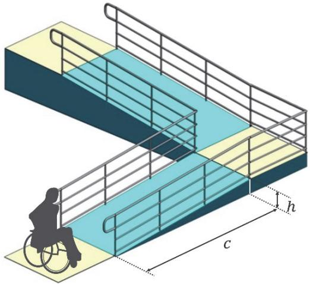

Determinada rampa de dois segmentos foi construida da seguinte maneira:

- o primeiro segmento possui projecao horizontal de  $10 \text{m}$  e inclinação de  $6\%$ ;- o segundo segmento possui projecão horizontal de  $7 \text{m}$  e desnivel de  $0,5 \text{m}$ .

Com base no que foi apresentado sobre a normativa, o que é correto afirmar sobre a adequacao desua rampa a norma de acessibilidade?

(A) A rampa nao esta adequada, pois os dois segmentos nao estao de acordo com a norma. 
(B) A rampa esta adequada, pois os dois segmentos estao de acordo com a norma. 
(C) A rampa nao esta adequada, pois o primeiro segmento nao esta de acordo com a norma. 
(D) A rampa nao esta adequada, pois o segundo segmento nao está de acordo com a norma. 
(E) A rampa esta adequada, pois, apesar de o segundo segmento nao estar de acordo com a norma, o primeiro esta.
----
## Questão 17

A imagem a seguir mostra um cruzamento da Rua da Consolação, na região central da cidade de São Paulo, em que há faixas de pedestre em diferentes direções. Essas faixas agilizam a travessia das ruas. Uma pessoa parte do ponto O e deseja chegar ao ponto C. Para tanto, percorre o trajeto pela faixa que liga O a B e, em seguida, utiliza a faixa que liga B a C. Considere que as codernadas dos pontos indicados na figura, em metros, são: O(0,0), B(13,- 15) e C(29,- 8).

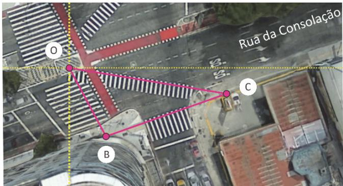

Seja  $d$  a distância, em metros, que essa pessoa deixaria de percorrer se tivesse optado por fazer a travessia pela faixa de pedestre que liga O e C. Nesse contexto, é correto afirmar:

(A)  $d< 2$  
(B)  $2\leq d< 5$  
(C)  $5\leq d\leq 8$  
(D)  $8< d\leq 11$  
(E)  $11< d$
----
## Questão 18

No dia 26 de marco de 2024, a 1h29min, aproximadamente, o navio cargueiro MV Dali colidiu com a ponte Francis Scott Key em Baltimore, EUA. O impacto causou o colapso da ponte, tornando- se um dos maiores acidentes maritimos da historia norte- americana.

A figura a seguir mostra os dados da velocidade do navio em fungao da hora local. A colisao ocorreu no intervalo de 38 segundos, marcado por linhas pontilhadas no grafico.

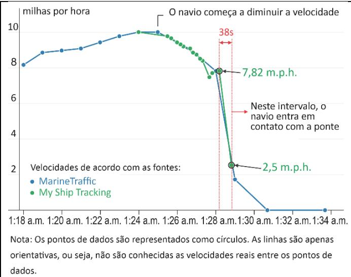

Disponivel em https://www.mynhas.com/ (Adaptado).

Assumindo que a massa do navio no momento do impacto seja de 100 mil toneladas e, tendo por base os dados do grafico, a magnitude da forca media atuando sobre o navio durante a colisao e de, aproximadamente,

(A)  $7\times 10^{-2}$  N. 
(B)  $7\times 10^{0}$  N. 
(C)  $7\times 10^{2}$  N. 
(D)  $7\times 10^{4}$  N. 
(E)  $7\times 10^{6}$  N.

Note e adote:

Considere que a fora atuando sobre o navio durante a colisao seja constante e igual a fora media.

Utilize 1 m.p.h.  $= 0.5m / s$
----
## Questão 19

O efeito Compton, descoberto na decada de 1920, e hoje amplamente utilizado durante tratamentos radioterapicos. O efeito relaciona- se a mudanca no comprimento de onda de fotonos de raios X quando interagem com particulas como eletrons ou protones, conforme ilustrado na figura a seguir.

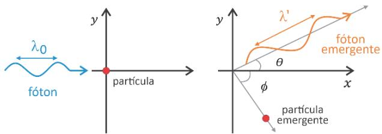

Quando um foton com comprimento de onda  $\lambda_0$  incide sobre uma particula, ele emerge dessa interacao formando um angulo  $\theta$  com sua direcao inicial de movimento, e seu novo comprimento de onda  $\lambda^\prime$  é dado pela relacao

$$
\lambda^{\prime} = \lambda_{0} + \frac{\alpha}{m} (1 - \cos \theta),
$$

em que  $\alpha$  é uma conditante positiva e  $m$  é a massa da particula.

Com base nessas informacoes e em seus conhecimentos sobre a propagação das ondas eletromagnéticas, assinale a alternativa correta.

(A) A maior variacao no comprimento de onda do foton ocorre quando o angulo  $\theta$  e igual a  $90^{\circ}$  
(B) Se o angulo  $\theta$  e igual a  $30^{\circ}$  o foton emergente tem frequencia menor do que a frequencia inicial. 
(C) Quando  $\theta = 0$  a velocidade do foton emergente é menor do que a do foton incidente, devido à conservacao da quantidade de movimento. 
(D) Se o angulo  $\theta$  e igual a  $60^{\circ}$  a variacao no comprimento de onda do foton é menor se a particula for um eletron do que se a particula for um proton. 
(E) Um foton que emergiu perpendicularmente a sua direcao inicial nao sofreu mudanca em sua frequencia.
----
## Questão 20

A figura a seguir apresenta a evolucao dos modelos atomicos, desde o primeiro, proposto por Dalton em 1803, até o de Bohr, proposto em 1913.

Sobre os quatro modelos atomicos apresentados, é correto afirmar:

(A) Todos os modelos previram a presenca de cargas positivas no nucleo atomico. 
(B) O modelo propoito por Thomson, por prever a existencia de neutrons, nao poderia explicar a radiacao alfa (a). 
(C) Diferentemente do modelo de Dalton, o modelo de Rutherford nao explica a estrutura de cations e anions. 
(D) Apenas o modelo de Bohr, com o advento de balanças de precisao, considerou a diferenca de massa entre os elementos. 
(E) Elementos radiativos nao poderiam ser explicados pelo modelo proposto por Dalton.
----
## Questão 21

Baterias ion- litio (ion- Li) armazenam energia por meio de um processo de intercalação ionica, no qual ions  $\mathsf{Li}^{+}$ penetram e se acomodam entre camadas de grafite no ânodo da bateria. A quantidade de energia armazenada é diretamente proportional ao número de ions  $\mathsf{Li}^{+}$ intercalados no ânodo, que, entre outros aspectos, é limitado pelo espaço disponível para a sua alocação. Uma recente inovação tecnológica em baterias é a substituição de Li por Na, formando baterias ion- sódio (ion- Na). O mecanismo de funcionamento se baseia no processo de intercalação, com a vantagem de que o Na é mais abundante do que o Li no planeta.

Considerando que a única diferença entre baterias de mesma massa e volume seja o fon utilizado (Na\* ou  $\mathsf{Li}^{+}$  ) e que a densidade de energia é a quantidade de energia armazenada na bateria por unidade de massa e volume, é correto afirmar que a densidade de energia de uma bateria ion- Na é

(A) maior do que de uma bateria ion-Li, pois o  $\mathsf{Na}^{+}$ tem maior massa e menor raio iônico do que o  $\mathsf{Li}^{+}$ .(B) menor do que de uma bateria ion-Li, pois o  $\mathsf{Na}^{+}$ tem maior massa e maior raio iônico do que o  $\mathsf{Li}^{+}$ .(C) maior do que de uma bateria ion-Li, pois o  $\mathsf{Na}^{+}$ tem menor massa e maior raio iônico do que o  $\mathsf{Li}^{+}$ .(D) menor do que de uma bateria ion-Li, pois o  $\mathsf{Na}^{+}$ tem menor massa e menor raio iônico do que o  $\mathsf{Li}^{+}$ .(E) igual à de uma bateria ion-Li, pois ambos os ions são monovalentes.

# Note e adote:

Distribução eletromica:  $\mathsf{Li} = 1\mathsf{s}^{+}$ ,  $2\mathsf{s}^{+}$ ,  $\mathsf{Na} = 1\mathsf{s}^{+}$ ,  $2\mathsf{s}^{+}$ ,  $2\mathsf{p}^{+}$ ,  $3\mathsf{s}^{+}$ . Massa atômica (u):  $\mathsf{Li} = 7$ ;  $\mathsf{Na} = 23$ .
----
## Questão 22

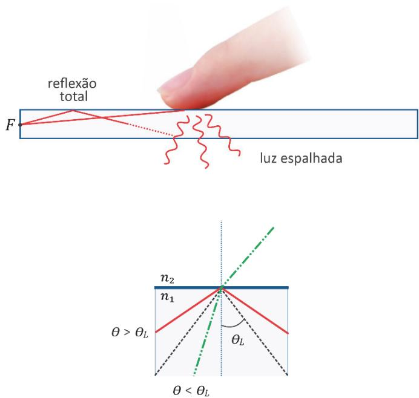

Uma das possíveis tecnologias para a produção de telas sensíveis ao toque aproveita a reflexão interna total da luz. Esse tipo de reflexão ocorre quando um raio luminoso viaja do interior de um meio 1, com índice de refração  $n_{1}$ , em direção a um meio 2, com índice de refração  $n_{2}$ , formando com a direção perpendicular à interface entre os meios um ângulo  $\theta$  maior do que um centro valor limite  $\theta_{\mathrm{L}}$ , tal que sen  $\theta_{\mathrm{L}} = n_{2} / n_{1}$ . Quando um objeto (como um dedo) se aproxima da interface entre os meios, a reflexão total não ocorre, o que é captado por sensores, revelando a posição do objeto. Suponha que se deseje projetar uma tela sensível ao toque que, conforme mostra a figura, funcione com uma fonte luminosa  $F$  fixa na borda. A tabela a seguir indica os índices de refração de alguns materiais candidatos à utilização no meio 1.

<table><tr><td>Material</td><td>Índice de refração n1</td></tr><tr><td>A</td><td>1,0002</td></tr><tr><td>B</td><td>1,0003</td></tr><tr><td>C</td><td>1,1503</td></tr><tr><td>D</td><td>1,3204</td></tr><tr><td>E</td><td>1,4889</td></tr></table>

Tratando o meio 2 sempre como tendo índice de refração  $n_{2} = 1,0003$ , o material que permite o maior intervalo de ângulos de incidência que produzem reflexão total é:

(A) Material A. 
(B) Material B. 
(C) Material C. 
(D) Material D. 
(E) Material E.
----
## Questão 23

Considere o texto a seguir.

  
The Event Horizon Telescope Collaboration.

"Com observacoes feitas pela primeira vez em luz polarizada, a nova imagem do buraco negro que se esconde no coração da Via Láctea revelou um campo magnético com uma estrutura muito semelhante à de outro buraco negro situado no centro da galáxia M87, sugerindo que campos magnéticos intensos podem ser comuns a todos os buracos negros.

A luz é uma onda eletromagnética que nos permite ver objetos. Por vezes, os campos elétrico e magnético associados à onda oscilam em direções preferenciais, definindo o que chamamos de luz polarizada. Apesar de estarmos rodeados por luz polarizada, aos olhos humanos essa luz é indistinguível da luz dita 'normal'. No plasma que rodeia estes buracos negros, as particulas que giram em torno das linhas de campo magnético conferem- lhe um padrão de polarização com orientação na direção perpendicular ao campo magnético do buraco negro, o que permite aos astrônomos ver com muitos detalhes o que se passa nas regiões dos buracos negros e mapear as suas linhas de campo magnético."

"Astrônomos descobrem campos magnéticos em espíral nas bordas de buraco negro da Via Láctea", Jornal da USP 19/03/2024. Disponível em https://jornal.usp.br/ciencias/ (Adaptado).

Com base no texto e em seus conhecimentos, é correto afirmar:

(A) A medida do padrão de polarização da luz mencionada no texto permite somente o mapeamento das linhas de campos magnéticos na direção paralela à direção da polarização. 
(B) O olho humano pode discriminar as diferentes direções da luz polarizada dos buracos negros, mapeando suas linhas de campo. 
(C) Campos magnéticos como os mencionados no texto são criados apenas por cargas elétricas em repouso no plasma que rodeia os buracos negros. 
(D) O plasma é formado por particulas eletricamente carregadas, dado que essas particulas exibem um movimento circular perpendicular à direção do campo magnético. 
(E) O processo de mapeamento das linhas de campo magnético mencionado no texto pode ser realizado por meio da detecção de qualquer tipo de onda eletromagnética gerada em buracos negros.
----
## Questão 24

Na zona sul da cidade de São Paulo, há uma esquina formada pelas ruas Cloreto de Sódio e Relíquia do Oceano.

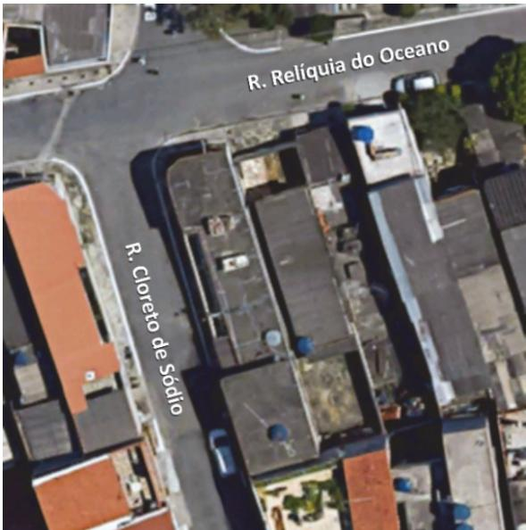

A coincidência do encontro dessas ruas chama a atenção, pois o cloreto de sódio

(A) praticamente não está presente no oceano, apesar de este ser salgado. 
(B) é insolúvel na água do oceano por apresentar ligação iônica. 
(C) utilizado no Brasil é quase todo proveniente do oceano. 
(D) obtido do oceano apresenta ligação covalente, enquanto o extraido do salgema, ligação iónica. 
(E) retirado do oceano tem mais átomos de cloro ligados ao sódio do que o oriundo de outras fontes.
----
## Questão 25
"Historiadores encontraram um mapa antigo onde não era possível identificar a escala do mapa. Com algum esforço e apoio de Geógrafos, foi possível avaliar a distância no mapa entre duas localidades como sendo de 20 centímetros. Buscando elementos na paisagem, foi possível quantificar a distância entre elas como equivalente a 40 quilômetros."

FITZ, Paulo Roberto. Cartografia Básica. São Paulo: Oficina de Textos, 2008 (Adaptado).

Com base nessas medidas, a escala numérica do mapa corresponde a

(A) 1:20.000. 
(B) 1:200.000. 
(C) 1:2.000.000. 
(D) 1:2.200.000. 
(E) 1:20.000.000.
----
## Questão 26
Atualmente  $80\%$  do comércio mundial transita pelos mares, principalmente em rotas que passam pelos Canais do Panamá e de Suez. Com a redução das calotas polares, novas rotas estão surgindo no Ártico. Mesmo com sua fragilidade ambiental, a região passou a ser uma nova fronteira para o comércio mundial.

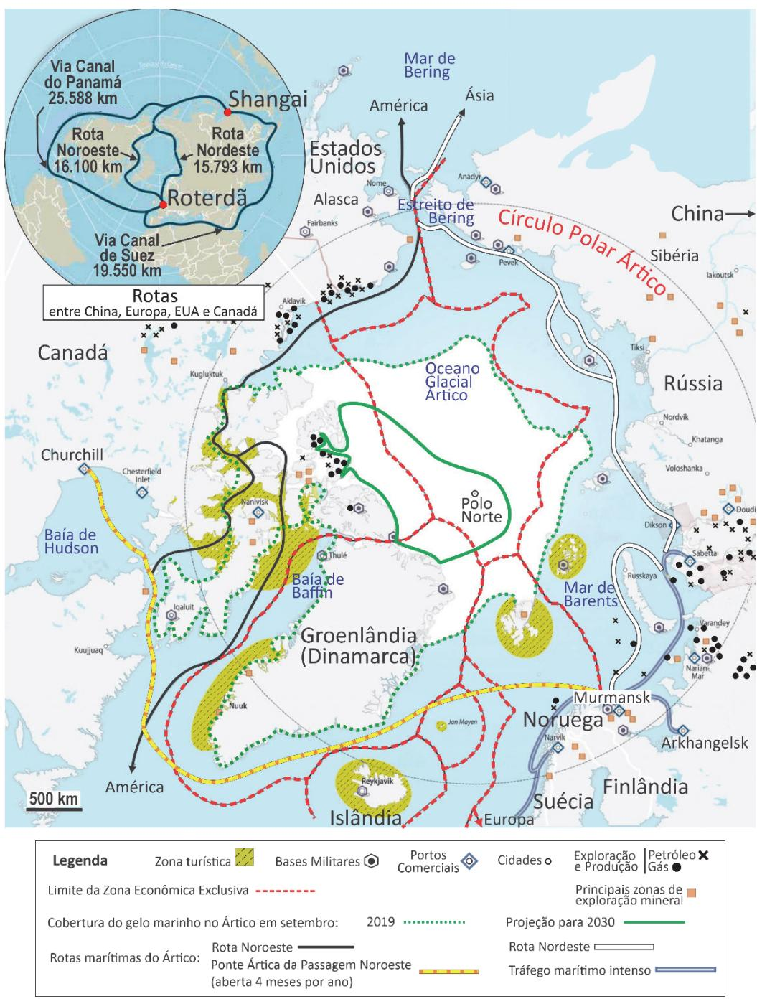  
Carto Le monde en cartes, n.59, maio-junho 2020 (Adaptado).

Com base no texto, na leitura do mapa e em seus conhecimentos sobre as rotas marítimas, assinale a alternativa correta.

(A) A rota que liga os portos de Murmansk a Churchill é vantajosa em razão da facilidade de acesso e de não interferir na Zona Econômica Exclusiva, evitando conflitos territoriais. 
(B) Os percursos advindos das rotas Noroeste e Nordeste possibilitam maior estratégia geopolítica dos países pertencentes à região, que utilizam, para isso, todas as zonas turísticas como sitios para bases militares. 
(C) A rota Nordeste, que liga Roterdã a Shangai, aumenta a distância percorrida pelas rotas marítimas e ainda pode ser ameaçada pela ampliação da cobertura de gelo no futuro. 
(D) A rota Noroeste, que liga Ásia a América, é percurso já consagrado pelo tráfego marítimo intenso, por sua menor distância e por percorrer muitos portos comerciais e bases militares. 
(E) O fluxo comercial possibilitado pelas rotas Noroeste e Nordeste tende a se concentrar no Estreito de Bering, reduzindo a distância a ser percorrida em relação aos trajetos via Canais do Panamá e de Suez.
----
## Questão 27

# Climate change is messing with time

"The melting of polar ice due to global warming is affecting Earth's rotation and could impact on precision timekeeping, according to a recent study.

The planet is not about to jerk to a halt, nor speed up so rapidly that everyone gets flung into space. But timekeeping is an exact science in a highly technological society, which is why global authorities more than half a century ago felt compelled by the slight changes in Earth's rotation to invent the concept of the 'leap second'.

Climate change makes these calculations even more complicated. Soon it may be necessary to insert a 'negative leap second' into the calendar to get the planet's rotation in sync with Coordinated Universal Time.

Timekeeping is based on an astronomical basis. Earth is a type of a clock. In simpler times, the planet would spin one full revolution on its axis, and everyone would call it a day.

But Earth doesn't spin at a perfectly constant speed. Our planet is in a complicated gravitational dance with the moon, the sun, the oceanic tides, Earth's own atmosphere and the motion of the planet's solid inner core.

The planet's fluctuating spin rate is carefully tracked by the International Earth Rotation and Reference Systems Service. In the early 1970s, Earth was clearly slowing down in its rotation, and a gap was forming between atomic time and astronomical time. Thus, was born the 'leap second' to adjust for the fact that the 'day' was getting a bit longer.

The melting of the ice caps in Antarctica and Greenland shifts mass - - meltwater - - toward the equator. That process increases the equatorial bulge of the planet. Meanwhile, at the poles, the land that had been pressed down by ice rises, and Earth becomes more spherical.

According to the study, although the core is causing the planet to spin faster, the planetary shape changes caused by a warming climate are slowing that process. Absent this effect, the overall acceleration of the planet's rotation might require timekeepers to insert a 'negative leap second' at the end of 2026. Because of climate change, that might not be necessary until 2029. "

Disponivel em https://www.washingtonpost.com/science/2024/03/27/ (Adaptado).

Segundo o texto, o processo de derretimento das calotas polares

(A) põe em dúvida a necessidade do conceito de segundo bissexto. 
(B) desloca o fluxo de água para regiões afastadas da linha do Equador. 
(C) deve antecipar em três anos o ajuste dos relógios atômicos. 
(D) ultrapassa o alcance do sistema do Tempo Universal Coordenado. 
(E) tende a reduzir a velocidade de rotação da Terra.
----
## Questão 28

# Climate change is messing with time

"The melting of polar ice due to global warming is affecting Earth's rotation and could impact on precision timekeeping, according to a recent study.

The planet is not about to jerk to a halt, nor speed up so rapidly that everyone gets flung into space. But timekeeping is an exact science in a highly technological society, which is why global authorities more than half a century ago felt compelled by the slight changes in Earth's rotation to invent the concept of the 'leap second'.

Climate change makes these calculations even more complicated. Soon it may be necessary to insert a 'negative leap second' into the calendar to get the planet's rotation in sync with Coordinated Universal Time.

Timekeeping is based on an astronomical basis. Earth is a type of a clock. In simpler times, the planet would spin one full revolution on its axis, and everyone would call it a day.

But Earth doesn't spin at a perfectly constant speed. Our planet is in a complicated gravitational dance with the moon, the sun, the oceanic tides, Earth's own atmosphere and the motion of the planet's solid inner core.

The planet's fluctuating spin rate is carefully tracked by the International Earth Rotation and Reference Systems Service. In the early 1970s, Earth was clearly slowing down in its rotation, and a gap was forming between atomic time and astronomical time. Thus, was born the 'leap second' to adjust for the fact that the 'day' was getting a bit longer.

The melting of the ice caps in Antarctica and Greenland shifts mass - - meltwater - - toward the equator. That process increases the equatorial bulge of the planet. Meanwhile, at the poles, the land that had been pressed down by ice rises, and Earth becomes more spherical.

According to the study, although the core is causing the planet to spin faster, the planetary shape changes caused by a warming climate are slowing that process. Absent this effect, the overall acceleration of the planet's rotation might require timekeepers to insert a 'negative leap second' at the end of 2026. Because of climate change, that might not be necessary until 2029. "

Disponivel em https://www.washingtonpost.com/science/2024/03/27/ (Adaptado).

Conforme o texto, os fenômenos naturais que desempenham papel significativo na complexa interação gravitacional que afeta a rotação da Terra são

(A) terremotos. 
(B) vulcões. 
(C) avalanches. 
(D) marés dos oceanos. 
(E) ciclones.
----
## Questão 29

# Climate change is messing with time

"The melting of polar ice due to global warming is affecting Earth's rotation and could impact on precision timekeeping, according to a recent study.

The planet is not about to jerk to a halt, nor speed up so rapidly that everyone gets flung into space. But timekeeping is an exact science in a highly technological society, which is why global authorities more than half a century ago felt compelled by the slight changes in Earth's rotation to invent the concept of the 'leap second'.

Climate change makes these calculations even more complicated. Soon it may be necessary to insert a 'negative leap second' into the calendar to get the planet's rotation in sync with Coordinated Universal Time.

Timekeeping is based on an astronomical basis. Earth is a type of a clock. In simpler times, the planet would spin one full revolution on its axis, and everyone would call it a day.

But Earth doesn't spin at a perfectly constant speed. Our planet is in a complicated gravitational dance with the moon, the sun, the oceanic tides, Earth's own atmosphere and the motion of the planet's solid inner core.

The planet's fluctuating spin rate is carefully tracked by the International Earth Rotation and Reference Systems Service. In the early 1970s, Earth was clearly slowing down in its rotation, and a gap was forming between atomic time and astronomical time. Thus, was born the 'leap second' to adjust for the fact that the 'day' was getting a bit longer.

The melting of the ice caps in Antarctica and Greenland shifts mass - - meltwater - - toward the equator. That process increases the equatorial bulge of the planet. Meanwhile, at the poles, the land that had been pressed down by ice rises, and Earth becomes more spherical.

According to the study, although the core is causing the planet to spin faster, the planetary shape changes caused by a warming climate are slowing that process. Absent this effect, the overall acceleration of the planet's rotation might require timekeepers to insert a 'negative leap second' at the end of 2026. Because of climate change, that might not be necessary until 2029. "

Disponivel em https://www.washingtonpost.com/science/2024/03/27/ (Adaptado).

Considerando os seres vivos atuais, as informações trazidas pelo texto e os principios da Teoria Sintética da Evolução, é correto afirmar que

(A) as espécies necessariamente se adaptarão às novas mudanças do planeta. 
(B) somente espécies de dias longos, ou seja, aquelas que precisam de mais horas de luz, sobreviverão às mudanças previstas. 
(C) é difícil prever como se dará a evolução das espécies, porque esse é um processo mediado pelo acaso. 
(D) nenhuma espécie sobreviverá às mudanças na Terra e novas espécies surgirão em seu lugar. 
(E) espécies aquáticas terão vantagem adaptativa sobre espécies terrestres, uma vez que todos os continentes submergirão com o derretimento das geleiras.
----
## Questão 30

A imagem a seguir ilustra o aparecimento de uma barreira que promoveu separação de uma população de rinocerontes e consequente redução no tamanho das populações resultantes.

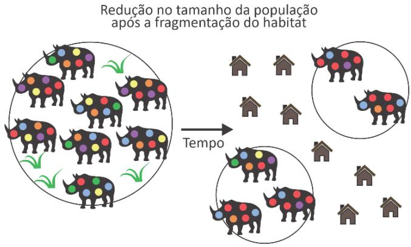

Disponível em https://kids.frontiersin.org/articles/10.3389/ (Adaptado).

É correto afirmar que, nas população fragmentadas, ocorre

(A) maior variabilidade genética. 
(B) maior risco de aparecimento de doenças genéticas recessivas. 
(C) menor frequência de mutações. 
(D) seleção natural dos indivíduos com características genéticas dominantes. 
(E) favorecimento da mistura entre elas.
----
## Questão 31

Alguns corais contem, em sua estrutura, algas fornecedoras de carboidratos que auxiliam no crescimento e na construgao do esqueleto do coral. Os corais, por sua vez, fornecem um ambiente de protecao e importantes nutrientes as algas. As mudangas climaticas globais tem provocado a morte dessas algas e, em muitos casos, a morte dos corais.

Assinale a alternativa que representa a relacao ecologica entre os corais e as algas, assim como o impacto imediato causado pela morte dos corais.

<table><tr><td></td><td>Relacao ecologica</td><td>Impacto imediato</td></tr><tr><td>(A)</td><td>Predacao</td><td>Formacao das mares vermelhas e desoxigenacao das aguas oceaniaicos.</td></tr><tr><td>(B)</td><td>Mutualismo</td><td>Perda de habitat para diversas especies marinas, assim como diminuicao de suas fontes de protecao e ilimento.</td></tr><tr><td>(C)</td><td>Colonia</td><td>Aumento de habitats e nichos ecologicos para especies que passam a viver no local antes ocupado pelos corais.</td></tr><tr><td>(D)</td><td>Competicao</td><td>Invasao biodlogica por especies que ocupam o nicho deixado vago pelos corais.</td></tr><tr><td>(E)</td><td>Comensalismo</td><td>Enriquecimento das aguas oceaniaicos por calcio e nitrogente, favorecendo o desenvolvimento de algas marinas.</td></tr></table>
----
## Questão 32

O fenomeno fisico conhecido como iridescencia ocorre nas asas de certas especies de borboletas e caracteriza- se pela variacao das cores de acordo com o angulo de observacao. A existencia de faixas coloridas na superficie das asas das borboletas ocorre devido a diferentes formas de superposicao entre raios luminosos refletidos por uma fina camada de substancia transparente existente na superficie das asas.

  
Disponivel em https://www.pbs.org/wgbh/.

Os fenomenos fisicos diretamente relacionados com a iridescencia sao

(A) dilatacao e reflexao. 
(B) interferencia e dilatacao. 
(C) dissipacao e difracao. 
(D) conveccao e dispersao. 
(E) reflexao e interferencia.
----
## Questão 33

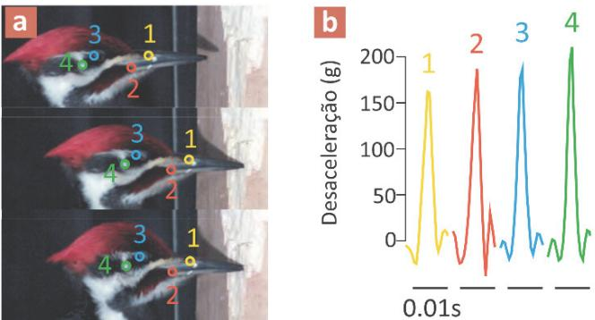  
WASSENBERGH, Sam Van; MIELKE, Maia. Physics Today, vol. 77 (2024) (Adaptado).

Em um estudo relatado no periodico Physics Today, cientistas belgas mostraram que os pica- paus nao dispom de mecanismos de absorcao de choques em seus ossos do cranio, ao contrario do que se acreditava anteriomente. Nos experimentos realizados, verificou- se que o cerebro de um pica- pau pode experimentar desaceleracoes instantaneas de ate  $400g$  ,sendo  $g$  o modulo da aceleracao da gravidade. Suponha que, durante uma batida em um tronco de dvore, o cranio do pica- pau, suposto perfeitamente rigido, sofra uma desaceleracao constante de  $200g$  ao longo de um tempo de 2,0 milissegundos. Qual e a distancia percorrida pelo cranio do pica- pau durante esse tempo, até atingir momentaneamente o repouso?

(A)  $2,0mm$  
(B)  $4,0mm$  
(C)  $8,0mm$  
(D)  $16mm$  
(E)  $32mm$

Note e adote: Aceleracao da gravidade:  $g = 10m / s^2$
----
## Questão 34

"São os ratos!... Vai escutar com atencão, a respiração meio parada. Hão de ser muitos: há vários fontes daquele guinchinho, e de quando em quando, no forro, em vários pontos, o rufar...

A casa está cheia de ratos..."

Dyonélio Machado. Os ratos.

A obra Os ratos (1935), de Dyonélio Machado, narra o dia em que Naziazeno saiu pela cidade de Porto Algarre no intuito de conseguir dinheiro para pagar a conta do lelteiro. Os animais que dão título à narrativa apenas aparecem em seus últimos capitulos e ocupam o tempo reservado para o descanso do protagonista. E possível, então, afirmar:

(A) Naziazeno, inconformado com sua condição de devedor, perambula pela cidade, encontrando refúgio junto aos ratos que o acolhem. 
(B) Os ratos são os credores de Naziazeno zoomorfizados, que se encontram à espreita para a cobrança de outras dividas. 
(C) Os "guinchinhos", que ressoam nos ouvidos de Naziazeno, são o eco de seu dia de perambulação, como se lebrassem os obstáculos que venceu. 
(D) Os ruidos dos roedores mostram que Naziazeno, ao pagar a sua dividada, esquece os obstáculos que venceu. 
(E) O contraste entre o repouso de Naziazeno e o aparecimento dos roedores denunção a permanência da sua situação de penúria social e financeira.
----
## Questão 35

"Ele vê o gesto do advogado Dr. Otávio Conti, no café, metendo a mão no bolso, tirando uma cédula de cem miréis e entregando- a ao Duque: '—Vá levantar esta letra. Você me devolve depois.' Não é bem caridade... Ele não sabe explicar... Há nisso um certo tom de versatilidade... de facilidade... de um tal ou qual afrouxamento do caráter... Ele vê o Andrade tirando, com o gesto do Dr. Otávio Conti, a 'mesma' cédula do bolso e entregando- lha... A casa aristocrática acha- se perto. A numeração já está em quase trezentos. Uma pequena aragem que sapra levemente nesta parte alta da rua passa- lhe pelas mãos e esfria- as... O seu corpo suado fica como que um bloco gelado e dá- lhe a sensação de que se encolhe, se retrai demo da sua roupa quente e assoleada, que dela se despega como duma carapaça. Ao mesmo tempo o coração, que batia lá no fundo do peito, veio palpitar bem à superficie, quase à flor da pele, meio engasgando- o."

Dyonélio Machado. Os ratos.

Dentre as frases em destaque, a que caracteriza os efeitos fisiológicos em Naziazeno da reação de luta ou fuga pela ativação do sistema nervoso simpático e:

(A) Ele vê o gesto do advogado Dr. Otávio Conti, no café, metendo a mão no bolso, tirando uma cédula de cem miréis e entregando- a ao Duque. 
(B) Ele não sabe explicar... Há nisso um certo tom de versatilidade... de facilidade... de um tal ou qual afrouxamento do caráter... 
(C) Ele vê o Andrade tirando, com o gesto do Dr. Otávio Conti, a "mesma" cédula do bolso e entregando- lha...

(D) Uma pequena aragem que sopra levemente nesta parte alta da rua passa-lhe pelas mãos e esfria-as. 
(E) Ao mesmo tempo o coração, que batia lá no fundo do peito, veio palpitar bem à superficie, quase à flor da pele, meio engasgando- o.
----
## Questão 36

"Madala pensou que devia dizer qualquer coisa ao Djimo, mas não se lembrou de repetir a pergunta para si mesmo e por isso não soube o que dizer.

O capataz fazia sinais à Maria, mas esta parecia não entender.

A planta que Madala segurava na mão oferecia ao seu esforço uma resistência exagerada. Por isso, o punho de Madala tremia.

(...)

O tom da voz de Djimo revelava certo nervosismo:

- Madala...

Mas o nervosismo desapareceu logo. Djimo deu uma ordem:

- Madala, não olhes para lá!

Dentro de Madala, qualquer coisa se crispou. Mas não eram os fios da sua doença."

Luís Bernardo Honwana. "Dina". In: Nos matamos o cão tinhoso!.

Considerando o papel da antologia Nos matamos o cão tinhoso! na literatura Moçambicana e como a sociedad de Moçambique dos anos 1950 e 1960 se configura literariamente no conto "Dina", é corroto afirmar:

(A) O conto apresenta, de modo documental e objetivo, a condição económico-social de uma família, mediante a enumeração de objetos que conotam a vida difícil dos moçambicanos em busca de um lugar na hierarquia prestabelecida pelo colonizador europeu. 
(B) O conto demonstra como Luís Bernardo Honwana recria consistentemente a estrutura do português do colonizador a partir das línguas originárias de Moçambique, fazendo da linguagem um instrumento de luta anticolonial. 
(C) O conto retrata as primeiras reações dos trabalhadores do campo, como Madala e Djimbo, que se levantam em armas contra os aparelhos repressivos do Estado português e a violência nas relações de trabalho, representados no texto pelo capataz. 
(D) No conto, a sociedad moçambicana vai sendo apresentada sobre ponto de vista do colonizador, de modo a comprovar o ideal civilizatório da colonização portuguesa na Africa e a convivência equilibrada entre colonizadores e colonizados. 
(E) No conto, embora perceba ter ultrapassado um limite moral ao descobrir o parentesco entre Maria e Madala, o capataz personifica a imposição da violência e do patriarcalismo metropolitanos aos homens e mulheres de Moçambique.
----
## Questão 37

# Bem-vinda!

"Bem- vindal!" "Eram faíscas suas palavras que me queimavam em doses homeopáticas durante todas as noites... Foram longos anos, dia após dia perdendo um pouco mais minha autoestima, abrindo mão das roupas que gostava, dos estudos, do trabalho e das amigas fazendo de tudo pra evitar brigas, mas ele sempre dizia que a culpa era minha. Até que um dia, me empurrou, me acuu como se eu pudesse caber em qualquer fosta, encurralada, me mandou ficar calada e, com medo, obedeci. Eu pedia desculpa toda vez depois de falar como se fosse um defeito de nascença querer me colocar. A minha casa se tornou um ambiente tão hostil e eu, prisioneira das minhas próprias ideias, acreditando que o amor era isso, esse abismo, onde só um fala e o outro, fica omisso. Precisei tirar forças de lugares sagrados, pra me afastar e reagir, recolher meus pedaços. Meus olhos encheram de mar, eu desaguei, decidi não mais me calar, denunciei! E depois do silêncio quebrado, meus pensamentos em guerra cessaram, recuperei o fôlego e ouvi meu coração sendo grato. Encontrei em mim um porto seguro, entendi que meu corpo é meu lar e, no caminho até ele, escolho quem anda comigo e quem convido pra entrar. Hoje, quando olho pra dentro, vejo uma nova mulher renascendo, eu celebro sua chegada e contemplo essa nova vida. Sem medo, abro a janela de casa e, com olhar de quem há tanto tempo esperava, te pego pela mão e digo: Seja bem- vinda!"

Mel Duarte. Colmeia - Poemas Reunidos.

A expressão bem- vinda usada no título repetida no último verso faz alusão

(A) ao uprisionamento da mulher que não consegue se libertar do poderio masculino. 
(B) à guerra interior e à falta de forças da mulher oprimida, que aceita sua condição. 
(C) ao renascimento da mulher que alcaica, após a opressão, coragem para encontrar-se a si mesma. 
(D) ao rebaixamento da mulher que se cala e se desculpa, perdendo aos poucos sua autoestima. 
(E) à força da mulher que, mesmo hostilizada, tem poder para fazer entrar em sua casa quem a encurralava.
----
## Questão 38

# Bem-vinda!

"Bem- vindal!" "Eram faíscas suas palavras que me queimavam em doses homeopáticas durante todas as noites... Foram longos anos, dia após dia perdendo um pouco mais minha autoestima, abrindo mão das roupas que gostava, dos estudos, do trabalho e das amigas fazendo de tudo pra evitar brigas, mas ele sempre dizia que a culpa era minha. Até que um dia, me empurrou, me acuu como se eu pudesse caber em qualquer fosta, encurralada, me mandou ficar calada e, com medo, obedeci. Eu pedia desculpa toda vez depois de falar como se fosse um defeito de nascença querer me colocar. A minha casa se tornou um ambiente tão hostil e eu, prisioneira das minhas próprias ideias, acreditando que o amor era isso, esse abismo, onde só um fala e o outro, fica omisso. Precisei tirar forças de lugares sagrados, pra me afastar e reagir, recolher meus pedaços. Meus olhos encheram de mar, eu desaguei, decidi não mais me calar, denunciei! E depois do silêncio quebrado, meus pensamentos em guerra cessaram, recuperei o fôlego e ouvi meu coração sendo grato. Encontrei em mim um porto seguro, entendi que meu corpo é meu lar e, no caminho até ele, escolho quem anda comigo e quem convido pra entrar. Hoje, quando olho pra dentro, vejo uma nova mulher renascendo, eu celebro sua chegada e contemplo essa nova vida. Sem medo, abro a janela de casa e, com olhar de quem há tanto tempo esperava, te pego pela mão e digo: Seja bem- vinda!"

Mel Duarte. Colmeia - Poemas Reunidos.

Assinale a alternativa que apresenta uma correspondência correta entre os versos destacados e os recursos utilizados para evidenciar a dor expressa no poema.

(A) "Eram faíscas suas palavras que me queimavam em/doses homeopáticas/ durante todas as noites..." — conotação: o predicativo "faíscas" e a forma verbal "queimavam" estão sendo usados em sentido figurado, enfatizando seu sofrimento. 
(B) "Até que um dia, me empurrou, me acuu/como se eu pudesse caber em qualquer fosta, /encurralada" — antitese: os elementos "empurrou", "acuu" e "encurralada" portencializam de forma contradutoria seu sofrimento. 
(C) "acreditando que o amor era isso, esse abismo, onde só/ um fala e o outro, fica omisso" — metonímia: o uso do aposto "esse abismo", referindo-se a "amor", expressa literalmente seu sofrimento. 
(D) "Precisei tirar forças de lugares sagrados/ pra me afastar e reagir, recolher meus pedaços" — pleonismo: o complemento "meus pedaços" reforça o significado do verbo "recolher", acentuando seu sofrimento. 
(E) "Meus olhos encheram de mar, eu desaguei, /decidi não mais me calar, denunciei!" — paronímia: os verbos "encher" e "desaguar" são elementos de significação próxima que são enfatise a seu sofrimento.
----
## Questão 39

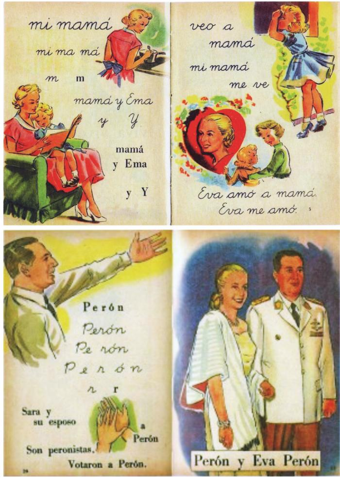

PALACIO, Angela. Privilegiados. Libro de lectura inicial. Buenos Aires: Kapelusz, 1954. Apud CAPELATO, Maria Helena. Multidoes em cena. Propaganda política no varguismo e no peronismo. Campinas: Papirus, 1998. p.88- 91.

As imagens mostram páginas de uma cartilha de alfabetização produzida durante o governo de Juan Domingo Perón na Argentina (1946- 1955). As ilustrações

(A) atribuem valor identico à presença de homens e de mulheres nas esferas pública e privada. 
(B) revelam a neutralidade do material no que diz respeito às posições políticas e às relações entre gêneros. 
(C) ressaltam a importância da formulação intelectual das mulheres oriundas dos setores populares. 
(D) fazem propaganda do regime político e demarcam as funções da mulher como mãe e esposa. 
(E) desenvolvem crítica politico-partidária à estrutura patriarca e à política popular.
----
## Questão 40

Attingir a igualdade de género é uma das metas do Objetivo de Desenvolvimento Sustentável (ODS) de número 5 da Agenda 2030, adotada pela ONU em 2015.

No cenário esportivo, é possível identificar alguns avanços em relação ao

alcance dessa mera, conforme reconheceu a jogadora brasileira de futebol Maria:

"Quando as atletas do sexo feminino têm a chance de se destacar, os resultados são enormes. E para isso, a Copa do Mundo Feminina de 2019 foi realmente uma virada no jogo. A audiência global do torneio ultrapassou 1 bilhão de pessoas."

Disponível em https://brasil.un.org/.

A Olimpiada de Paris 2024, por sua vez, estabeleceu, pela primeira vez na história, a paridade de género em todos os esportes olímpicos, com 5.250 vagas destinadas a cada sexo. Apesar das conquistas, o caminho rumo à igualdade de género continua.

Com base no expoisto, é correto afirmar:

(A) As práticas esportivas devem ser consideradas como práticas sociais, pois claramente reflete em sua realidade as potencialidades e os retrocessos da sociedade. Sendo assim, as mulheres já atingiram o mesmo nível de desbaque que os homens na sociedade contemporânea, haja vista a ascensão e visibilidade feminina no cenário esportivo. 
(B) Os grandes eventos esportivos conferem às mulheres uma visibilidade muitas vezes camouflada na sociedade. A visibilidade gerada para as atletas em cenário esportivo, a partir dos grandes eventos, demonstra o quanto elas já atingiram em totalidade seu status social e caminham no sentido de alcançar a agenda dos ODS. 
(C) As mulheres atletas têm, vagarosamente, alcançado mais possibilidades de inclusão e participação junto ao mundo esportivo, porém a igualdade de género ainda se mostra uma meta distance de ser alcançada quando se observa a baixa proporgão de mulheres ocupando cargos de gestão e liderança no cenário esportivo. 
(D) O mundo esportivo não tem implicação direta junto ao alcance das metas dos ODS, uma vez que possui organização e regeneramento específicos, além de uma constituição social próprio. Dessa maneira, a instituição esportiva não deve ser padrão de referência para revelar avanços ou retrocessos da sociedade como um todo. 
(E) O esporte tem sido importante fenômeno de promoção das mulheres, mas sua influência é limitada à prática profissional de modalidades esportivas mais populares, sem potencial de contribuir para a igualdade de oportunidades para as mulheres em todos os níveis de tomada de decisão na vida política, econômica e pública.
----
## Questão 41

"Quick, quick, tell me something awful Like you are a poet trapped inside the body of a finance guy Tell me all your secrets, all you'll ever be is My eternal consolation prize You see, I was a debutante in another life, but Now I seem to be scared to go outside If comfort is a construct, I don't believe in good luck Now that I know what's what

I hate it here so I will go to secret gardens in my mind People need a key to get to, the only one is mine I read about it in a book when I was a precocious child No mid- sized city hopes and small- town fears I'm there most of the year 'cause I hate it here I hate it here

My friends used to play a game where We would pick a decade We wished we could live in instead of this I'd say the 1830s but without all the racists And getting married off for the highest lid Everyone would look down 'cause it wasn't fun now Seems like it was never even fun back then Nostalgia is a mind's trick If I'd been there, I'd hate it It was freezing in the palace"

"I hate it here", Taylor Swift, do album The Tortured Poets Department, 2024 (Adaptado).

Na letra da música, o verso "Like you are a poet trapped inside the body of a finance guy"

(A) enaltece a romantização e idealização de épocas passadas. 
(B) destacado papel de contextos externos no manejo de frustrações. 
(C) expressa o sentimento de insatisfação ou inadequação em relação às expectativas sociais. 
(D) crítica a revelação de segredos e o rompimento de fronteiras pessoas. 
(E) enfatiza a importância da sorte e de elementos culturais como mitos e rituais.
----
## Questão 42

"Quick, quick, tell me something awful Like you are a poet trapped inside the body of a finance guy Tell me all your secrets, all you'll ever be is My eternal consolation prize You see, I was a debutante in another life, but Now I seem to be scared to go outside If comfort is a construct, I don't believe in good luck Now that I know what's what

I hate it here so I will go to secret gardens in my mind People need a key to get to, the only one is mine I read about it in a book when I was a precocious child No mid- sized city hopes and small- town fears I'm there most of the year 'cause I hate it here I hate it here

My friends used to play a game where We would pick a decade We wished we could live in instead of this I'd say the 1830s but without all the racists And getting married off for the highest lid Everyone would look down 'cause it wasn't fun now Seems like it was never even fun back then Nostalgia is a mind's trick If I'd been there, I'd hate it It was freezing in the palace"

"I hate it here", Taylor Swift, do album The Tortured Poets Department, 2024 (Adaptado).

No texto, a percepção de "conforto como construto" indica que o eu lírico vê o conforto como

(A) refúgio mental para apaziguar as pressões e o descontentamento da vida. 
(B) concepção ligada às experiências infantis em mecanismos de enfrentamento. 
(C) conceito pressuposto, dependente da realidade concreta das pessoas. 
(D) dificuldade de ter autoafirmação, por conta de questões internas pendentes. 
(E) algo criado pela sociedade, produzindo falsa sensação de segurança.
----
## Questão 43

43Carlos Drummond de Andrade foi o criador de uma obra lírica que, ao mesmo tempo, se aproxima e se afasta do Modernismo de 1922, propondo, a partir de traços desse movimento, uma poetica original. Com base no exposto, em Alguma poesia (1930). (A) os aspectos prosaicos da linguagem modernista ganham expressão lírica a partir de um sujeito poético que repropõe, em versus livres, a nostalgia romântica da infância idealizada. (B) o sujeito poético incorpora, sob a perspectiva de uma lírica de raiz subjetiva, vários procedimentos estilísticos das volguridas modernistas, em especial a esinha automática e o surrealismo. (C) a topica literária do desconcerto do mundo ganha uma reconfiguração moderna, a partir de um sujeito poético que, mais do que revelar um mundo às avessas, focaliza o seu desajuste frente à realidade. (D) o nacionalismo literário, tão típico da revisão empreendida pela primeira geração modernista sobre a realidade brasileira, apresenta- se como eixo temático de cunho ufanista. (E) a paisagem mineira, no espaço literário, é configurada pelo sujeito poético como ambiente bucólico e refúgio privilegiado para os seus desajustes frente ao "vasto mundo".
----
## Questão 44

  
Disponível em https://br.pinterest.com/.

"Quem negaria que os futuros ainda não são? Mas já está na mente a espera dos futuros. E quem negaria que os passados já não são? Todavia, ainda está na mente a memória dos passados. E quem negaria que o tempo presente não tem extensão temporal, porque massa em um instante? Todavia, perdura a atenção, pela qual o que está presente se encaminha para a ausência."

Agostinho de Hipona. Confiessoes.

Ao propor uma aproximacao entre a fala da personagem Calvin no quadrinho e o trecho citado das Confissoes de Agostinho, é possivel encontrar semelhancas com relacao a descriaco do tempo e sua compreensao filosofica. Dentre as afirmativas a seguir, qual delas pode ser considerada verdadeira para ambos os casos?

(A) A passagem do tempo e ilusoria. 
(B) O tempo desfaz a mudanca. 
(C) Ha um paradoxo na compreensao do tempo. 
(D) Os momentos do tempo identificam se entre si. 
(E) Ha ruptura completa entre o tempo presente e o futuro.
----
## Questão 45

Considere que a expectativa de vida no Brasil a idade de 19 anos pode ser calculada, de forma aproximada, como a media aritmetica simples entre a expectativa de vida estimada a mesma idade dos homens e das mulheres. O mesmo pode ser feito a idade de 20 anos.

Segundo dados do IBGE, em 2022, a expectativa de vida estimada no Brasil a idade de 19 anos era 58, e a expectativa de vida estimada dos homens a mesma idade era 54,7.

Sabe- se que a diferencia entre a expectativa de vida estimada dos homens e a das mulheres se manteve a idade de 20 anos e que a expectativa de vida estimada dos homens a essa idade  $(\mathsf{EVH}_{20})$  era 53,8.

Com base nos dados apresentados, assimale a alternativa que apresenta a expectativa de vida estimada dos mulheres a idade de 19 anos  $(\mathsf{EVM}_{19})$  e a expectativa de vida estimada a idade de 20 anos no Brasil  $(\mathsf{EVB}_{20})$  em 2022.

<table><tr><td></td><td>EVM19</td><td>EVB20</td></tr><tr><td>(A)</td><td>54,7</td><td>54,7</td></tr><tr><td>(B)</td><td>54,7</td><td>58</td></tr><tr><td>(C)</td><td>60</td><td>54</td></tr><tr><td>(D)</td><td>61,3</td><td>56</td></tr><tr><td>(E)</td><td>61,3</td><td>57,1</td></tr></table>
----
## Questão 46

A maior parte da alimentacao humana e constituida por graos e cereais, que, em sua maioria, correspondem as sementes, em termos botanicos. Esse consumo e adequado, uma vez que as sementes

(A) constituem o unico orgao de reserva de amido das plantas, substancia altamente energetica para os seres vivos em geral. 
(B) armazenam todas as vitaminas e nutrientes necessarios para a planta e, portanto, tambem ao ser humano. 
(C) possuem DNA da planta-mae e do embriao, que constituem nutrientes sem os quais a especie humana nao sobrevive. 
(D) contem substancas de reserva provedoras de energia para o desenvolvimento do embriao vegetal, que tambem servem de fonte energetica aos seres humanos. 
(E) possuem enzimas digestivas de amido e de proteinas, que disponibilizam energia ao embriao vegetal e tambem sao usadas para promover a digestao em seres humanos.
----
## Questão 47

A figura a seguir representa os niveis medios de consumo de gordura saturada nadrieta para adultos com idade ≥20 anos.

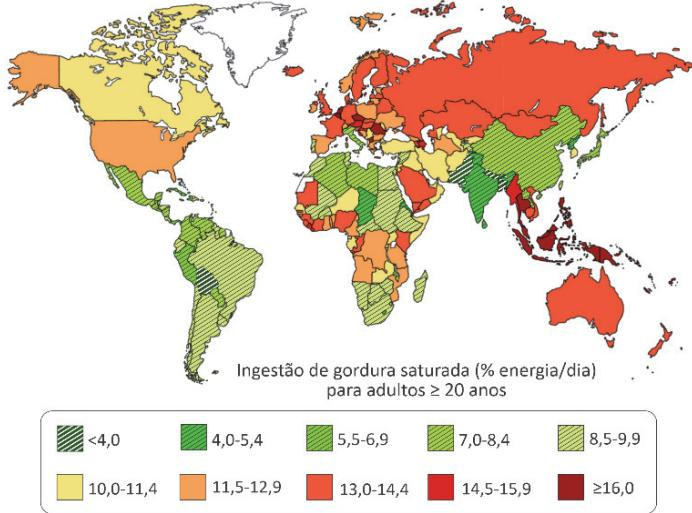  
MICHA, R. et al., (2014). British Medical Journal, v. 348. g2272. DOI: 10.1136/bmj.g2272.

Considerando apenas os dados da figura, os habitantes da Australia e da Russia apresentam maiores riscos de desenvolver doenças

(A) renais. 
(B) respiratorias. 
(C) cardiovasculares. 
(D) cerebrais. 
(E) neuromusculares.
----
## Questão 48

48Os gráficos a seguir apresentam a evolução do abate de bovinos e da participação de machos e fêmeas, por trimestre (indicado por algarismo romano), segundo informações obtidas pelo IBGE.

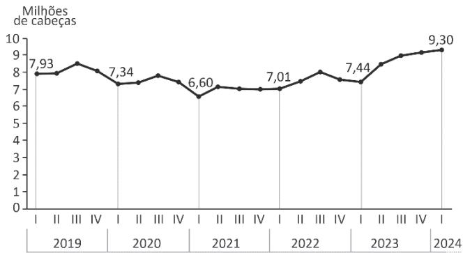  
Evolugao do abate de bovinos no Brasil por trimestre (2019-2024)

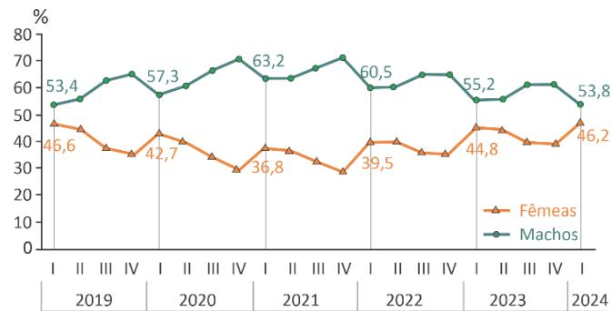  
Evolugao da participação de machos e fêmeas no abate de bovinos no Brasil por trimestre (2019-2024)

IBGE: Diretoria de Pesquisas. Coordenação de Estatísticas Agropecuárias. Pesquisa Trimestral do Abate de Animais 2019- 2024 (Adaptado).

A partir dos dados observados nos gráficos, é correto afirmar:

A partir dos dados observados nos gráficos, é correto afirmar:(A) No primeiro trimestre de 2023, a diferença entre as quantidades de machos e fêmeas abatidos foi menor que a do primeiro trimestre de 2019. (B) No primeiro trimestre de 2023, a quantidade de fêmeas abatidas foi de, aproximadamente, 2 milhões. (C) No primeiro trimestre de 2021 e de 2022, a diferença entre as quantidades de machos e fêmeas abatidos foi igual. (D) No primeiro trimestre de 2024, a quantidade de fêmeas abatidas foi de, aproximadamente, 4,3 milhões. (E) No primeiro trimestre de 2024, a quantidade de fêmeas abatidas foi igual à do primeiro trimestre de 2019.
----
## Questão 49

49Observe as imagens de satélite que indicam o desmatamento de 12.272 hectares no município de Formosa do Rio Preto (BA), região do MATOPIBA, composta pelos estados do Maranhão, Tocantins, Piauí e Bahia, no período 2019- 2022.

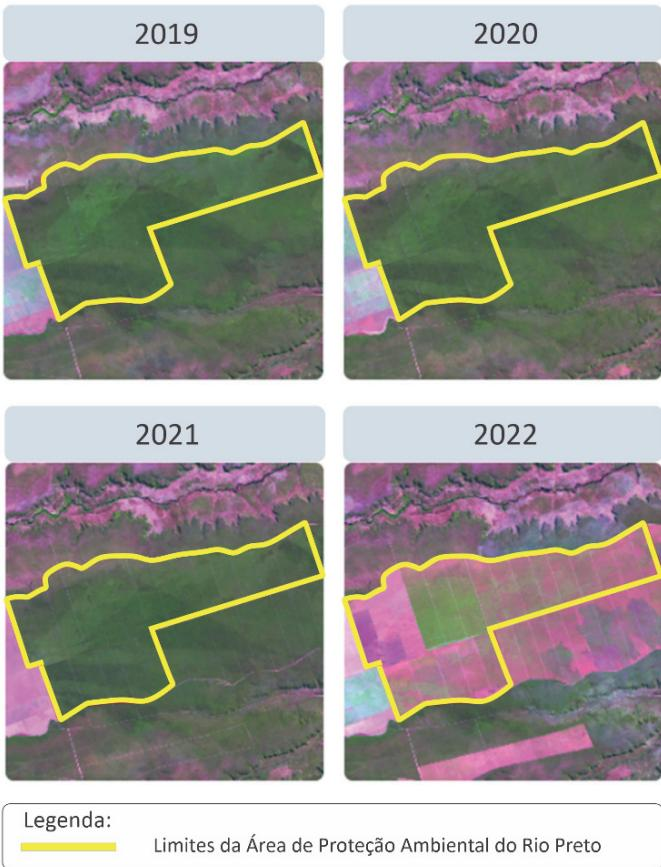  
MapBiomas. 2023. Rediório de desmatamento no Brasil (Adaptado).

Com base na análise temporal das imagens, assinale a alternativa que apresenta, respectivamente, o bioma correspondente à região do MATOPIBA, a atividade econômica desenvolvida nesse local e o possível impacto ambiental negativo decorrente de tal atividade.

(A) Cerrado, agropecuária e processos erosivos. 
(B) Cerrado, silvicultura e contaminação do solo. 
(C) Amazônia, mineração e poluição das águas. 
(D) Caatinga, pastagem e impermeabilização da superfície. 
(E) Caatinga, extrativismo e perda de biodiversidade.
----
## Questão 50

Neste bioma, a vegetação nativa apresenta- se intercalada por extensas monoculturas da soja e de arroz. Em alguns lugares, a vegetação campestre original tem sido substituída por vegetação florestal, formada por árvores de eucaliptos. Em vários locais, observa- se a expansão de grandes areas, em que os solos arenosos ficam expositos e suscétíveis a uma intensa erosão. Este é o bioma brasileiro menos protegido por Unidades de Conservação, embora esteja entre aqueles que mais perderam vegetação nativa nas últimas três décadas.

A descrição da patagem impactada por ações humanas refere- se ao bioma

(A) Caatinga. 
(B) Cerrado. 
(C) Mata Atlântica. 
(D) Pampas. 
(E) Pantanal.
----
## Questão 51

A figura a seguir representa a variagao espacial da temperatura do ar por tipo de area, considerando diferentes padroes de uso e ocupagao do solo de um municipio.

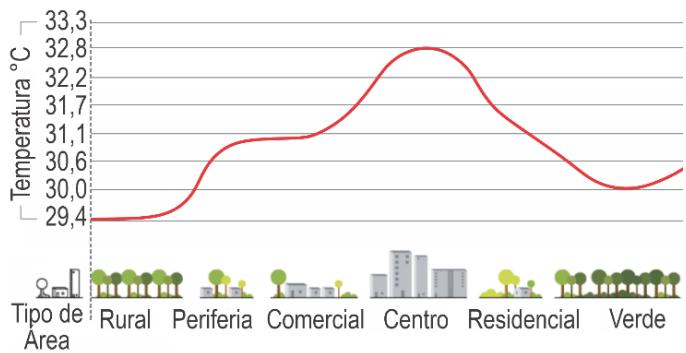

Revista Pesquisa FAPESP - Setembro/2023 (Adaptado).

A explicagao para as caracteristicas desse perfil de temperatura do ar deve- se

(A) a maior ocorrencia de areas verdes nas periferias, que absorvem mais radiagao solar e aquecem o ambiente, ultrapassando os  $32^{\circ}C$  
(B) a maior absorgao de radiagao solar nas areas centrais das cidades, compostas em sua maioria por asfalto, vidro e concreto. 
(C) ao efeito de sombreamento dos edificios nas areas centrais, com maior disponibilidade de radiagao solar e temperaturas inferiores a  $30^{\circ}C$  
(D) a presenca de areas comerciais e residenciais ao longo de todo perfil, que elevam a temperatura acima dos  $32^{\circ}C$  e reduzem a umidade. 
(E) a maior reflexao da radiagao solar nas areas centrais pelo asfalto, por apresentarem albedo menor que as superficies vegetadas.
----
## Questão 52

As enchentes ocorridas no Rio Grande do Sul, em maio de 2024, prejudicaram a infraestrutura de comunicaao. A população afetada era informada sobre as noticias relativas as enchentes ao sintonizar, por rádio de pilhas, frequências de onda AM, cujo alcance é maior.

Uma onda AM é modelada matematicamente por equações que envolvem a fungão cosseno, cuja variável independente é o tempo  $t$ , que aparece multiplicado pela frequência  $f$  da onda.

Como exemplo, pode- se considerar a equação referente ao processo de modulação de uma onda AM:

$$
s(t) = A[1 + km(t)]\cos (2\pi ft),
$$

em que  $A$  é a amplitude,  $f$  a frequência,  $k$  a constante da sensibilidade à amplitude e  $m(t)$  o silnal que contém a informação.

Quando a frequência  $f$  é multiplicada por 3, o comprimento da onda sofre alteração. Por causa dessa multiplicação, qual transformação ocorre no gráfico da função cosseno original?

(A) Expansão vertical. 
(B) Translação horizontal.

(C) Expansão horizontal. 
(D) Contração horizontal. 
(E) Contração vertical.
----
## Questão 53

A Estação Meteorológica Mirante de Santana é a principal referência do Instituto Nacional de Meteorologia (INMET) no município de São Paulo - SP. O climograma a seguir apresenta dados referentes ao mão de fevereiro de 2023. Neste mesmo mês, o Centro de Georenciamento de Emergências Climáticas detectou 11 pontos de alagamentos no dia 19 e 14 pontos no dia 21.

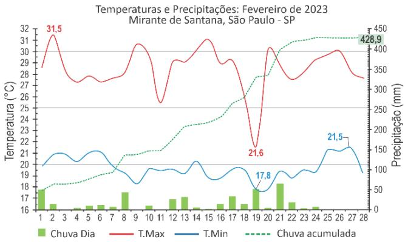

Disponível em https://portal.immet.gov.br/noticias/ (Adaptado).

Com base no texto e no gráfico, assinale a alternativa correta.

(A) A menor amplitude térmica ocorreu no dia 19, quando foi observado um dos maiores volumes de chuva do mês. 
(B) Os quatro dias mais chuvosos apresentaram as menores temperaturas minimas. 
(C) A temperatura máxima no período variou entre  $21,5^{\circ}C$  e  $17,8^{\circ}C$ . 
(D) Os cinco dias mais quentes correspondem às maiores precipitações. 
(E) Os pontos de alagamento nos dias 19 e 21 foram provocados pela chuva acumulada de 428,9 mm.
----
## Questão 54

"A distribuigao dos mosquitos, a frequencia de suas picadas e o tempo de eclosao de seus ovos sao afetados pela temperatura, pluviosidade e velocidade do vento, alem de outros fatores, como deslocamento e densidade populacionais. Por exemplo, com uma temperatura de  $27^{\circ}C_{i}$  o periodo de incubagao dos ovos e de dez dias; no entanto, a  $37^{\circ}C_{i}$  esse periodo passa a ser de sete dias. Alem disso, a intermitencia das chuvas no final da etacao do verao e os ventos calmos acentuam a proliferagao e a utacao do vetor."

MENDONCA, Francisco de Assis. Aquecimento Global e Saude: uma perspectiva geografica - notas introdutorias. Terra Livre, 2003 (Adaptado).

Com base no texto, assimale a alternativa correta.

(A) A elevacao da temperatura e o aumento da pluviosidade, somados ao desmatamento, a urbanizagao e a circulagao de pessoas em varias areas, potencializam a expansao da dengue. 
(B) A dengue e um problema nacional e esta relacionada ao fato de o Brasil ser um pais tropical com areas de florestas, aspectos que, combinados a dispersao da população, contribuem para minimizar a epidemia. 
(C) A proliferagao do mosquito Aedes aegypti ocorre em areas pouco povoadas nos centros urbanos, associada as baixas temperatura que intensificam a transmissao da doenga. 
(D) No território brasileiro, as areas com baixas temperatura reduzem o tempo necessario para eclosao dos ovos, aumentando a proliferagao do mosquito Aedes aegypti e a frequencia de picadas. 
(E) A dengue e um problema de saude publica em escala mundial e sua disseminagao esta asociada a diminuigao de temperatura, aumento da velocidade do vento e reducao da precipitacao.
----
## Questão 55

Dentre os animais invertebrados, alguns grupos apresentam o sistema circulatório fechado, enquanto outros apresentam o sistema circulatório aberto, o que leva a diferenças em processos fisiológicos.

Nos invertebrados, o sistema circulatório

(A) fechado apresenta uma menor precozo do sangue / hemolinfa em relagao ao sistema circulatório aberto. 
(B) aberto apresenta o coragao dividido em quatro cavidades: dois atrios e dois ventriculos. 
(C) fechado permite maior efficiencies no transporte de oxigênio em relagao ao sistema circulatório aberto. 
(D) aberto facilita a distribuigao dos nutrientes aos tecidos em relagao ao sistema circulatório fechado. 
(E) fechado mistura mais facilmente os gases respiratórios: oxigênio e dióxido de carbono.
----
## Questão 56

O processo de mumificagao usado pelos egipcios começava com a retirada dos orgaos e desidratação do corpo utilizando uma mistura natural, obtida em leito de lagos, de sais soluveis de sodio, como carbonato, hidrogenocarbonato, cloreto e sulfato. Após a desidratação, o corpo era premachido com uma mistura de serragem e ervas aromáticas como canela, cássia, mirra e até mesmo cebola, que, por conterem álcoois e aldeídos com propriedades antimicrobianas, dificultavam a decomposição do corpo. Por fim, o corpo era envolvido em tecido embebido em resinas insoluveis em água, como betume ou óleo de cedro, que, após seco, formava uma camada impermeabilizante.

A partir dessas informações, assinale a alternativa correta.

(A) Os sais de sodio mencionados, por serem hidrofilicos, repelem a água. 
(B) Propanona e hexano são exemplos de álcoois e aldeídos antimicrobianos. 
(C) Assim como o betume e óleo de cedro, qualquer outro composto orgânico serviria como impermeabilizante. 
(D) Todo sal iônico poderia ser utilizado em substituição aos sais de sodio mencionados. 
(E) A impermeabilidade conferida pelas resinas se deve às suas características apolares ou muito pouco polares.
----
## Questão 57

Em países frios, é comum o uso de pequenos aquecedores de mãos, normalmente descartáveis, que podem ser colocados dentro de luvas. Uma alternativa mais sustentável é o aquecedor de mão reutilizável, que é constituído por uma solução aquosa superaturada de acetato de sodio armazenada em um reservatório maleável, conforme mostrado na figura a seguir.

Um choque mecânico nesse reservatório perturba a solução supersaturada e leva à precipitação do sal, resultado no seu aquecimento. Após o uso, o aquecedor pode ser regenerado por imersão em água quente, que dissolve o sal, deixando- o pronto para ser reutilizado.

Em relagao à operação desse aquecedor, é correto afirmar:

(A) A precipitação do acetato de sodio é exotérmica e sua solubilização é endotérmica. 
(B) A diminuição da temperatura aumenta a solubilidade do acetato de sodio. 
(C) A solubilização do acetato de sodio para a regeneração do aquecedor libera energia, aquecendo o banho de água. 
(D) Quando o aquecedor é regenerado, a solução interna passa de supersaturada para uma solução diluída. 
(E) A concentração de acetato de sodio na solução dentro do reservatório não muda durante a regeneração do aquecedor.
----
## Questão 58

A toxicidade do Pb e o risco de sua ingestao ganharam notoriedade na midia devido a presença desse elemento em copos termicos amplamente comercializados. A exposicao ao Pb, no entanto, pode ocorrer tambem por fontes naturais, como a ingestao de agua em contato prolongado com minérios como a anglesita, rico em  $\mathrm{PbSO_4}$ $(\mathrm{Kps} = 1,0\times 10^{- 8})$  Sabendo que a legislação estabelece a concentração máxima de Pb de  $0,01\mathrm{mg / L}$  para agua potavel, assimale a alternativa correta em relação à ingestao de agua que tenha contato prolongado com a anglesita.

(A) Nao e segura, pois a concentração de Pb na agua sera de  $2,07\times 10^{-6}\mathrm{mg / L}$  maior que o valor permitido. 
(B) E segura, pois a concentração de Pb na agua sera de  $1\times 10^{-4}\mathrm{mg / L}$  , menor que o valor permitido. 
(C) Nao e segura, pois a concentração de Pb na agua sera de  $1\times 10^{-8}\mathrm{mg / L}$  , menor que o valor permitido. 
(D) E segura, pois a concentração de Pb na agua sera de  $1\times 10^{-2}\mathrm{mg / L}$  , igual ao valor permitido. 
(E) E segura, pois a concentração de Pb na agua sera de  $2,07\times 10^{-6}\mathrm{mg / L}$  , maior que o valor permitido.

Note e adote: Massa molar  $(g / mol)$  :  $\mathrm{Pb} = 207$
----
## Questão 59

Quando uma barra de um certo material é aquecida até uma temperatura  $T$  a partir de uma temperatura inicial  $T_{0}$  seu comprimento inicial  $L_{0}$  sofre um aumento  $\Delta L$  dado por  $\Delta L = \alpha L_{0}$ $(T - T_{0})$  , sendo  $\alpha$  o coeficiente de expansão linear, que depende do material. O gráfico a seguir mostra curvas de expansão linear para barras feitas de três materiais distintos.

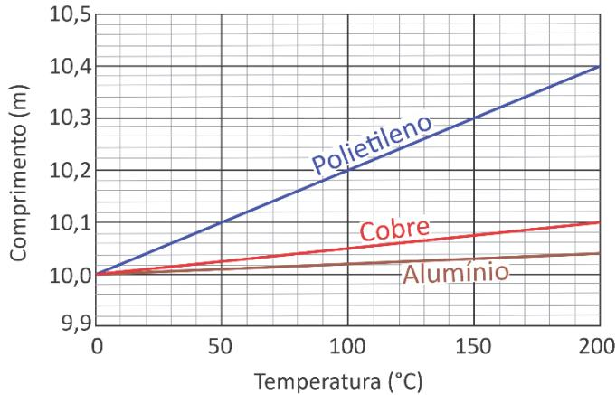

Com base no gráfico e nas informações apresentadas, é correto afirmar:

(A) O gráfico mostra curvas para três barras que possuem o mesmo comprimento à temperatura de  $30^{\circ}C$  
(B) Em um processo de aquecimento entre  $100^{\circ}C$  e  $200^{\circ}C,$  o comprimento da barra de cobre aumenta em  $0.1m$  
(C) O coeficiente de expansão linear do alumínio é maior do que o do cobre. 
(D) Partindo de  $0^{\circ}C,$  aumentar em  $10cm$  o comprimento da barra de polietileno requer elevar sua temperatura até  $50^{\circ}C$

(E) Duas barras de comprimentos  $5m$  e  $10m$  a  $0^{\circ}C,$  feitas do mesmo material, sofrem iguais incrementos de comprimento quando levadas de  $0^{\circ}C$  a  $100^{\circ}C$
----
## Questão 60

As massas de duas barras, uma de ferro e outra de aço inoxidável, armazenadas em um mesmo ambiente úmido e na presença de oxigênio, foram monitoradas ao longo do tempo. Assinale a alternativa que representa a variação das massas de ambas as barras ao longo do tempo.

<table><tr><td></td><td>Ferro</td><td>Aço inoxidável</td></tr><tr><td rowspan="2">(A)</td><td>Massa (mg)</td><td>Massa (mg)</td></tr><tr><td>Tempo (meses)</td><td>Tempo (meses)</td></tr><tr><td rowspan="2">(B)</td><td>Massa (mg)</td><td>Massa (mg)</td></tr><tr><td>Tempo (meses)</td><td>Tempo (meses)</td></tr><tr><td rowspan="2">(C)</td><td>Massa (mg)</td><td>Massa (mg)</td></tr><tr><td>Tempo (meses)</td><td>Tempo (meses)</td></tr><tr><td rowspan="2">(D)</td><td>Massa (mg)</td><td>Massa (mg)</td></tr><tr><td>Tempo (meses)</td><td>Tempo (meses)</td></tr><tr><td rowspan="2">(E)</td><td>Massa (mg)</td><td>Massa (mg)</td></tr><tr><td>Tempo (meses)</td><td>Tempo (meses)</td></tr></table>
----
## Questão 61

Os versos a seguir pertencem à canção Fall on Me, da banda norte- americana R.E.M., lançada em 1986.

"There's a problem, feathers, iron Bargain buildings, weights and pulleys Feathers hit the ground before the weight can leave the air"

Bill Berry, Peter Buck, Mike Mills e Michael Stipe.

A qual episódio (real ou hipotético) da história da física o trecho da música faz alusão?

(A) A queda de uma macã, que teria inspirado Newton à descoberta da gravitacao universal. 
(B) A observacao de um pássaro em vào, que teria levado Einstein a formular a teoria da relatividade. 
(C) Aos experimentos com objetos de massas diferentes, que teriam indicado a Galileu os principios da queda livre. 
(D) Ao transbordamento da agua em uma banheira, que teria sugerido a Arquimedes o conceito de empuxo. 
(E) A queda de um bloco de ferro ligado a uma helice, que teria levado Joule a equivalencia entre calor e energia.
----
## Questão 62

Um brinquedo bastante comum em palques de diversoes, a montanha- russa, utiliza- se da transformagao parcial de energia potencial em energia cinetica (e vice- versa) como principio de funcionamento. Uma das montanhas- russas mais famosas do mundo, a Takabisha, cuja pista possui mais de 1 km de extensao, localiza- se no Japao e tem vista para o Monte Fuji. Nela, a subida inicial ate o ponto mais alto, situado a uma altura aproximada de  $50m$  do solo, e feita sob angulo de aproximadamente 90 graus, seguida de uma descida vertiginosa, cuja velocidade, no ponto mais baixo desse trecho, atinge cerca de  $30m / s$  em poucos segundos.

  
Montanha-russa Takabisha.

Considerando um carrinho ocupado com massa total de  $300kg$  em repouso na posigao de altura maxima, a energia mecânica perdida durante a descida inicial e, aproximadamente,

(A) 1200 J. 
(B) 2500 J. 
(C) 5000 J. 
(D) 15000 J. 
(E) 20000 J.

Note e adote: Aceleragao da gravidade:  $\mathbf{g} = 10\mathbf{m} / \mathbf{s}^2$
----
## Questão 63

A utilizacao de matrizes energeticas limpas, tais como aquelas que nao aumentam a concentracao de  $CO_2(g)$  na atmosfera, e essencial para evitar a escalada das alteracoes climaticas causadas pela emissao de gases de efeito estufa. Considere a proposta apresentada na figura a seguir para a producao de uma matriz energetica limp.

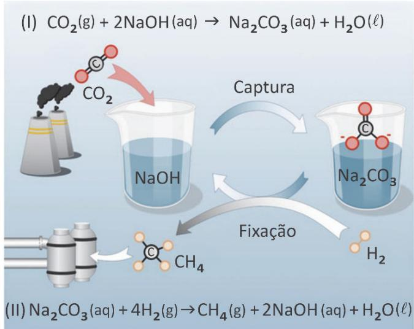

(1) Capturar o  $CO_2(g)$  atmosferico utilizando NaOH(aq) para formar  $\mathrm{Na_2CO_3(aq)}$  . (1l) Tratar essa solugao, na presencia de um catalisador, com  $\mathsf{H}_2(\mathsf{g})$  oriundo de fontas renovaveis, para gerar  $\mathsf{CH}_4(\mathsf{g})$  um gas combustivel.

Com base nessas informacoes e em seus conhecimentos, assassale a altenativa correta.

(A) O catalisador participa da reagao de producao de metano e se decompose em NaOH. 
(B) A combustao do  $\mathbb{C}\mathbb{H}_4$  nao emite  $CO_2,$  motivo pelo qual a proposta se configura como uma matriz energetica limp. 
(C) A proposta nao representa uma matriz energetica limp, pois a combustao completa de 1 mol de  $\mathbb{C}\mathbb{H}_4$  emite mais  $CO_2$  do que o que e utilizado para a sua sintese. 
(D) A retirada de  $CO_2$  da atmosfera seria maior se a proposta de usar uma matriz energetica limp se resumisse unicamente em utilizar o  $\mathsf{H}_{2}$  como combustivel. 
(E) Em relagao ao ciclo do carbono, a proposta e semelhante ao uso do etanol como combustivel veicular.
----
## Questão 64

Alguns motores de foguetes espaciais usam metano como combustivel e oxigênio como comburente. Ambos os compostos sao armazenados em estado lquido no proprioguete, o que permite o seu armazenamento em maior quantidade do que se estivessem no estado gasoso. Sabe- se que o foguete armazena um volume de oxigênio lquido 1,5 vez maior do que de metano lquido e que ambos sao completamente consumidos na combustivo, conforme a equacao  $\mathrm{CH}_4(\ell) + 2\mathrm{O}_2(\ell)\rightarrow \mathrm{CO}_2(\mathbf{g}) + 2\mathrm{H}_2\mathrm{O}(\mathbf{g})$

Nessas condicoes, e corroto afirmar que a razao entre a densidade do metano lquido e a densidade do oxigênio l'quido e igual a

(A) 0,186. 
(B) 0,375. 
(C) 0,75. 
(D) 1,5. 
(E) 3.

Note e adote: Massa molar  $(\mathrm{g / mol})$  ..  $\mathsf{H} = 1$ $\mathbb{C} = 12$  .  $0 = 16$
----
## Questão 65

# Da moenda para a célula a combustivel caldo de cana e usado para produzir energia elétrica

"Pesquisadores do Instituto de Pesquisas Energéticas e Nucleares (Ipen), orgao associado à USP, testaram o uso de caldo de cana para gerar energia elétrica em células a combustivel. O processo dispensa a transformação do caldo in natura em etanol, feita nas usinas de álcool, impedindo a formação de resíduos nocivos ao meio ambiente. Após o êxito dos experimentos em laboratório, os cientistas vão desenvolver a aplicação da técnica em escala industrial.

'A célula a combustivel tem o mesmo princípio de funcionamento de uma pilha. A diferença é que o combustivel serve como reagente para ser consumido e gerar eletricidade', explica o pesquisador do Ipen, Almir Oliveira Neto, que coordenou a pesquisa. 'No dispositivo que foi desenvolvido na pesquisa, a oxidação do caldo de cana acontece no ânodo e a redução de oxigênio no catodo. O objetivo do experimento era obter energia da biomassa com o mínimo impacto ambiental possível. Para isso, utilizou-se o caldo de cana em uma célula a combustivel para gerar energia elétrica', diz o pesquisador. 'O uso do caldo de cana direto evita a formação de vinhaça, um residuo ambientalmente perigoso decorrente da produção de etanol, contribuindo, assim, para a preservação do meio ambiente'.

Disponível em https://jornal.usp.br/ciencias/ (Adaptado).

De acordo com o texto, a pesquisa com caldo de cana apresentou resultados promissores em relação à sustentabilidade ambiental, porque

(A) o caldo in natura é obtido com facilidade, demandando somente a utilização das moendas, o que barateia os custos do processo.

(B) a energia elétrica proveniente da célula a combustivel é considerada limpa, já que esse dispositivo dispensa o uso de pilhas, cujo descarte constitui um problema ambiental. 
(C) a vinhaça, residuo danoso ao meio ambiente, deixa de ser produzida ao se evitar a transformação do caldo de cana em álcool. 
(D) a célula a combustivel se destaca pela economia energética gerada ao funcionar como uma pilha, reduzindo a quantidade de caldo de cana utilizada. 
(E) o Ipen não produz o caldo de cana em escala industrial, o que diminui a produção da vinhaça poluidora do meio ambiente.
----
## Questão 66

# Da moenda para a célula a combustivel caldo de cana e usado para produzir energia elétrica

"Pesquisadores do Instituto de Pesquisas Energéticas e Nucleares (Ipen), orgao associado à USP, testaram o uso de caldo de cana para gerar energia elétrica em células a combustivel. O processo dispensa a transformação do caldo in natura em etanol, feita nas usinas de álcool, impedindo a formação de resíduos nocivos ao meio ambiente. Após o êxito dos experimentos em laboratório, os cientistas vão desenvolver a aplicação da técnica em escala industrial.

'A célula a combustivel tem o mesmo princípio de funcionamento de uma pilha. A diferença é que o combustivel serve como reagente para ser consumido e gerar eletricidade', explica o pesquisador do Ipen, Almir Oliveira Neto, que coordenou a pesquisa. 'No dispositivo que foi desenvolvido na pesquisa, a oxidação do caldo de cana acontece no ânodo e a redução de oxigênio no catodo. O objetivo do experimento era obter energia da biomassa com o mínimo impacto ambiental possível. Para isso, utilizou-se o caldo de cana em uma célula a combustivel para gerar energia elétrica', diz o pesquisador. 'O uso do caldo de cana direto evita a formação de vinhaça, um residuo ambientalmente perigoso decorrente da produção de etanol, contribuindo, assim, para a preservação do meio ambiente'.

Disponível em https://jornal.usp.br/ciencias/ (Adaptado).

Ao empregar o promoem se em "utilizou- se o caldo de cana em uma célula a combustivel para gerar energia elétrica", o pesquisador

(A) indetermina o sujeito, tentando mostrar que desconhece a real autoria do experimento. 
(B) valoriza o objeto "caldo de cana", enfatizando a importância dese produto para o experimento. 
(C) chama a atenção para o verbo transitivo "utilizar", valorizando a importância de se experimentar diretamente o caldo de cana. 
(D) faz uso da voz passiva, construgão em que "caldo de cana" atua como sujeito, deixando de haver mengão a quem realizou o experimento. 
(E) escolhe uma construgão reflexiva em que "caldo de cana" é, ao mesmo tempo, o agente e o objeto do experimento realizado.
----
## Questão 67

Pesquisas e terapias com células- tronco têm se mostrado cada vez mais promissores pela possibilidade de seu uso no tratamento de diferentes tipos de doenças, como câncer e doenças degenerativas. As células- tronco podem se diferenciar em células especializadas, conforme exemplificado a seguir.

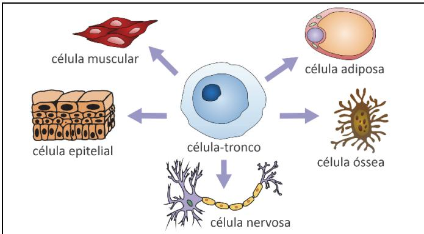  
Disponível em https://upload.wikimedia.org/wikipedia/(Adaptado).

As células especializadas que derivam de uma mesma célula- tronco possuem os(as) mesmos(as)

(A) genes. 
(B) RNAs. 
(C) proteínas. 
(D) lipídeos. 
(E) organelas.
----
## Questão 68

O gráfico a seguir apresenta dados do Produto Interno Bruto (PIB) por pessoa e dados de publicações científicas por milhão de habitantes para um grupo selecionado de países, além de destacar o estado de São Paulo.

Publicações científicas e PIB por pessoa - 2020 Area dos discos proportional ao número absoluto de publicações

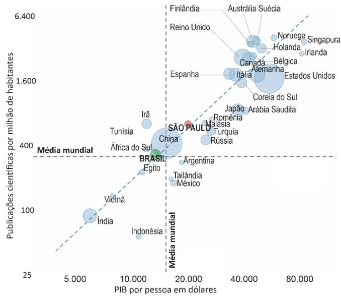

Revista Pesquisa FAPESP - Agosto/2022 (Adaptado).

A partir da análise do gráfico e do texto, é correto afirmar:

(A) Irã, Tunísia e Africa do Sul possuem um PIB por pessoa abaixo da média mundial e apresentam um número de publicações científicas por milhão de habitantes superior ao da média mundial. 
(B) O estado de São Paulo possui uma quantidade de publicações por milhão de habitantes abaixo da média mundial, enquanto o Brasil, com um PIB por pessoa maior que o do estado paulista, tem uma quantidade de publicações maior. 
(C) Índia e Indónésia possuem um PIB por pessoa acima da média mundial, no entanto, o número de publicações por milhão de habitantes desses países é superior ao da média mundial. 
(D) Os países do Norte Global, embora tenham um PIB por pessoa maior que a média mundial, possuem uma quantidade menor de publicações por milhão de habitantes, se comparados com a média mundial. 
(E) Argentina, Tailândia e México, apesar de possuírem um PIB por pessoa abaixo da média mundial, apresentam produção científica por milhão de habitantes acima da média mundial.
----
## Questão 69

No plano cartesiano Oxy, o gráfico que melhor representa a função  $f(x) = |x^2 + 5x - 6| - 5x + 6$  é dado por

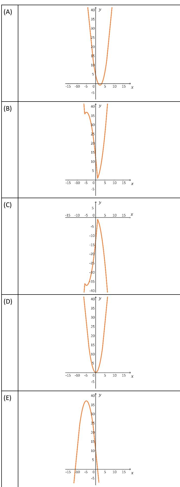
----
## Questão 70

Seja  $(a_{n})$  uma progressao aritmeticaca pup primeiro termo é  $a_1$  e a razao  $r$  ambos numeros reais. E possivel construir uma outra sequencia  $(b_{n})$  , em que o primeiro termo e um numero real  $b_{1}$  e com a seguinte lei de formacao

$$
b_{n + 1} = b_{n} + a_{n},
$$

sendo  $n > 0$  um numero natural.

Por exemplo, se  $b_{1} = 0$  e

$$
(a_{n}) = (1,3,5,7,9,11,\ldots),
$$

tem- se

$$
(b_{n}) = (0,1,4,9,16,25,\ldots).
$$

Com base em tais informacoes, os valores de  $a_1$  e  $r$  foram escolhidos de forma que  $(b_{n})$  tambem seja uma progressao aritmeticaca  $\mathbf{r}^{\prime}$  .Nessas condicoes, e correto afirmar:

(A)  $r^{\prime} = a_{1}$  
(B)  $r^{\prime} = 2a_{1}$  
(C)  $r^{\prime} = r$  
(D)  $r^{\prime} = 2r$  
(E)  $r^{\prime} = b_{1} - a_{1}$
----
## Questão 71

# Aumenta nos hospitais brasileiros a presenga de bactérias resistentes a antibioticos

"A disseminacao de bactérias resistentes a antibioticos e um pesadeolo mundial. Ela avanca rapidamente e representa uma ameaca a uma das maiores conquistas da medicina moderna: a capacidade de eliminar infecoes. Sem antibioticos eficientes, fica quase impossivel realizar cirurgias, transplantes e outros tratamentos em segurança.

Expostas a concentracao adequada dos antibioticos e por tempo suficiente, as bactérias facilmente morrem. Se a dosagem e duracao do tratamento forem inferiores ao necessario para aniquila- las, uma parte pode sobreviver e se multiplicar, acumulando alteracoes no material genetico que lhes permitem escapar a acao dos farmacos.

As bactérias estao em todos os lugares: na agua, no solo, no ar e nas superficies, inclusive no nosso corpo. Com o uso intensivo de antibioticos na saude humana e na producao de alimentos, as bactérias sao continuamente expostas a esses farmacos. Esse contato favorece a selecao das variedades resistentes."

Revista Pesquisa FAPESP - Janeiro/2024 (Adaptado).

O grafico a seguir ilustra o crescimento de uma especie de bacteria em meio de cultura, com e sem antibiotico. Foram testados tres antibioticos diferentes (1, 2 e 3).

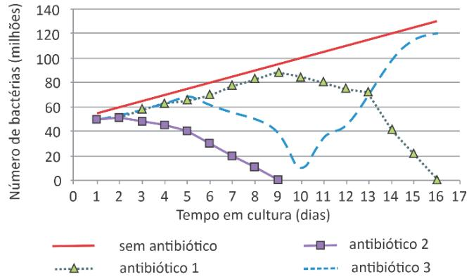

Considerando o texto e o grafico, sobre a resistencia de bactérias a antibioticos, e correto afirmar:

(A) A combinacao de mais de um antibiotico durante um tratamento reduz a quantidade de antibioticos lancada na rede de esgoto e as chances de surgirem bactérias mutantes na natureza. 
(B) Para reduzir as chances de selecao de bactérias resistentes, e necessario aumentar a concentração de antibioticos presentes na natureza e matar as bactérias patogênicas livres. 
(C) Mutações aleatorias que acontecem nas bactérias, associadas à exposição prolongada a antibioticos, contribuem para a selecao de bactérias resistentes a antibioticos. 
(D) O antibiotico 3 sera eficiente, nas mesmas concentrações utilizadas no experimento, para tratar infecoes causadas pelas linhagens de bactérias presentes no dia 16 de cultivo. 
(E) Dentre todos os antibioticos testados, o 2 e 0 mais eficiente para combater a bacteria do experimento relatado, enquanto o 1 e 0 menos eficiente.
----
## Questão 72

A reagao do antibiotico sulfanilamida com halogenios leva a reagao de substituicao com o halogenio em duas posicoes distintas do anel aromatico, como representado na equagao nao balanceada a seguir.

Em um experimento, 1 L de uma solucao de sulfanilamida de pH 5 reagiu com  $\mathsf{Br}_2$  em excesso, obtendo- se pH 4 apos reagao total. Considerando que o volume se manteve inalterado apos a adigao do halogenio, quantos mols de sulfanilamida reagiram com bromo?

(A)  $4,5\times 10^{-5}$  
(B)  $9,0\times 10^{-5}$  
(C)  $1,0\times 10^{-4}$  
(D)  $5,0\times 10^{-2}$  
(E)  $1,0\times 10^{-1}$
----
## Questão 73

Um artigo publicado em 2018, na Revista Brasileira de Ensino de Física, reporta um curioso estudo sobre a pressão interna de "foguetes de garrafa PET", propulsionados a partir da reagão química entre ácido acético e bicarbonato de sódio.[1] Uma mistura de vinagre (que contem acido acético,  $\mathrm{CH_3COOH}$  com bicarbonato de sódio  $(\mathrm{NaHCO_3})$  produz gas carbonico  $(CO_2)$  por meio da reagão química representada pela seguinte equação:

$$
\mathsf{CH}_3\mathsf{COOH} + \mathsf{NaHCO}_3\rightarrow \mathsf{CH}_3\mathsf{COONa} + \mathsf{CO}_2 + \mathsf{H}_2\mathsf{O}
$$

A reagao ocorre no interior de uma garrafa PET de 2 L de volume util total, da qual foi retirado todo o ar. Insere- se na garrafa um volume inicial  $V_{\text{vin}}$  de vinagre líquido e bicarbonato de sódio, sendo a garrafa posteriormente selada com uma tampa acoplada a um manometro. A reagao produzirá gas carbonico que ocupará um volume  $V_{CO_2}$  e exercera uma pressao  $P_{CO_2}$  sobre a tampa da garrafa, medida pelo manometro, como mostra a figura.

[1] FONSECA et al, (RBEF, vol. 40, n9 3, e3504 (2018). Disponível em http://dx.doi.org/10.1590/1806- 9126- RBEF- 2017- 0340.

Suponha que a reagao produza 2 mols de  $CO_2$  para cada 3 litros de vinagre. Nas condições do experimento, em que o volume de líquido é  $1 / 3$  de litro à temperatura  $T = 300 \mathrm{K}$ , a pressão  $P_{CO_2}$  medida pelo manometro sorrá por volta de

(A) 3,2 atm. 
(B) 4,1 atm. 
(C) 6,2 atm. 
(D) 9,0 atm. 
(E) 12 atm.

# Note e adote:

Considere o  $CO_2$  como um gás ideal. Constante dos gases ideais:  $R = 0,08$  atm.L/(K.mol). Assuma que todo o acido acético do vinagre reaguiu com o bicarbonato de sódio e que o líquido resultante da reagao occupa aproximadamente o mesmo volume do vinagre antes da reagao  $(V_{\text{vin}})$
----
## Questão 74

Um artigo publicado em 2018, na Revista Brasileira de Ensino de Física, reporta um curioso estudo sobre a pressão interna de "foguetes de garrafa PET", propulsionados a partir da reagão química entre ácido acético e bicarbonato de sódio.[1] Uma mistura de vinagre (que contem acido acético,  $\mathrm{CH_3COOH}$  com bicarbonato de sódio  $(\mathrm{NaHCO_3})$  produz gas carbonico  $(CO_2)$  por meio da reagão química representada pela seguinte equação:

$$
\mathsf{CH}_3\mathsf{COOH} + \mathsf{NaHCO}_3\rightarrow \mathsf{CH}_3\mathsf{COONa} + \mathsf{CO}_2 + \mathsf{H}_2\mathsf{O}
$$

A reagao ocorre no interior de uma garrafa PET de 2 L de volume util total, da qual foi retirado todo o ar. Insere- se na garrafa um volume inicial  $V_{\text{vin}}$  de vinagre líquido e bicarbonato de sódio, sendo a garrafa posteriormente selada com uma tampa acoplada a um manometro. A reagao produzirá gas carbonico que ocupará um volume  $V_{CO_2}$  e exercera uma pressao  $P_{CO_2}$  sobre a tampa da garrafa, medida pelo manometro, como mostra a figura.

[1] FONSECA et al, (RBEF, vol. 40, n9 3, e3504 (2018). Disponível em http://dx.doi.org/10.1590/1806- 9126- RBEF- 2017- 0340.

Considere agora um outro experimento feito em condições semelhantes, em que o manometro indica uma pressão de 5 atm e, sem que a pressão no interior do garrafa se altere, ele é cuidadosamente substituído por uma rolha de  $10 \mathrm{g}$  de massa e  $2 \mathrm{cm}$  de diâmetro (igual ao diâmetro interno do bocal da garrafa). Logo após a rolha ser encajada no local, ela é expelida devido à pressão interna da garrafa ser maior que a pressão atmosférica.

A aceleração da rolha no momento em que ela é expelida é de, aproximadamente,

(A)  $12 \mathrm{m / s^2}$ . 
(B)  $120 \mathrm{m / s^2}$ .

(C)  $1200 \mathrm{m / s^2}$ . 
(D)  $12000 \mathrm{m / s^2}$ . 
(E)  $120000 \mathrm{m / s^2}$ .

Note e adote:

Assuma que a pressão atmosférica seja de 1 atm  $= 10^5$  Pa.

Utilize  $\pi = 3$

Considere que as forças relevantes atuando sobre a rolha no momento em que é expelida são apenas aquelas relativas à diferença de pressão entre os seus lados interno e externo.
----
## Questão 75

Um designer de produtos deseja fabricar um vaso para flores conforme a figura a seguir.

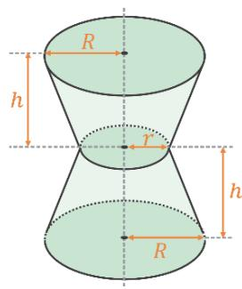

Sabe- se que a base e o topo do vaso são uma circunferência de raio  $R$  que mede  $10 \mathrm{cm}$ , a parte central é uma circunferência de raio  $r$  de  $5 \mathrm{cm}$  e a medida  $h$  mede  $12 \mathrm{cm}$ . Qual é a capacidade volumétrica desse vaso em  $cm^3$ ?

(A)  $1400 \pi$  
(B)  $2100 \pi$  
(C)  $2400 \pi$  
(D)  $2600 \pi$  
(E)  $2800 \pi$
----
## Questão 76

Considere um cilindro  $C$  de altura  $h > 0$  e cujo raio das circunferências, do topo e da base, é  $r > 0$ ; um cilindro  $C_1$  cujo raio é igual ao de  $C$  e altura igual a  $\frac{h}{2}$ ; e um cilindro  $C_2$  com altura  $h$  e raio igual a  $\frac{r}{2}$ .

Sendo  $V$ ,  $V_1$  e  $V_2$  os volumes e  $A$ ,  $A_1$  e  $A_2$  as áreas laterais dos cilindros  $C$ ,  $C_1$  e  $C_2$ , respectivamente, é correto afirmar:

(A)  $V = V_{1} + V_{2}$  e  $A = A_{1} + A_{2}$  
(B)  $V = V_{1} + V_{2}$  e  $A = A_{1} + 2A_{2}$  
(C)  $V = V_{1} + 2V_{2}$  e  $A = A_{1} + 2A_{2}$  
(D)  $V = V_{1} + 2V_{2}$  e  $A = A_{1} + A_{2}$  
(E)  $V = 2V_{1} + 2V_{2}$  e  $A = 2A_{1} + 2A_{2}$
----
## Questão 77

Em relação ao plano cartesiano Oxy, é correto afirmar que as equações  $x^{2} + y^{2} - 4x = - 3$  e  $x^{2} + y^{2} - 4y = - 3$  representam

(A) duas circunferências com raios de mesma medida e que se interceptam em dois pontos. 
(B) duas circunferências com raios de medidas diferentes e que se interceptam em dois pontos. 
(C) duas circunferências que se interceptam em um único ponto. 
(D) duas circunferências concentricas e que não se interceptam. 
(E) duas circunferências com centros distintos e que não se interceptam.
----
## Questão 78

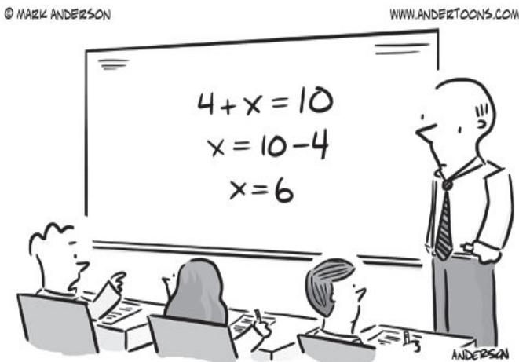

"Hold on. When we learned Roman numerals, X was 10. Now it's 6. What's going on around here?!"

Disponível em https://andertoons.com/math/cartoon/7359/.

Contribui para o efeito decomicidade do cartum a

Contribui para o efeito decomicidade do cartum a(A) atitude do docente diante da apatia do grupo, incapaz de produzir uma resposta. (B) certeza do aluno em seu argumento, desafiando a autoridade do professor. (C) interpretação por parte do discente de símbolos matemáticos ligados à teoria dos conjuntos. (D) adoção pelo professor de duas formas semelhantes e eficazes de resolver a mesma equação. (E) rivalidade entre os colegas para determinar quem possui mais conhecimento.
----
## Questão 79

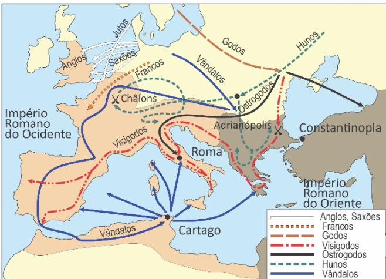

Migrações e invasões no Império Romano, séculos IV e V.

Disponível em https://www.britannica.com/ (Adaptado).

A análise do mapa permite identificar deslocamentos de povos não romanos caracterizados

(A) pela concentração de rotas migratórias em território bizantino. 
(B) pela inexistência de invasões direcionadas para o norte da Africa. 
(C) pela inexpressiva diversidade de povos das correntes migratórias. 
(D) pela proeminência de migrações na porção ocidental do Império Romano. 
(E) pela predominio de invasões por rotas marítimas em detrimento das rotas terrestres.
----
## Questão 80

Leia o excerto a seguir de A Etica Protestante e o Espirito do Capitalismo, de Max Weber.

"Temos de nos emancipar da seguinte visao: que se pode deduzir a Reforma das transformações econômicas como algo 'necessario em termos de desenvolvimento histórico'. Por outro lado, nao se deve de forma alguma defender uma tese tao disparatadamente doutrinária que afirmasse que o 'espirito capitalista' pode surgir somente como resultado de determinados influxos da Reforma.

Em face da enorme barafunda de influxos recíprocos entre as bases materiais, as formas de organização social e política e o conteúdo espiritual das epocas culturais da Reforma, procederemos tao- so de modo a examinar de perto se, e em quais pontos, podemos reconhecer determinadas 'afinidades eletivas' entre certas formas da fe religiosa e certas formas da etica profissional. Por esse meio serao elucidados o efeito que, em virtude de tais afinidades eletivas, o movimento religioso exerceu sobre o desenvolvimento da cultura material."

WEBER, Max. A Etica Protestante e o Espirito do Capitalismo. Sao Paulo: Companhia das Letras, 2004, p.82- 83 (Adaptado).

A partir da ideia expressa no excerto acerca da relacao entre o desenvolvimento do capitalismo e alguns elementos da doutrina calvinista, e corroto afirmar que

(A) as ideias calvinistas impulsionaram o capitalismo e levaram os comerciantes germanicos a buscar a acumulação irrestrita de capitais. 
(B) o crescimento acelerado dos mercados consumidores facilitou, no século XVI, a aceitação das ideias calvinistas pelos banqueiros e negociantes europeus. 
(C) as condições materiais, sociais e políticas da Europa Central contribuíram, no século XVI, para a expansão do capitalismo e para a repressão do calvinismo. 
(D) a união entre os comerciantes contra o Sacro Império Romano Germanico e contra o Papado determinou a adoção de práticas capitalistas e calvinistas na Europa medieval. 
(E) a defesa calvinista do trabalho árduo e o estimulo ao comportamento austero do crente tiveram impactos positivos na formação de condutas adequadas ao desenvolvimento do capitalismo.
----
## Questão 81

"O eixo economico do pais, que ja havia se deslocado para a zona de mineracao, caminhou mais uma vez, deslocando- se em direcao as ondulacoes do planalto paulista, que foram se recobrindo pelo verde escuro dos cafesais. Enquanto outras regioes brasileiras vegetavam ou iniciavam mesmo um processo de decadencia economica, a Provincia, logo depois estado de Sao Paulo, apresentava uma ascensao esplendida e vigorosa."

PETRONE, Pasquale. As industrias paulistanas e os fatores de sua expansao. Terra Livre. 1953, p. 27 (Adaptado).

Sobre a industrializacao no territorio brasileiro, e corroto afirmar:

(A) Tal como Sao Paulo, a Zona Franca de Manaus teve a expansao de suas industrias dada pelo potencial do mercado consumidor local dos produtos resultantes da industrializacao. 
(B) O Nordeste teve sua expansao industrial durante o Estado Novo, em razao da alta concentração de capitais dos estados da regiao, permitindo conexoes dos seus polos industriais ja consolidados. 
(C) O boom industrial que aconteceu na regiao Sul, a partir da decada de 1980, foi similar ao desenvolvimento ocorrido no Sudeste, onde a mao de obra especializada aumentou a producao. 
(D) A concentracao industrial no Sudeste ocorreu devido a existencia de mercado consumidor, de capitais, de mao de obra disponivel se de maior capacidade dos meios de transporte. 
(E) A regiao Centro-Oeste contou com a facilidade de obtencao de energia, por meio de hidrelétricas e termoeletricas, alem da densa malha viaria para o seu desenvolvimento industrial.
----
## Questão 82

Mais de uma vez, o brasileiro Machado de Assis e o portugues Eça de Queiros foram aproximados porque tracaram linhas de compreensao das suas respectivas sociedades, em um mesmo tempo historicamente situado. Os protagonists Rubiao, de Quincas Borba (1891), e Goncao, de A llustre Casa de Ramires (1900),

(A) representam, respectivamente, a ascensao politica da burguesia brasileira durante a segunda metade do seculo XIX e a decadencia da aristocracia portuguesa no mesmo periodo. 
(B) tem suas aspiracoes de grandeza e reconhecimento social frustradas diretamente pelo envolvimento de ambos com as politicas partidarias nacionais, introduzindo reformas substanciais que alteram a situaao periferica de cada pais. 
(C) buscam reconhecimento social, continuamente frustrados nesse proposito por se inserirem em meios sociais que privilegiam a grandeza moral e as virtudes humanas. 
(D) comprometem-se com a superacao dos atrasos civilizacionais de seus paises. Apesar de terem destinos diferentes, confrontam-se com o descompromisso de suas respectivas sociedades quanto as transformacoes sociais e economicas. 
(E) sao vtimas de suas ideias ambiciosas de modernizacao nacional, seja por Rubiao promover ideias politicas "modernas", seja por Goncao insistir na restauracao da grandeza de sua familia. Ao final, atingem seus objetivos.
----
## Questão 83

O funcionario publico como personagem literario ganha destaque na literatura brasileira a partir dos anos 1930. Uma explicacao para esse fenomeno esta na tematizacao, por parte dos escritores, das mudanças do papel do Estado brasileiro na constituicao do mercado de trabalho assalariado e como agente da modernizacao do pais:

"De 1930 em diante, foram criadas dozenas de comissoes, instituicoes e orgaos de planejamento e/ou de promoção das atividades economicas, notadamente as ligadas às atividades agrícolas e aquelas voltadas para a industrialização."

MATTOS, Fernando Augusto Mansor de. A trajetória do emprego publico no Brasil desde o mico do seculo XX. Lisubos 172, v.50, n.2, p.93, jun.2015.

No romance Os ratos, de Dyonelio Machado, o funcionalismo publico configura- se como

(A) solugao final para o conflito basico da narrativa, uma vez que é a partir de seu emprego publico que o protagonista do romance obtem recursos para superar as limitacoes financeiras que, inicialmente, impulsionam sua perambulacao pela cidade. 
(B) principal opcao de sobrevivencia para os homens livres da sociedade brasileira recem-saida da escravidao, em especial para os personagens negros, a quem era impossivel, de outro modo, alcar posicoes nos estratos sociais mais elevados. 
(C) retrato da constituicao de uma cultura organizacional ligada ao Estado, cuja dinamica conduz, ao longo do seculo XX, ao desenvolvimento economico do pais e a vertiginosa ascensao social das classes meidas, apontada pelo desfecho positivo do romance. 
(D) opcao de ocupacao para as camadas meidas da sociedade brasileira, que, embora constituia meio legitimo de sobrevivencia, acaba por marginaliza das pela precarizacao dos ganhos e a desvalorizacao do trabalho, como retrata a trajetoria do protagonista. 
(E) estrutura de trabalho de cunho patrimonialista, cujas posicoes de autoridade sao ocupadas pelas camadas proprietarias e na qual a distribucao de cargos publicos, entre os quais o do protagonista, objetivava a garantia de apoio politico e social.
----
## Questão 84

Leia os trechos das obras Marilia de Dirceu e Romanceiro da Inconfidencia:

Lira VII (Parte II)

"Meu prezado Glauceste, Se fazes o conceito Que, bem que reu, abrigo A candida Virtude no meu peito; Se julgas, digo, que menego ainda Da tua mao socorro; Ah! Vem dar- mo agora, Agora, sim, que morro!

Nao quero que, montado No Pegaso fogoso, Venhas com dura lanca Ao monstro infame traspassar, raivoso. Deixa que viva a perida calunia, E forje o meu tormento: Com menos, meu Glauceste, Com menos me contento."

Tomas Antonio Gonzaga. Marilia de Dirceu.

Romance LXVI ou De Outros Maldizentes

"Que fica, na fontaleza, daquele poeta Gonzaga? - Um par de esporas, somente. Um par de esporas de prata. (...) Dizem que tinha um cavalo que Pegaso se chamava. Nao pisava neste mundo, mas nos planetos da Arcadia!"

Cecilia Meireles. Romanceiro da Inconfidencia.

Considerando o substantivo Pegaso, presente nos dois excertos, e correto afirmar:

(A) No poema de Cecilia Meireles, a referencia tem por objetivo destacar o animal mitico, enquanto na lira de Gonzaga o substantivo se refere a um animal real. 
(B) No poema de Gonzaga, a referencia ao animal mitológico serve para aludir às características heroicas de Glauceste, enquanto, no poema de Cecilia Meireles, Pegaso alude à criação poética. 
(C) Por pretender um tom épico, Cecilia Meireles usa o animal mitológico para distinguir a condição heroica do poeta, enquanto Gonzaga se refere às suas diferencias com Glauceste. 
(D) No poema de Cecilia Meireles, a metáfora do cavalo alado indica a evasão da realidade, típica dos poetas arcades, enquanto, no poema de Gonzaga, a referência ao animal serve para aludir às suas próprias características heroicas. 
(E) A referência ao cavalo alado provoca um efeito de estranhamento no leitor, tendo em vista as características específicas de cada obra poética.
----
## Questão 85

"Se a derrama for lança, há levante, com certeza. Corre- se por essas ruas? Corta- se alguma cabeça? Do cimo de alguma escada, profere- se alguma arenga? Que bandeira se desdobra? Com que figura ou legenda? Coisas da Maçonaria, do Paganismo ou da Igreja? A Santíssima Trindade? Um génio a quebrar algumas? Atrás de portas fechadas, à luz de velas acesas, entre sigilo e espionagem, acontece a Inconfidência."

Os versos de Cecília Meireles, no Romanceiro da Inconfidência, remetem

(A) à insurreição promovida por maçons e reinóis, adeptos do iluminismo, contra a cobrança do quinto real sobre a exploração de diamantes na Capitania de Minas Gerais. 
(B) à possibilidade de sublevação motivada pela defesa da liberdade, por indivíduos de diferentes setores de Minas Gerais, ante a ameaça de cobrança de impostos metropolitanos. 
(C) à disputa entre católicos apoiadores do recolhimento do dízimo nas Minas Gerais e republicanos defensores da suspensão de impostos cobrados pelo Estado e pela Igreja. 
(D) ào movimento de setores reacionários da sociedade mineira, responsáveis por conspirar contra os idealizadores da Conjuração e denunciar os seus planos de revolução. 
(E) à trapaga e delação, que fizeram parte da Conjuração e ocorreram em razão das discrepáncias ideológicas dos denunciantes em relação aos rebelados.
----
## Questão 86

No texto intitulado Tarsila, a pesquisaadora Aracy Amaral transcreve um trecho das impressões de Tarsila do Amaral sobre a viagem às cadades históricas coloniais mineiras, que realizara em 1924 com o grupo modernista, liderado por Mário de Andrade: "...) As decorações murais de um modesto corredor de hotel; o forro das salas, feito de taquarinhas coloridas e trançadas; as pinturas das igrejas, simples e comoventes, executadas com amor e deveção por artistas anônimos; o Aleijadinho, nas suas estátuas e nas linhas geniais da sua arquitetura religiosa, tudo era motivo para as nossas exclamações admirativas. Encontrei em Minas as cores que adorava em crianca, Ensinaram- me depois que eram feitas e caipiras. Segui o ramerrão do gosto apurado... Mas depois vinguei- me da opressão passando- as para as minhas telas: azul puríssimo, rosa violáceo, amarelo vivo, verde cantante, tudo em gradações mais ou menos fortes, conforme a mistura de branco. Pintura limpa, sobretudo, sem medo de cânones convencionais. Liberdade e sinceridade, uma certa estilização que a adaptava à época moderna."

AMARAL, Tarsila, 1939. Apud AMARAL, Aracy. Tarsila, In: Tarsila do Amaral. São Paulo: Fundação Finambras, s.d, p.4.

Tarsila do Amaral, O mamoeiro, 1925, óleo s/ tela, 65,0 cm x 70,0 cm. Coleção Mário de Andrade - incluítao de Estudos Brasileiros da Universidade de São Paulo. Reprodução fotográfica: Rômulo Fialdini. Disponível em: https://enciclopedia.itaucultural.org.br/.

Considerando a obra O Mamoeiro, de Tarsila do Amaral, qual e o principal elemento que caracteriza a influência do movimento modernista brasileiro na pintura?

(A) O emprego de recursos pictóricos que realçam os efeitos de luz e sombra na cena retratada. 
(B) A representação de aspectos da cultura brasileira, valorizando uma paisagem local. 
(C) A simplificação de formas geométricas abstratas. 
(D) A inspiração na arte africana e na produção simbólica de povos originários. 
(E) A incorporação da colagem e de técnicas mistas como procedimentos artísticos centrais.
----
## Questão 87

# Tecidos de Ijebu

"Os ijebus vestem- se quase sempre com panos produzidos por eles proprios. Sao fazendas de algodao, materia- prima que obtem localmente. Nas familias, as tarefas de colher algodao, fia- lo, tecé- lo e tingi- lo esta costumeiramente a cargo das mulheres, e sabe- se ser muito grande a quantidade de tecidos manufaturados em ljebu e dali exportados, nao apenas para os países vizinhos, mas ate mesmo para o Brasil, cujos navios vem buscar em Lagos essa mercadoria tao apreciada pela gente de origem africana transplantada para aquela terra distante. As cores mais comuns, depois da branca o de azul, saco a america, a vermelha, a caramoseim e a vorda. Alguns panos sao de uma so cor, outros sao multicoloridos."

OSIFEKUNDE. Noticia sobre o pais e o povo dos ljebus. In: COSTA E SILVA, Alberto. Imagens da Africa. Sao Paulo: Penguin, 2012. p.361.

O texto e parte de um relato das memorias de um exescravizado natural de ljebu, na atual Nigeria, trazido ao Brasil no inficio do scculo XIX. O excerto faz mencao

(A) a existencia de um comercio de produtos manufaturados entre a Africa e a America. 
(B) a prerogativa masculina na producao de tecidos naquela regiao da Africa. 
(C) a baixa qualidade das manufaturas africanas em comparacao com as da Europa. 
(D) a impossibilidade de acesso, por africanos e afrodescendentes, a produtos vindos da Africa. 
(E) ao comercio de africanos escravizados para o trabalho nas plantacoes de algodao.
----
## Questão 88

"Consiste em uma faixa de terra semiarida e arida que contorna a borda sul do Deserto do Saara e percorre a extensao da Africa no sentido leste- oeste. Atua como um tinturao que divide o continente africano em dois, a Africa majoritariamente islamica, ao norte, e a crista, ao sul. Englopando ao menos onze países, a regiao é lar para dezenas de grupos etnicos."

VAGEN, Tor- Gunnar; GUMBRICHT, Thomas. UNEP/ONU, 2012 (Adaptado).

O texto descreve caracteristicas da regiao denominada de

(A) Chifre da Africa. 
(B) Africa Meridional. 
(C) Africa Setentrional. 
(D) Rift Valley. 
(E) Sabol.
----
## Questão 89

"Aconteceu num debate, num pais europeu. Da assistencia alguem me lancou a seguinte pergunta:

- Para si, o que é ser africano?

Falava-se, inevitavelmente, de identidade versus globalizacao. Respondi com uma pergunta:

- E para si, o que é ser europeu?

O homem gaguejou. Nao sabia responder. Mas o interessante é que, para ele, a questao da identidade se colocava naturalmente para os africanos. Nao para os europeus. Ele nunca tinha colocado aquestão no espelho.

Recordo o episodio porque me parece que ele toca uma questiono central: quando se fala de Africa, de qual Africa estamos falando? Terao continente africano uma essencia facilmente capturado? Havera uma substancia exotica que os caçadores de identidades possam recolher como sendo a alma africana?"

COUTO, Mia. "Um retrato sem moldura". In: HERNANDEZ, Leila Leite. A Africa na sala de aula: visita à historia contemporanea. Sao Paulo: Selo Negro, 2008. p.11.

Ao relatar e comentar o episodio, o escritor mozambicano Mia Couto apresenta a Africa como

(A) uma construgao historica proporcionada pela acao humanitaria dos colonizadores europeus. 
(B) um resultado natural da luta dos povos do continente contra a dominacao estrangeira. 
(C) uma regiao historicamente afetada por graves problemas demograficos e sanitarios. 
(D) um continente definido a partir de critérios politicos e geograficos deteministas. 
(E) um mosaico composto por relacoes economicas, politicas e culturais instaveis.
----
## Questão 90

"Brasil, meu Brasil brasileiro Meu mulato inzoneiro. You cantar- te nos meus versos O Brasil, samba que dá Bamboleio, que faz gingar O Brasil do meu amor Terra de Nosso Senhor Brasil, pra mim O, abre a cortina do passado Tira a mane preta do terrado Bota o Rei Congo no congado Brasil, pra mim (...) O! Esse coqueiro que dá coco Onde eu amarro a minha rede Nas noites claras de guar Brasil, pra mim O! Ouve essas fontes murmurantes Onde eu mato a minha sede E onde a lua vem brincar O! Este Brasil lindo e trigueiro E o meu Brasil, brasileiro Terra de samba e pandeiro Brasil, pra mim"

A cancao Aquarela do Brasil foi composta por Ari Barroso e lancada no ano de 1939. Sua letra permite identificar temas que guardam afinidades com a política cultural do Estado Novo, podendo ser destacada a

(A) discriminacao em relacao a afrodescendentes. 
(B) exaltacao das virtudes naturais e nacionais. 
(C) concepcao civilizatoria assentada na religiao catolica. 
(D) valorizacao da cultura cabocla e do regionalismo. 
(E) escolha do malandro como simbolo nacional.
----
