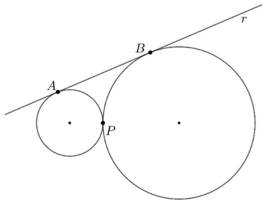
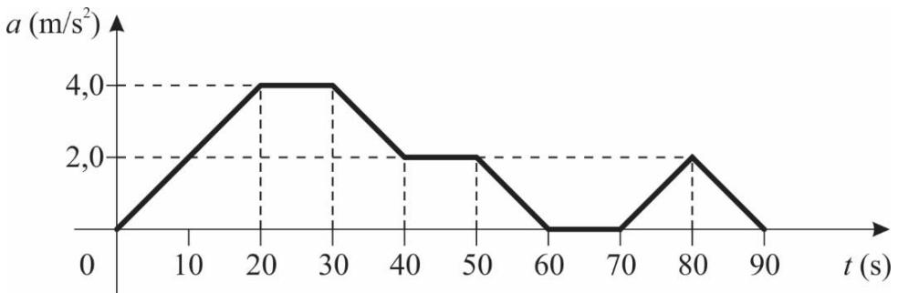
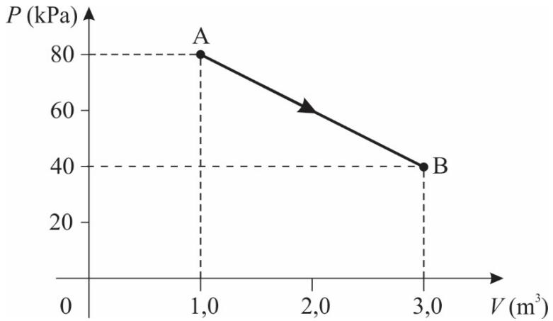
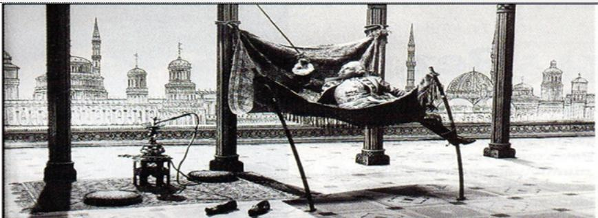

----
## Questão 8

a) afastar-se da sala, a qualquer tempo, portando o caderno de prova, o cartão-resposta ou a versão definitiva (quando houver);  
b) descumpir instruções/determinações contidas no caderno de prova ou receições de qualquer membro da equipe de aplicação;  
c) destacar ou rasgar qualquer página do caderno de prova, salvo a parte reservada para anotação das respostas do próprio candidato, devidamente indicada na capa do caderno de prova (quando houver);  
d) faltar com o devido respeito para com qualquer membro da equipe de aplicação da prova, autoridade presente ou outro candidato;  
e) for responsmavel por rudios (som/vibração) emitidos por equipamentos eletrónicos, tais como religio, celular ou outros parelhos eletrónicos;  
f) for surpreendido em comunicação com outro candidato ou terceiros, verbalmente, por escrito ou por qualquer outro meio de comunicação;  
g) mantiver em seu poder religios, aparelhos eletrónicos (por ex. chave de carro, pen drive, fone de ouvido), carteira de documentos/dinheiro ou similares ou qualquer objeto identificável pelo detector de metais;  
h) não assinar o cartão-resposta ou não assinar a versão definitiva;  
i) obtiver deferimento para anotação e cujo acompanhante descumprir as regas de processo;  
j) praticar ates contra as normas, disciplina ou que gerem desconforto durante a aplicação da prova;  
k) realizar anotação de informações relatinas às suas respostas em qualquer outro meio que não o permitido;  
l) recusar-se a aguardar a salida simultânea, em razão de ser um dos três últimos candidatos da torna presentes na sala de prova;  
m) recusar-se a entregar o material da prova (caderno de prova, cartão-resposta ou versão definitiva) ao término do tempodestadado para a sua realização;  
n) recusar-se a passar pela inspeção de segurança e deteccção de metais a qualquer momento;  
o) retirar-se do local de prova antes de decorrida 01h30min do seu inicio;  
p) utilizar meios fraudulentos ou ilegais (eletrónicos, estatisticos, visuais, grafologicos ou outros procedimentos ilícitos) para obter para si ou para terceiros a aproveção no processo.

9. Ao concluir a prova, permaneça em seu lugar e comunique ao aplicador de prova. Aguarde autorização para entregar o material de prova.

10. Se desejar, anote as respostas no quadro disponível no verso desta folha, recorte na linha indicada e leve-orconsigo.

11. Após sair definitivamente da sala de prova, dirija-se imediatamente ao portão de saída e retire-se do local de prova, sob pena de ser excluido do Processo Seletivo.

<table><tr><td colspan="10">RESPOSTAS</td></tr><tr><td>01 -</td><td>10 -</td><td>19 -</td><td>28 -</td><td>37 -</td><td>46 -</td><td>55 -</td><td>64 -</td><td>73 -</td><td>82 -</td></tr><tr><td>02 -</td><td>11 -</td><td>20 -</td><td>29 -</td><td>38 -</td><td>47 -</td><td>56 -</td><td>65 -</td><td>74 -</td><td>83 -</td></tr><tr><td>03 -</td><td>12 -</td><td>21 -</td><td>30 -</td><td>39 -</td><td>48 -</td><td>57 -</td><td>66 -</td><td>75 -</td><td>84 -</td></tr><tr><td>04 -</td><td>13 -</td><td>22 -</td><td>31 -</td><td>40 -</td><td>49 -</td><td>58 -</td><td>67 -</td><td>76 -</td><td>85 -</td></tr><tr><td>05 -</td><td>14 -</td><td>23 -</td><td>32 -</td><td>41 -</td><td>50 -</td><td>59 -</td><td>68 -</td><td>77 -</td><td>86 -</td></tr><tr><td>06 -</td><td>15 -</td><td>24 -</td><td>33 -</td><td>42 -</td><td>51 -</td><td>60 -</td><td>69 -</td><td>78 -</td><td>87 -</td></tr><tr><td>07 -</td><td>16 -</td><td>25 -</td><td>34 -</td><td>43 -</td><td>52 -</td><td>61 -</td><td>70 -</td><td>79 -</td><td>88 -</td></tr><tr><td>08 -</td><td>17 -</td><td>26 -</td><td>35 -</td><td>44 -</td><td>53 -</td><td>62 -</td><td>71 -</td><td>80 -</td><td>89 -</td></tr><tr><td>09 -</td><td>18 -</td><td>27 -</td><td>36 -</td><td>45 -</td><td>54 -</td><td>63 -</td><td>72 -</td><td>81 -</td><td>90 -</td></tr></table>

# MATEMÁTICA
----
## Questão 1

A) -2 
B) 0 
C)3 
D) 4 
E) 5
----
## Questão 2

A) 6 
B) 7 
C) 8 
D) 9 
E) 10
----
## Questão 3

A) 1/2 
B)  $\sqrt{3}$  
C) 1 
D) 2 E)3
----
## Questão 4

A)  $\sqrt{5}$  
B)  $\sqrt{10}$  
C) 5/2 
D) 5 
E) 10
----
## Questão 5

A- 5 
B) -4 
C) -1 
D) 2 
E) 5
----
## Questão 6

A) 9 
B) 12 
C) 18 
D) 36 
E) 120
----
## Questão 7

A) 1/3 
B) 2/3 
C) 4/3 
D) 1 
E) 2
----
## Questão 8

A) 2/25 
B) 3/25 
C) 7/25 
D) 9/25 
E) 16/25
----
## Questão 9

A)  $\sqrt{3}$   
B)  $\sqrt{5}$   
C)  $2\sqrt{2}$   
D)  $2\sqrt{3}$   
E)  $2\sqrt{5}$

# FísICA

Atengao: em todas as questoes, as medioces sao feitas por um referencial inercial. O modulo da aceleracao gravitacional e representado por  $g$  . Quando for necessario, use  $g = 10m / s^2$  para o modulo da aceleracao gravitacional.
----
## Questão 10

Um objeto de massa constante  $m = 0,2 \text{kg}$  desloca- se em um movimento unidimensional ao longo de uma linha reta, e sua aceleração  $a$  é medida em função do tempo  $t$ , obtendo- se, então, o gráfico a seguir:

A)  $F = 0,0 \text{N}$   
B)  $F = 0,4 \text{N}$   
C)  $F = 0,8 \text{N}$   
D)  $F = 4,0 \text{N}$   
E)  $F = 8,0 \text{N}$
----
## Questão 11

Um objeto de massa constante  $m = 0,2 \text{kg}$  desloca- se em um movimento unidimensional ao longo de uma linha reta, e sua aceleração  $a$  é medida em função do tempo  $t$ , obtendo- se, então, o gráfico a seguir:

A)  $v_{2} = 35 \text{m / s}$   
B)  $v_{2} = 45 \text{m / s}$   
C)  $v_{2} = 55 \text{m / s}$   
D)  $v_{2} = 65 \text{m / s}$   
E)  $v_{2} = 75 \text{m / s}$
----
## Questão 12

Um objeto de massa constante  $m = 0,2 \text{kg}$  desloca- se em um movimento unidimensional ao longo de uma linha reta, e sua aceleração  $a$  é medida em função do tempo  $t$ , obtendo- se, então, o gráfico a seguir:

A)  $W = -10 \text{J}$   
B)  $W = -5 \text{J}$   
C)  $W = 0 \text{J}$   
D)  $W = 5 \text{J}$   
E)  $W = 10 \text{J}$
----
## Questão 13

A)  $e = 0,70 \text{cm}$   
B)  $e = 0,70 \text{km}$   
C)  $e = 70 \text{mm}$   
D)  $e = 70 \mu \text{m}$   
E)  $e = 70 \text{nm}$
----
## Questão 14

A)  $i = 20 \text{A}$   
B)  $i = 10 \text{A}$   
C)  $i = 5,0 \text{A}$   
D)  $i = \sqrt{20} \text{A}$   
E)  $i = 0,050 \text{A}$
----
## Questão 15

A)  $v = 6,25 \text{m / s}$   
B)  $v = 12,5 \text{m / s}$   
C)  $v = 50,0 \text{m / s}$   
D)  $v = 100 \text{m / s}$   
E)  $v = 200 \text{m / s}$
----
## Questão 16

Uma dada quantidade de gas ideal executa o processo termodinamico apresentado no grafico a seguir, iniciando no ponto A e terminando no ponto  $B$ :

A)  $\begin{array}{r}\frac{T_B}{T_A} = \frac{3}{4}\\ \frac{T_B}{T_A} = \frac{4}{3}\\ \frac{T_B}{T_A} = \frac{2}{3}\\ \frac{T_B}{T_A} = \frac{1}{2}\\ \frac{T_B}{T_A} = \frac{3}{2} \end{array}$  
B) 
C) 
D) 
E)
----
## Questão 17

Uma dada quantidade de gas ideal executa o processo termodinamico apresentado no grafico a seguir, iniciando no ponto A e terminando no ponto  $B$ :

A)  $W = 20 \text{kJ}$   
B)  $W = 40 \text{kJ}$   
C)  $W = 80 \text{kJ}$   
D)  $W = 120 \text{kJ}$   
E)  $W = 160 \text{kJ}$
----
## Questão 18

A)  $p' = -12,0$  cm  
B)  $p' = -6,0$  cm  
C)  $p' = +4,0$  cm  
D)  $p' = +6,0$  cm  
E)  $p' = +12,0$  cm

# QUIMICA
----
## Questão 19

Qual metodo de separacao é descrito nesse processo de enriquecimento do metal?

A) Filtração  
B) Flotação  
C) Destilação  
D) Decantação  
E) Centrifugacao
----
## Questão 20

Driscoll, D. M. et al. Observation of a promethium complex in solution, Nature, n. 629, p. 819, 2024.

O esquema a seguir ilustra esse processo:

$$
\begin{array}{r}{146\mathsf{N d} + \mathsf{A}\longrightarrow \mathsf{\Gamma}_{60}\mathsf{N d}\longrightarrow \mathsf{\Gamma}_{61}\mathsf{P m} + \mathsf{\beta}} \end{array}
$$

Considerando as informações apresentadas, a espécie indicada por A, no esquema, corresponde a um(a):

A) prôton.  
B) elétron.  
C) fóton gama.  
D) particula (radiação) alfa.  
E) néutron.
----
## Questão 21

A) [Ne]  $3s^2 3p^1$   
B) [Ne]  $3s^2 3p^6 3d^5$   
C) [Ar]  $3d^6 4s^2$   
D) [Ar]  $3d^{10}4s^2 4p^1$   
E) [Kr]  $5s^2 4d^1$
----
## Questão 22

$$
\mathrm{Cu_2CO_3(OH)_2 + 8SiO_2 + 2CaCO_3\longrightarrow 2CaCuSi_4O_{10} + 3CO_2 + H_2O}
$$

Em um experimento, foram misturados 221 gramas de  $\mathrm{Cu_2CO_3(OH)_2}$ , 600 gramas de  $\mathrm{SiO_2}$  e 1000 gramas de  $\mathrm{CaCO_3}$ .

Considerando as informações formecidas e que a massa molar  $(\mathsf{g}\mathsf{mol}^{- 1})$  de  $\mathrm{Cu_2CO_3(OH)_2}$  é 221, a de  $\mathrm{SiO_2(s)}$  é 60, a de  $\mathrm{CaCO_3}$  é 100 e a de  $\mathrm{CaCuSi_4O_{10}}$  é 376, qual será a massa de pigmento azul egípcio obtida, em gramas?

A) 188  
B) 221  
C) 752  
D) 940  
E) 1821
----
## Questão 23

  
Diclorometano

Considerando as informacoes presentadas, qual e o valor de angulo, para a molecula do diclorometano, entre as ligaoes H- C- H que mais se aproxima do observado experimentalmente?

A)  $30^{\circ}$  
B)  $90^{\circ}$  
D)  $180^{\circ}$  
E)  $360^{\circ}$
----
## Questão 24

A) Metalica 
B) lonica 
C) De hidrogeno 
D) Covalente simples 
E) Covalente multipla
----
## Questão 25

$$
4\mathsf{NH}_3 + 3\mathsf{O}_2\rightarrow 2\mathsf{N}_2 + 6\mathsf{H}_2\mathsf{O}\qquad \Delta H_1 = -1268\mathsf{kJ}(\mathsf{Reagao}1)
$$

Entretanto, a adocao da amonia encontra varios obstaculos tencios, como o fato de sua combustao tambem produzir oxidos de nitrogeno altamente oxicos. A producao do oxido de nitrogeno mais simples (NO) e mostrada na Reacao 2:

$$
4\mathsf{NH}_3 + 5\mathsf{O}_2\rightarrow 4\mathsf{NO} + 6\mathsf{H}_2\mathsf{O}\qquad \Delta H_2 = -904\mathsf{kJ}(\mathsf{Reagao}2)
$$

Por outro lado, o oxido de nitrogeno e produzido por qualquer motor de combustao interna a partir do nitrogeno atmosferico, como mostra a Reacao 3:

$$
\mathsf{N}_2 + \mathsf{O}_2\rightarrow 2\mathsf{NO}\qquad \Delta H_3 = \mathsf{?}\qquad (\mathsf{Reagao}3) \tag{Reagao 3}
$$

Utilizando os dados fornecidos, assinale a alternativa que apresenta corretamente o valor da variacao da entalpia da Reacao 3  $(\Delta H_3)$  ,em kJ.

A)182 
B) 364 
C) 728 
D) 1086 
E) 2172
----
## Questão 26

Considerando essas informacoes, qual das moleculas a seguir apresenta fungao mista?

A) Acetato de etila 
B) Acetileno 
C)Acido cloroacetico 
D) Anidrido acetico 
E) Cloreto de acetila
----
## Questão 27

Considerando a formula molecular indicada, quantos isomeros estao presentes nessa mistura de alcenos?

A) 12 
B) 8 
C) 6 
D) 4 
E) 2

# BIOLOGIA
----
## Questão 28

<table><tr><td>Variáveis</td><td>Individuo 1</td><td>Individuo 2</td><td>Individuo 3</td></tr><tr><td>Glicose em jejum (mg/dL)</td><td>80</td><td>150</td><td>150</td></tr><tr><td>Insulina em jejum (μU/mL)</td><td>10</td><td>0,4</td><td>40</td></tr><tr><td>HOMA-IR</td><td>1,9</td><td>0,1</td><td>13,5</td></tr></table>

HOMA- IR: modelo matemático de avaliação da homeostase para resistência à insulina.

Referências para análise dos resultados: Glicose normal: 70 a 99 mg/dL Insulina normal: 2 a 13 μU/mL HOMA- IR > 2,7 indica resistência à ação da insulina

Sobre a relação entre as variáveis apresentadas e as possíveis consequências para a saúde dos individuos apresentados na tabela, é correto infimar:

A) O indivíduo 3 apresenta valores elevados de glicose e insulina devido à resistência insulínica, condição em que as células não respondem adequadamente a esse hormônio. 
B) No indivíduo 2, o valor de insulina abaixo do normal se deve ao valor de glicose alto, já que as duas variáveis são inversamente correlacionadas em individuos saudáveis. 
C) O valor de insulina obtido no indivíduo 3 indica a necessidade de tratamento com esse lipidio para normalizar a quantidade de glicose em jejum. 
D) Os valores das variáveis obtidos no indivíduo 1 sugerem que ele apresenta diabetes, doença causada por excesso de lipidios no sangue. 
E) O valor de insulina abaixo do normal no indivíduo 2 se deve à entrada da insulina nas células, fato que ocorre quando a quantidade de glicose está alta.
----
## Questão 29

Com base no texto, assinale a alternativa correta em relação a possíveis consequências da ação da seleção natural.

A) A seleção natural disruptiva altera o código genético dos insetos verdes isolados em áreas de solo arenoso, fazendo com que se tornem amarelos. 
B) A seleção natural estabilizadora promove irradiação adaptativa ao longo das gerações ao favorecer a sobreviência de insetos marrons nas áreas de prados abertos. 
C) A seleção natural direcional, atual do em cada tipo de ambiente, pode levar à diferência entre os insetos ao longo das gerações e à especiação alopatifica. 
D) A seleção natural estabilizadora induz os insetos a soferem mutações nos genes determinantes da cor da carapaca, podendo ocorrer especiação sin pátrica. 
E) A seleção natural direcional, atual do nos três tipos de ambiente, promove alterações moleculares aleatorias na coloração dos insetos, podendo gerar novas adaptações.
----
## Questão 30

A) A seiva bruta transporta os nutrientes inorganicos da fotossintese, como carbofiltratos e aminoacidos, das folhas para outras partes da planta. 
B) O xilema é responsável pelo transporte da seiva elaborada, que é composta principalmente de água e carboidratos. 
C) A seiva bruta contem açúcares e nutrientes orgânicos, enquanto a seiva elaborada contem principalmente água e sais minerais. 
D) A seiva elaborada é produzida pelas folhas e transporta nutrientes orgânicos, como carboidratos, para diferentes partes de planta por meio da fese. 
E) A seiva elaborada se movimenta das raízes em direção às folhas, e a seiva bruta pode movimentar-se em várias direções, dependendo da necessidade da planta.
----
## Questão 31

A) A transcrição das moléculas de DNA recombinantes por meio da ação da enzima ligase gera muitas cópias dessas moléculas, e esse processo é necessário para otimizar a produção de insulina. 
B) A insulina é produzida pelas bactérias a partir da expressão de moléculas de DNA recombinantes, que possuem, além do genoma bacteriano, o gene da insulina humano. 
C) A tecnologia do DNA recombinante consiste na inserção do gene bacteriano de interesse no genoma humano; a partir disso, a insulina passa a ser produzida pelo paciente. 
D) A insulina recombinada combina insulina bacteriana e humana e, em geral, não provoca reações imunológicas porque a imunidade já foi adquirida por meio de vacina. 
E) A combinação de aminoácidos humanos e bacterianos gera as moléculas de DNA recombinantes que serão inseridas em um vetor que irá produzir a insulina.
----
## Questão 32

Com base nessa tela alimentar, assinale a alternativa que descreve corretamente a sequência de níveis tróficos, do nível mais baixo ao mais alto, e os organismos correspondentes a cada nível trófico.

A) Coelhos: produtores  $\rightarrow$  cobras: consumidores primarios  $\rightarrow$  águias: consumidores secundários  $\rightarrow$  fungos: consumidores terciários  $\rightarrow$  capim: decompositores. 
B) Capim: produtores  $\rightarrow$  fungos: consumidores primarios  $\rightarrow$  coelhos: consumidores secundários  $\rightarrow$  cobras: consumidores terciários  $\rightarrow$  águias: consumidores quaternários. 
C) Fungos: produtores  $\rightarrow$  coelhos: consumidores primarios  $\rightarrow$  capim: consumidores secundários  $\rightarrow$  águias: consumidores terciários  $\rightarrow$  cobras: consumidores quaternários. 
D) Capim: produtores  $\rightarrow$  coelhos: consumidores secundários  $\rightarrow$  águias: consumidores terciários  $\rightarrow$  cobras: consumidores quaternários  $\rightarrow$  fungos: decompositores. 
E) Capim: produtores  $\rightarrow$  coelhos: consumidores primarios  $\rightarrow$  cobras: consumidores secundários  $\rightarrow$  águias: consumidores terciários  $\rightarrow$  fungos: decompositores.
----
## Questão 33

A) Anfibios adultos excretam principalmente amônia como uma estratégia para evitar a desidratação. 
B) Os insetos excretam uma uma na pouco concentrada produzida pelos metanefírios. 
C) Mamíferos terrestres conveniem a ureia em amônia, substância menos toxica e menos solúvel. 
D) Os répteis, em geral, perder pouca água na excreção, pois excretam o ácido úrico, altamente insolúvel. 
E) A ureia, por ser a excreta menos toxica, contribui para que embriões de aves se desenvolvam em ovos.
----
## Questão 34

A) O funcionamento enzimático denominado modelo chave-fechadura permite que diversas enzimas atuem na síntese de DNA, otimizando os recursos celulares. 
B) A DNA polimerase degrada o DNA para liberar os nucleotídeos utilizados na síntese de novas moléculas de DNA durante a replicação celular. 
C) Os substratos da DNA polimerase são os desoxirribonucleotídeos livres, os quais são incorporados a uma fita em forma. 
D) As enzimas que sintetizam DNA possuem os centros ativos específicos para os diferentes tipos de aminoácidos que formarão a molécula. 
E) A síntese de DNA ocorre pela ação de enzimas que, em um processo semiconservativo, convertem o RNA mensagem em uma molécula de DNA.
----
## Questão 35

Considerando as informações fornecidas, partindo do estimulo de um neurônio motor em repouso, assinale a alternativa que apresenta a ordem e os eventos corretos responsáveis por efetivar esse movimento.

A) Despolarização: saída de  $\mathsf{K}^{+}$  no neurônio motor  $\rightarrow$  Repolarização: entrada de  $\mathsf{Na}^{+}\rightarrow$  Propagação do potencial de ação  $\rightarrow$  Extremidade do axônio  $\rightarrow$  Liberação de acetilcolina  $\rightarrow$  Ligação de acetilcolina nos receptores de membrana das células musculares esqueléticas. 
B) Repolarização: saída de  $\mathsf{K}^{+}$  no neurônio motor  $\rightarrow$  Despolarização: entrada de  $\mathsf{Na}^{+}\rightarrow$  Propagação do potencial de ação  $\rightarrow$  Extremidade dos dendritos  $\rightarrow$  Liberação de acetilcolina  $\rightarrow$  Ligação de acetilcolina nos receptores de membrana das células musculares esqueléticas. 
C) Despolarização: entrada de  $\mathsf{Na}^{+}$  no neurônio motor  $\rightarrow$  Repolarização: saída de  $\mathsf{K}^{+}\rightarrow$  Propagação do potencial de ação  $\rightarrow$  Extremidade do axônio  $\rightarrow$  Sinapse elétrica  $\rightarrow$  Estímulo elétrico às células musculares esqueléticas. 
D) Repolarização: entrada de  $\mathsf{Na}^{+}$  no neurônio motor  $\rightarrow$  Despolarização: saída de  $\mathsf{K}^{+}\rightarrow$  Propagação do potencial de ação  $\rightarrow$  Extremidade dos dendritos  $\rightarrow$  Sinapse elétrica  $\rightarrow$  Estímulo elétrico às células musculares esqueléticas. 
E) Despolarização: entrada de  $\mathsf{Na}^{+}$  no neurônio motor  $\rightarrow$  Repolarização: saída de  $\mathsf{K}^{+}\rightarrow$  Propagação do potencial de ação  $\rightarrow$  Extremidade do axônio  $\rightarrow$  Liberação de acetilcolina  $\rightarrow$  Ligação de acetilcolina nos receptores de membrana das células musculares esqueléticas.
----
## Questão 36

Genótipos AABB e AaBB resultam em planta alta. Genótipos AABb e AaBB resultam em planta de altura médiana. Genótipos AAbb, Aabb, aaBB ou aaBb resultam em planta baixa. Genótipo aabb resulta em planta muito baixa.

Considerando as informações presentadas, assinale a alternativa que informa corretamente qual é a probabilidade de se obter uma planta de altura médiana na descendência do cruzamento de duas plantas heterozigotas para ambos os genes (AaBb x AaBb).

A) 1/2 
B) 1/4 
C) 3/4 
D) 6/16 
E) 9/16

# GEOGRAFIA
----
## Questão 37

Moreira, J. C.; Sene, E. Geografia: ensino médio. São Paulo: Scipione, 2018. p. 278. (Projeto Multiplo, Parte 2)

Com base no excerto apresentado nos conhecimentos sobre o assunto, assinate a alternativa correta a respeito dos processos de expansão e desenvolvimento do capitalismo mencionados.

A) A fase informacional do capitalismo se caracteriza pela terceira Revolução Industrial, pela integração do comércio mundial e pela industrialização de países em desenvolvimento. 
B) O capitalismo comercial se iniciou no século XIV, quando as potências europeias instituíram a escravidão na África. 
C) A fase do capitalismo industrial comecou no final do século XIX, quando surgiu a indústria automobilística. 
D) O capitalismo financeiro se iniciou com a instituição do Banco Mundial e do Fundo Monetário Internacional, responsáveis por regular os fluxos mundais de capital. 
E) A primeira fase da globalização comecou quando as nações europeias ocuparam territórios na África, na Asia e nas Américas, integrando os continentes em um único mercado.
----
## Questão 38

A) O planejamento estatal não previu o impacto da urbanização no aumento da demanda por alimentos, e a agricultura apresentava baixa produtividade porque a maior parte do território da URSS era coberta por tundra e deserto. 
B) Os Planos Quinquenais soviéticos prioritaram a indústria de alimentos e de outros bens de consumo corrente, a fim de atender às necessidades populares. 
C) Os Planos Quinquenais restringiram a atividade madeireira na Sibéria, motivo pelo qual a Floresta de Taiga se manteve como a segunda maior floresta do mundo. 
D) A Perestroika, implementada pela URSS nos anos 1980, é um conjunto de reformas económicas que substituiu mecanismos de planejamento estatal por mecanismos de economia de mercado. 
E) O sistema planificado se mostrou superior em termos de inovação tecnológica, como visto com a vitória da URSS na corrida espacial contra os EUA.
----
## Questão 39

A) O aquecimento global eleva o volume de água evaporada no planeta, o que reduz as reservas disponíveis em lagos e represas. 
B) O ciclo da água e produzido pela energia do sol; assim como ocorre com as massas de ar, e pela força da gravidade. 
C) A maior parte da água doce está nas bacias hidrográficas e nos grandes lagos, e a Bacia Amazônica é a maior reserva mundial desse recurso. 
D) Uma etapa básica do ciclo da água é o escoamento superficial, processo em que as águas continentais escoam para o oceano por meio de redes de denagem. 
E) O grande volume anual de chuva na Amazônia cria correntezas velozes, e essa velocidade responde pela quantidade de sedimentos transportados por esses rios.
----
## Questão 40

A) As energias renováveisi já respondem por mais da metade da produção energetica na China, superando o Brasil em termos de participação dessas fontes na produção nacional. 
B) O petróleo vem sendo explorado nos EUA desde o século XIX, e o esgotamento de suas reservas fez desse país um dos maiores consumidores mundiais de energia gerada por fontes não renováveis. 
C) O etanol é uma fonte de energia renovável, mas o uso de terras agrícolas para a produção de biocombustível pode contribuir para o desmatamento de reas naturais. 
D) A participação dos combustíveis fóseais no consumo mundial de energia nos últimos 20 anos recuou fortemente devido ao aumento da produção de energia eólica e solar. 
E) O elevado potencial brasileiro para a produção de energia hidrelétrica e geotérmica permitiu atender ao aumento da demanda nacional por eletricidade sem recorrer a fontes não renováveis.
----
## Questão 41

A) Os países com grandes áreas de vegetação natural apresentam percentuais mais elevados de população rural, o que implica um ritmo mais lento de urbanização. 
B) Na União Europeia, a urbanização desacelerou a partir da década de 1970, quando a política agrícola comum foi implementada com o objetivo de reter a população no campo. 
C) A urbanização se define, nos países desenvolvidos, por metrópoles densamente povoadas, enquanto países emergentes têm cidades com população mais dispersa. 
D) Os países onde a taxa de urbanização é inferior a 50% se concentram na África subsaariana e no sul da Ásia, regiões essas com os maiores números de pessoas extremamente pobres no mundo. 
E) Projeções da ONU indicam que as tecnologias de trabalho remoto reduzirão o éxodo rural, freando o processo de urbanização por permitirem que a população more no campo e trabalho em empregos urbanos.
----
## Questão 42

A) A revolução tecnológica já atingiu seu potencial de aumento da produção, de modo que, para continuar enfrentando a explosão demográfica, é preciso um novo modelo produtivo. 
B) O aumento de produção se deu por meio da ocupação de grandes áreas de florestas, sendo, portanto, ambientalmente insustentável. 
C) Cereais são plantas adaptadas a regiões de clima temperado, de modo que o aumento de produtividade se concentrou no hemisfério Norte. 
D) O uso intensivo de maquinário, fertilizantes químicos e pesticidas eleva os custos de produção agrícola, de modo que o aumento da produção se deu pelos investimentos do agronegócio. 
E) O crescimento da produção de cereais no mundo foi resultado das tecnologias da revolução verde e provocou a diminuição da desnutrição em escala mundial.
----
## Questão 43

Rosling, H. Factfulness: abóbito libertador de só ter opiniões baseadas em fatos. 2. ed. Rio de Janeiro; São Paulo: Record, 2019. p. 102.

# Sobre os fatores que afetam as mudanças expressas nos indicadores de qualidade de vida, assinale a alternativa correta.

A) O Egito exemplifica um processo mundial de melhora das condições de vida causada pela combinação de crescimento econômico com progresso tecnológico. 
B) A redução da mortalidade infantil é um avanço social que impõs o desafio de enfrentar o aumento das taxas de crescimento demográfico em países múculmanos. 
C) A melhora das condições de saúde foi mais rápida na África do que na Ásia e América Latina devido às campanhas de vacinação contra a malária, doença que era epidémica no continente africano. 
D) O salto de qualidade de vida descrito ocorreu nos países subdesenvolvidos exportadores de petróleo, como o Egito. 
E) A comparação entre os países citados mostram mais rapidamente.
----
## Questão 44

A) As capitais dos estados da Região Norte não alcançam o nível de metrópoles devido às baixas taxas de urbanização regionais. 
B) São Luís do Maranhão e considerada uma cidade regional porque exerce influência em seu estado sem chegar a ser uma metrópole. 
C) São Paulo e Rio de Janeiro são as duas metrópoles com maiores áreas de influência dentro da rede urbana brasileira. 
D) Corumba ainda não atingiu o nível de metrópole regional devido ao papel propulsor da agricultura na economia do Centro-Oeste, que retem a população no campo. 
E) Rio Branco, capital do Acre, é classificada como metrópole internacional porque sua posição geográfica lhe permite exercer influência sobre cidades da Bolívia.
----
## Questão 45

A) As políticas públicas aplicadas pela Superintendência do Desenvolvimento do Nordeste (Sudene) fizeram com que a participação nordestina no PIB nacional dobresse no período considerado. 
B) A participação do estado de São Paulo no PIB industrial do país diminuiu devido ao crescimento mais rápido da indústria em outros estados. 
C) A Grande Região Centro-Oeste manteve seu nível de participação no PIB nacional em um patamar baixo, pois a agricultura é uma atividade que tende a perder importância na economia moderne. 
D) O crescimento econômico da Região Norte foi mais lento do que a média nacional, pois as legislações ambientais impuseram restrições crescentes à exploração dos recursos naturais da Amazônia. 
E) A construção de Brasília cumpriu o objetivo de reduzir a concentração popularacional nos estados litorâneos, pois induziu a migração de população para os estados interiores.

# HISTORIA
----
## Questão 46

A) osacos diplomaticos estabelecidos com as regioes do norte da Europa cristai, especialmente o tratado entre o califado abassida e o reino franco de Carlos Martel. 
B) a permissao de que povos conquistados mantivessem suas religioes mediante o pagamento da jizia, imposto cobrado de suditos nao mugulmanos. 
C) o fundamentalismo religiosos dos arabes, que eram movidos pelo fervor da jihad, termo que pode ser traduzido como "guerra santa". 
D) a realocacao da capital dos califados para Constantinopla, cidade bizantina conquistada pelas forças islamicas e localizada entre a Asia e a Europa. 
E) a conversao voluntaria de julues, especialmente no norte da Africa e na peninsula bérica, que ficaram conhecidos como mocaras.
----
## Questão 47

# O Império integrava suas populações?

O Império, embora fundado nas cidades, abriu suas fronteiras internas e permitiu uma circulação mais intensa de pessoas, de creditos, de objetos, de influências culturais [...] O Império, contudo, nunca foi um todo homogêneo. Era possível ser romano de várias maneiras em toda a sua extensão territorial. Isso valia para a religião, para aspectos da cultura material — como habitações, vestuários, modos de experimento —, ou para a língua do dia a dia.

Guarinello, N. L. História Antiga. São Paulo: Editora Contexto, 2016. p. 158. Adaptado.

O trecho aborda a pluralidade do contexto social e politico do Império Romano. Com base no texto e nos conhecimentos de História Antiga, asynale a alternativa que apresenta duas características responsáveis por essa pluralidade identitária.

A) O cristianismo e a implementação do parlamento romano.  
B) A urbanização e a política de São e Circo.  
C) A invenção dos aquedutos e a proibição da escravidão.  
D) A construção de estradas e a universalização da cidadania romana.  
E) A educação filosófica e o uso do grego como língua franca.
----
## Questão 48

A nossa compreensão do periodo que vai de Filipe, o Belo a Henrique IV ficaria muito facilitada se fossem suprimidos dos livros de História dois temos solidários e solidariamente inexatos: "Idade Média" e "Renascimento". Com isso se abandonaria todo um conjunto de preconceitos. Ficar- se- ia, especialmente, livre da ideia de ter havido um corte brusco que veio separar uma época de luz de um periodo de trevas.

Delumeau, J. A Civilização do Renascimento. Lisboa: Editora Estampa, 1994. p. 19. v. 1. Adaptado.

No trecho, o historiador Jean Delumeau aponta que uma separação bem demarcada entre o período medieval e o período renascentista é fruto de analises historiográficas posteriores, e não necessariamente dos processos históricos ocorridos entre os séculos XIV e XVI. Com base no texto e nos conhecimentos sobre História Moderna, assinale a alternativa que apresenta corretamente um elemento de continuidade entre os períodos.

A) A organização política e econômica feudal, que se espalhou das regiões francesas part a península Itálica especialmente nos séculos XV e XVI.  
B) A doutrina de Despotismo Esclarecido, que embasava a legitimidade dos governantes no Medievo e manteve-se firme nos séculos seguintes.  
C) A religiosidade cristá, marcante nos séculos medievais e perceptível em diversas obras artísticas e textos do Renascimento no Ócidente.  
D) O espírito cruzadístico, que moveu diversas campanhas militares desde o século XI e, no Renascimento, delimitou o movimento inquisitorial.  
E) A ideia de antropocentrismo, que foi amplamente discutida nos mosteiros medievais e ganhou verniz cultural com os artistas do Renascimento.
----
## Questão 49

A) Por serem portugueses de nascommento, bandeirantes como Borba Gato passaram a ser vistos de forma negativa durante o periodo da República Velha, uma vez que o novo governo buscava fomentar o nacionalismo por meio de personagens nativos da História do Brasil.  
B) Tradicionalmente considerados heróis e forjados como símbolos de identidade nacional, os bandeirantes passaram a ser questionados pela historiografia recente por suas ações violentas e excluentes, como o assassinato, a caça e a tentativa de escravização de indigenas nativos.  
C) Desprezados desde o início do século XX por movimentos culturais como o dos modernistas, os bandeirantes foram recuperados como fruto de orgulho nacional durante a ditadura militar, motivo pelo qual passaram a ser questionados novamente após a redemocratização.  
D) Simbolos marcantes da identidade brasileira, os bandeirantes foram idolatrados por seu vasto conhecimento sobre o territorio, ao passo que, mais recentemente, passaram a ser questionados por não representarem o Brasil como um todo, dada sua vinulação exclusiva com São Paulo.  
E) Embora muitos bandeirantes fossem violentos, motivo que sustenta certos questionamentos contemporâneos, a caça aos indigenas não era a prerogativa das expedições, que são, hoje, louvadas pelo pioneirismo na catalogação de espécies de fauna e flora nativas no territorio brasileiro.
----
## Questão 50

A) um passo rumo a abolição da escravidão, já que a alforria poderia ser comprada junto a uma parcela de terras devolutas.  
B) o primeiro exemplo de reforma agrária bem-sucedida no país, com o rigido controle sobre a grilagem de terras.  
C) um privilegio aos migrantes italianos recém-chegados, com a distribuição de títulos de terra.  
D) o rompimento com o latifúndio ja estabelecido, dada a possibilidade da aquisição de pequenas propriedades.  
E) a restrição da propriedade de terra e de sua aquisição em contexto de crescente trabalho livre.
----
## Questão 51

A) Castrismo  
B) Sandinismo  
C) Peronismo  
D) Bolivarianismo  
E) Zapatismo
----
## Questão 52

O governo de Sua Majestade encara favoravelmente o estabelecimento, na Palestina, de um Lar Nacional para o Povo Judeu e empregará todos os seus esforços do sentido de facilitar a realização desse objetivo, entendendo- se claramente que nada sera feito que possa atentar contra os direitos civis e religiosos das coletividades não judaicas existentes na Palestina, nem contra os direitos e o estatuto politico de que gozam os judeus em qualquer outro país.

Disponível em: https://imagesonline.bl.uk/asset/2781. Adaptado.

O texto apresentado foi retirado de um documento público conhecido como Declaração de Balfour, que consiste em uma carta escrita pelo secretário britânico dos Assuntos Estrangeiros, Arthur Balfour, para o lider da comunidade judaica no Reino Unido, Lionel Rothschild, em 1917. Considerada um indicativo importante para a formação de um Estado Judeu no Oriente Médio, o contexto histórico e político da Declaração pode ser identificado como:

A) de imperialismo britânico e de divisão do Império Otomano.  
B) de busca por petróleo e pelo desmantelamento das lideranças dos partidos palestinos.  
C) de atuação internacional da ONU e de contencão do avanço bolchevique.  
D) de sionismo e de reparação histórica pelo Holocausto.  
E) de nacionalismo arabe e de suppressão do radicalismo islâmico.
----
## Questão 53

[...] ninguém coloniza inocentemente, ninguém coloniza impunemente; uma nação colonizadora, uma civilização que justifica a colonização - portanto a fora - ja é uma civilização doente, uma civilização moralmente atingida [...]. Colonização: uma cabeça de ponte, em uma civilização, da barbória que, a qualquer momento, pode levar à jour e simples negação da civilização.

Césaire, A. Discuso sobre o Colonialismo. São Paulo: Veneta, 2020. p. 21. Adaptado.

Esse texto, publicado originalmente por Aimé Césaire em 1950, denuncia as violências do colonialismo europeu e seus efeitos morais tanto para o mundo colonizado quanto para a Europa. A respeito do colonialismo europeu na Africa e seu legado para o continente no século XX, assinale a alternativa correta.

A) As classificação étnico-racialis e o estabelecimento de fronteiras arbitárias por parte das metrópoles ajudam a explicar diversos conflitos civis em países africanos formados após o processo de descolonização.  
B) A captura e o tráfico de pessoas escravizadas, intensificados entre os séculos XIX e XX, ajudaram a criar um clima de violência que deu origem aos governos ditoriais e guerras civis no continente africano.  
C) A interdição para a construção de ferrovias e escolas, por parte das metrópoles, barrou o desenvolvimento econômico de diversos países africanos, ocasionando crises de fome após a descolonização.  
D) A proibição de missões catequizadoras cristás, condutoras de uma doutrina igualitária e universalista, abriu espaço para o surgimento de discriminações raciais e econômicas na formação de países africanos.  
E) O recrutamento de soldados africanos durante a Segunda Guerra interrompeu a implementação da democracia na África por parte das metrópoles colonialistas, o que ocasionou o surgimento de governos autoritários e da violência interetnica.
----
## Questão 54

A) A construção da hidrelétrica de Itaipu foi motivada pela escassez energética, fruto da crise econômica que suceceu o "milagre econômico", possibilitando, por um lado, o abandono de modelos de energia nuclear e, por outro, a independência do petróleo venezuelano.  
B) O projeto da usina hidrelétrica de Itaipu é um exemplo das várias demonstrações centenárias de união entre Paraguai e Brasil, países que tradicionalmente manifestaram um compromisso muito com as agendas um do outro e, durante as respectivas ditaduras militares, estreitaram ainda mais seus laços políticos e econômicos.  
C) O desenvolvimento da ditadura envolveu debates entre diferentes setores da sociedade, polarizados entre aqueles que o viam como avanço moderno, representado na construção da hidrelétrica de Itaipu, e aqueles que o condenavam por violações a diferentes povos - no caso de Itaipu, o povo Avá-Guarani.  
D) A ditadura militar brasileira coexistiu com outras ditaduras no Cone Sul, o que fez com que variados projetos de expansão ameaçassem a soberania nacional do Brasil, sendo a construção de Itaipu uma demonstração contrária e essa tendência e, portanto, um motivo de commemoração binacional.  
E) Os países sul-americanos sob ditadura militar eram apoiados pelos Estados Unidos, o que fazia da existência de projetos nacionalistas de soberania energética uma ameaça aos interesses norte-americanos, tornando Itaipu, portanto, uma exceção dentro do contexto ditorial brasileiro.

# LÍNGUA PORTUGUESA
----
## Questão 55

# Tragédia no RS apaga pessoas negras e escancara racismo ambiental

No inficio dos anos 2000, viajei a Mato Grosso do Sul para participar de um evento universitario. Lembro que na época eu causei espanto em alguns participantes acdizer que eu era de Porto Alegre. A surpresa vinha acompanhada de um questionamento: "Não sabia que tinha negros no Rio Grande Sul". Ao longo dos anos experimentei essa reação diversas vezes, em contextos e lugares diferentes.

Essa percepção faz parte de um senso comum bastante arraigado no Brasil, e é fruto de um projeto de embraquecimento e apagamento das comunidades negras no estado. Um projeto bem- sucedido que há séculos invisibiliza não só a presença de pessoas negras, como também sua contribuição crucial na construção do estado.

O imaginário popular é este: o Rio Grande do Sul é branco, constituído por uma grande colônia alema, de ares europeus, lugar em que os moradores nem falam português. Um estereótipo que é reforçado pelas imagens dos municípios como Gramado e Canela, com seus chalés, fábricas de chocolates, vinhos e cafés coloniais.

Obviamente que existe uma inegável contribuição da colonização europeia na formação do estado, no entanto, o que se colocou aqui é a supervalorização dessa cultura e o apagamento de outras.

Segundo dados do proprio governo do estado, o Rio Grande do Sul tem uma população negra de  $21\%$ . Os levantamentos também mostram que os negros são os mais pobres, ganham salários mais baiços e têm menos acesso à educação e à saúde quando comparados aos brancos. Além disso, a representatividade na política é pequena: apenas na última eligibleo foi eleita a primeira bancada negra de Porto Alegre.

As enchentes no Rio Grande do Sul revelam a existência de uma segregação racial no estado. A tragédia atingiu de maneira significativa a região metropolitana de Porto Alegre, por exemplo, um lugar onde reside grande parte da população negra e periférica.

Portanto, são comunidades interias pertencentes a uma classe operária, que ocupan áreas de risco e que estão propensas a serem as primeiras vítimas das catástrores climáticas.

Não se pode falar em reconstrução de um estado sem levar em consideração os efetitos do racismo ambiental. A reconstrução deve se dar num contexto compreendendo que, historicamente, as comunidades periféricas, negras, quilombolas e indigenas não tiveram acesso a serviços básicos como saneamento, água potável, luz, acesso à internet, saúde e educação de qualidade.

As enchentes escancararam o racismo ambiental, portanto, será preciso dar atenção ainda maior às desigualdades raciais para uma reconstrução justa e humana.

Disponível em: https://www.geledes.org.br/tragedia- no- rs- apaga- pessoas- negras- e- escancara- racismo- ambiental. Adaptado.

A) "embranquecimento" e "construção do estado" 
B) "estereótipo" e "representatividade na política" 
C) "sensão comum" e "imaginário popular" 
D) "racismo ambiental" e "reconstrução justa e humana" 
E) "classe operária" e "quilombolas e indigenas"
----
## Questão 56

# Tragédia no RS apaga pessoas negras e escancara racismo ambiental

No inficio dos anos 2000, viajei a Mato Grosso do Sul para participar de um evento universitario. Lembro que na época eu causei espanto em alguns participantes acdizer que eu era de Porto Alegre. A surpresa vinha acompanhada de um questionamento: "Não sabia que tinha negros no Rio Grande Sul". Ao longo dos anos experimentei essa reação diversas vezes, em contextos e lugares diferentes.

Essa percepção faz parte de um senso comum bastante arraigado no Brasil, e é fruto de um projeto de embraquecimento e apagamento das comunidades negras no estado. Um projeto bem- sucedido que há séculos invisibiliza não só a presença de pessoas negras, como também sua contribuição crucial na construção do estado.

O imaginário popular é este: o Rio Grande do Sul é branco, constituído por uma grande colônia alema, de ares europeus, lugar em que os moradores nem falam português. Um estereótipo que é reforçado pelas imagens dos municípios como Gramado e Canela, com seus chalés, fábricas de chocolates, vinhos e cafés coloniais.

Obviamente que existe uma inegável contribuição da colonização europeia na formação do estado, no entanto, o que se colocou aqui é a supervalorização dessa cultura e o apagamento de outras.

Segundo dados do proprio governo do estado, o Rio Grande do Sul tem uma população negra de  $21\%$ . Os levantamentos também mostram que os negros são os mais pobres, ganham salários mais baiços e têm menos acesso à educação e à saúde quando comparados aos brancos. Além disso, a representatividade na política é pequena: apenas na última eligibleo foi eleita a primeira bancada negra de Porto Alegre.

As enchentes no Rio Grande do Sul revelam a existência de uma segregação racial no estado. A tragédia atingiu de maneira significativa a região metropolitana de Porto Alegre, por exemplo, um lugar onde reside grande parte da população negra e periférica.

Portanto, são comunidades interias pertencentes a uma classe operária, que ocupan áreas de risco e que estão propensas a serem as primeiras vítimas das catástrores climáticas.

Não se pode falar em reconstrução de um estado sem levar em consideração os efetitos do racismo ambiental. A reconstrução deve se dar num contexto compreendendo que, historicamente, as comunidades periféricas, negras, quilombolas e indigenas não tiveram acesso a serviços básicos como saneamento, água potável, luz, acesso à internet, saúde e educação de qualidade.

As enchentes escancararam o racismo ambiental, portanto, será preciso dar atenção ainda maior às desigualdades raciais para uma reconstrução justa e humana.

Disponível em: https://www.geledes.org.br/tragedia- no- rs- apaga- pessoas- negras- e- escancara- racismo- ambiental. Adaptado.

A) A contribuição da colonização europeia no Rio Grande do Sul é incontestável. 
B) Pesquisas mostram que os negros são mais pobres no Rio Grande do Sul. 
C) As enchentes no Rio Grande do Sul foram desastrosas à região de Porto Alegre. 
D) A falsa crença de que o Rio Grande do Sul é branco é prejudicial ao estado. 
E) As comunidades das áreas de risco devem ter acesso a serviços básicos.
----
## Questão 57

# Tragédia no RS apaga pessoas negras e escancara racismo ambiental

No inficio dos anos 2000, viajei a Mato Grosso do Sul para participar de um evento universitario. Lembro que na época eu causei espanto em alguns participantes acdizer que eu era de Porto Alegre. A surpresa vinha acompanhada de um questionamento: "Não sabia que tinha negros no Rio Grande Sul". Ao longo dos anos experimentei essa reação diversas vezes, em contextos e lugares diferentes.

Essa percepção faz parte de um senso comum bastante arraigado no Brasil, e é fruto de um projeto de embraquecimento e apagamento das comunidades negras no estado. Um projeto bem- sucedido que há séculos invisibiliza não só a presença de pessoas negras, como também sua contribuição crucial na construção do estado.

O imaginário popular é este: o Rio Grande do Sul é branco, constituído por uma grande colônia alema, de ares europeus, lugar em que os moradores nem falam português. Um estereótipo que é reforçado pelas imagens dos municípios como Gramado e Canela, com seus chalés, fábricas de chocolates, vinhos e cafés coloniais.

Obviamente que existe uma inegável contribuição da colonização europeia na formação do estado, no entanto, o que se colocou aqui é a supervalorização dessa cultura e o apagamento de outras.

Segundo dados do proprio governo do estado, o Rio Grande do Sul tem uma população negra de  $21\%$ . Os levantamentos também mostram que os negros são os mais pobres, ganham salários mais baiços e têm menos acesso à educação e à saúde quando comparados aos brancos. Além disso, a representatividade na política é pequena: apenas na última eligibleo foi eleita a primeira bancada negra de Porto Alegre.

As enchentes no Rio Grande do Sul revelam a existência de uma segregação racial no estado. A tragédia atingiu de maneira significativa a região metropolitana de Porto Alegre, por exemplo, um lugar onde reside grande parte da população negra e periférica.

Portanto, são comunidades interias pertencentes a uma classe operária, que ocupan áreas de risco e que estão propensas a serem as primeiras vítimas das catástrores climáticas.

Não se pode falar em reconstrução de um estado sem levar em consideração os efetitos do racismo ambiental. A reconstrução deve se dar num contexto compreendendo que, historicamente, as comunidades periféricas, negras, quilombolas e indigenas não tiveram acesso a serviços básicos como saneamento, água potável, luz, acesso à internet, saúde e educação de qualidade.

As enchentes escancararam o racismo ambiental, portanto, será preciso dar atenção ainda maior às desigualdades raciais para uma reconstrução justa e humana.

Disponível em: https://www.geledes.org.br/tragedia- no- rs- apaga- pessoas- negras- e- escancara- racismo- ambiental. Adaptado.

1. As condições sociais da periferia de Porto Alegre foram a principal causa das enchentes. 
2. A população negra do Rio Grande do Sul forma a maior parte da população do estado. 
3. A reconstrução humana e justa do Rio Grande do Sul poderá combater o racismo ambiental. 
4. O autor do texto não sabia que havia negros no Rio Grande do Sul.

Assinale a alternativa correta.

A) Somente a afirmativa 3 é verdadeira. 
B) Somente as afirmativas 1 e 2 são verdadeiras. 
C) Somente as afirmativas 2 e 4 são verdadeiras. 
D) Somente as afirmativas 1, 3 e 4 são verdadeiras. 
E) As afirmativas 1, 2, 3 e 4 são verdadeiras.
----
## Questão 58

# Tragédia no RS apaga pessoas negras e escancara racismo ambiental

No inficio dos anos 2000, viajei a Mato Grosso do Sul para participar de um evento universitario. Lembro que na época eu causei espanto em alguns participantes acdizer que eu era de Porto Alegre. A surpresa vinha acompanhada de um questionamento: "Não sabia que tinha negros no Rio Grande Sul". Ao longo dos anos experimentei essa reação diversas vezes, em contextos e lugares diferentes.

Essa percepção faz parte de um senso comum bastante arraigado no Brasil, e é fruto de um projeto de embraquecimento e apagamento das comunidades negras no estado. Um projeto bem- sucedido que há séculos invisibiliza não só a presença de pessoas negras, como também sua contribuição crucial na construção do estado.

O imaginário popular é este: o Rio Grande do Sul é branco, constituído por uma grande colônia alema, de ares europeus, lugar em que os moradores nem falam português. Um estereótipo que é reforçado pelas imagens dos municípios como Gramado e Canela, com seus chalés, fábricas de chocolates, vinhos e cafés coloniais.

Obviamente que existe uma inegável contribuição da colonização europeia na formação do estado, no entanto, o que se colocou aqui é a supervalorização dessa cultura e o apagamento de outras.

Segundo dados do proprio governo do estado, o Rio Grande do Sul tem uma população negra de  $21\%$ . Os levantamentos também mostram que os negros são os mais pobres, ganham salários mais baiços e têm menos acesso à educação e à saúde quando comparados aos brancos. Além disso, a representatividade na política é pequena: apenas na última eligibleo foi eleita a primeira bancada negra de Porto Alegre.

As enchentes no Rio Grande do Sul revelam a existência de uma segregação racial no estado. A tragédia atingiu de maneira significativa a região metropolitana de Porto Alegre, por exemplo, um lugar onde reside grande parte da população negra e periférica.

Portanto, são comunidades interias pertencentes a uma classe operária, que ocupan áreas de risco e que estão propensas a serem as primeiras vítimas das catástrores climáticas.

Não se pode falar em reconstrução de um estado sem levar em consideração os efetitos do racismo ambiental. A reconstrução deve se dar num contexto compreendendo que, historicamente, as comunidades periféricas, negras, quilombolas e indigenas não tiveram acesso a serviços básicos como saneamento, água potável, luz, acesso à internet, saúde e educação de qualidade.

As enchentes escancararam o racismo ambiental, portanto, será preciso dar atenção ainda maior às desigualdades raciais para uma reconstrução justa e humana.

Disponível em: https://www.geledes.org.br/tragedia- no- rs- apaga- pessoas- negras- e- escancara- racismo- ambiental. Adaptado.

A) As enchentes no Rio Grande do Sul mostram o racismo ambiental do estado. 
B) A reconstrução do Rio Grande do Sul depende da população negra. 
C) Os negros têm pouca representatividade política no Rio Grande do Sul. 
D) A colonização europeia contribuiu para o crescimento do Rio Grande do Sul. 
E) Os brasileiros desconhecem a presença da população negra no Rio Grande do Sul.
----
## Questão 59

Disponivel em: https://www.instagram.com/tirinhadearmandinho.

Assinale a alternativa que aponta o fenômeno linguistico que provoca humor nesses quadrinhos.

A) Sinonímia  
B) Conotação  ▶C) Homofónia  
D) Metáfora  
E) Derivação
----
## Questão 60

# Entenda os juros

Juros sao o valor do dinheiro no tempo. Os seja, funcionam como se fossem o aluguel do dinheiro. Os bancos e outras institucoes financeiras fazem a intermediacao entre quem tem dinheiro (poupador ou investidor) e quem precisa de dinheiro (tomador ou devedor). Se voce e um pupador/investidor, o dinheiro que voce aplicou na institucao financeira sera emprestado ao tomador/devedor, que pagar o valor, mais jurors ao banco. O banco, por sua vez, fica com parcela do valor pago como remuneracao e devolve a voce a quantia com jurors no momento futuro, conforme combinado.

O tomador vai devolver ao banco um valor superior ao que tomou emprestado e o pupador vai receber um montante maior do que o investido.

# Taxa de jurors

E o preco do "aluguel" do dinheiro por um periodo de tempo; percentual calculado pela divisao dos jurors contratados pelo capital emprestado/poupado.

Se os jurors cobrados pelo emprestimo de  $\mathbb{R}\mathbb{S}1.000$  durante um ano forem  $\mathbb{R}\mathbb{S}\mathbb{80}$  , significa que o tomador pagou uma taxa de jurors de  $8\%$  a.a. (ao ano). O calculo e feito da sequinte forma: jurors/capital, ou seja  $80 / 1.000 = 8 / 100$  por ano  $= 8\%$  a.a.

Por outro lado, considero cenario em que um investimento de  $\mathbb{R}\mathbb{S}$  1.000 renda a taxa de jurors de  $5\%$  a.a. (ao ano). Assim, o investidor recebera  $\mathbb{R}\mathbb{S}\mathbb{5}$  por cada  $\mathbb{R}\mathbb{S}100$  investidos (5/100) durante um ano, o que, ao final do periodo, totalizar a montante de  $\mathbb{R}\mathbb{S}1.050$

Disponivel em: https://www.bcb.gov.br/cidadaniafinanceira/entendajuro.

1. As institucoes financeiras atuam no meio do processo entre o investidor e o devedor.  
2. O devedor e o participante que sai lucrando no processo de emprestimo de dinheiro dos bancos.  
3. A taxa de jurors define o valor da administracao bancaria na gestao de investimentos financeiros.  
4. O valor dos jurors pago pelo devedor e igual ao valor lucrado pelo investidor.

Assinale a alternativa correta.

A) Somente a afirmativa 1 e verdadeira.  
B) Somente as afirmativas 1 e 3 sao verdadeiras.  
C) Somente as afirmativas 2 e 4 sao verdadeiras.  
D) Somente as afirmativas 2, 3 e 4 sao verdadeiras.  
E) As afirmativas 1, 2, 3 e 4 sao verdadeiras.
----
## Questão 61

# Entenda os juros

Juros sao o valor do dinheiro no tempo. Os seja, funcionam como se fossem o aluguel do dinheiro. Os bancos e outras institucoes financeiras fazem a intermediacao entre quem tem dinheiro (poupador ou investidor) e quem precisa de dinheiro (tomador ou devedor). Se voce e um pupador/investidor, o dinheiro que voce aplicou na institucao financeira sera emprestado ao tomador/devedor, que pagar o valor, mais jurors ao banco. O banco, por sua vez, fica com parcela do valor pago como remuneracao e devolve a voce a quantia com jurors no momento futuro, conforme combinado.

O tomador vai devolver ao banco um valor superior ao que tomou emprestado e o pupador vai receber um montante maior do que o investido.

# Taxa de jurors

E o preco do "aluguel" do dinheiro por um periodo de tempo; percentual calculado pela divisao dos jurors contratados pelo capital emprestado/poupado.

Se os jurors cobrados pelo emprestimo de  $\mathbb{R}\mathbb{S}1.000$  durante um ano forem  $\mathbb{R}\mathbb{S}\mathbb{80}$  , significa que o tomador pagou uma taxa de jurors de  $8\%$  a.a. (ao ano). O calculo e feito da sequinte forma: jurors/capital, ou seja  $80 / 1.000 = 8 / 100$  por ano  $= 8\%$  a.a.

Por outro lado, considero cenario em que um investimento de  $\mathbb{R}\mathbb{S}$  1.000 renda a taxa de jurors de  $5\%$  a.a. (ao ano). Assim, o investidor recebera  $\mathbb{R}\mathbb{S}\mathbb{5}$  por cada  $\mathbb{R}\mathbb{S}100$  investidos (5/100) durante um ano, o que, ao final do periodo, totalizar a montante de  $\mathbb{R}\mathbb{S}1.050$

Disponivel em: https://www.bcb.gov.br/cidadaniafinanceira/entendajuro.

Você investiu  $\mathbb{R}\mathbb{S}$  3.500,00 em uma institução financeira, com uma taxa de juros de  $8\%$  ao ano.

Assinale a alternativa que define o valor do lucro após um ano.

A)  $\mathbb{R}\mathbb{S}$  100,00  
B)  $\mathbb{R}\mathbb{S}$  280,00  
C)  $\mathbb{R}\mathbb{S}$  350,00  
D)  $\mathbb{R}\mathbb{S}$  380,00  
E)  $\mathbb{R}\mathbb{S}$  800,00
----
## Questão 62

1. Uma das etapas do processo de reciclagem de plastics e a separacao de diferentes polimeros. Um dos metodos mais empregados consiste na separacao por densidade. Uma amostra contendo differentes polimeros e triturada e colocada num liquido. Os plastics mais densos que o liquido afundam e os menos densos flutuam, permitindo a separacao. 
2. Dois tipos de transporte que podem acontecer nas membranas plasmaticas sao o transporte passivo e o transporte ativo. O primeiro pode acontecer por simples difusao do elemento a ser transportado através da bicamada lipidica da membrana. Já o transporte ativo sempre depende de proteinas que através a membrana, as mais o elemento a ser transportado se liga, desligando-se posteriormente do outro lado da membrana.

Assinale a altenativa que substitui, respectiva e adequadamente, os itens grifados em cada um dos enunciados, respeitando o nexo sintatico- semantico:

A) ao conter - ao permitir - contudo, 
B) pode conter - que permite - no tentanto, 
C) que contenha - permitem - portanto, 
D) ao conter - permitiriam - em seguida, 
E) que conten - o que permite - por outro lado,
----
## Questão 63

# O santo bateau

Minha mae e fa de Lana Del Rey\* aos 56 anos. Essa e uma feliz excegao. Em geral nos perdemos a capacidade de gostar de musica nova por volta dos 30. Um experimento publicado em 2022 analisou as preferencias de 1064 pessoas entre 18 e 84 anos e descobriu que as cancoes favoritas de cada uma, em media, sairam quando elas tinham 17. A maior parte de nos gosta dos hits da nossa infancia, ama os da juventude e odeia (ou so ignora) boa parte do que e lancado depois. E o famoso "no meu tempo que era bom".

Vaiano, B. O Santo bateau, Superinteressante, ed. 464, junho 2024.

\*Lana Del Rey, cantora performática, compositora, modelo e poetisa norte- americana, nascida em 1985.

Considere as seguintes sequências extraidas do texto:

1. Essa é uma feliz exceção. 
2. Em geral nos perdemos a capacidade de gostar de música por volta dos 30. 
3. A maior parte de nos gosta dos hits de infância. 
4. É o famoso "no meu tempo que era bom".

A presenta(m) marca expressiva da subjetividade do autor:

A) apenas a afirmativa 1.  B) apenas as afirmativas 1 e 4.  C) apenas as afirmativas 2 e 3.  D) apenas as afirmativas 2, 3 e 4.  E) as afirmativas 1, 2, 3 e 4.
----
## Questão 64

Todas as grandes línguas de cultura que conhecemos hoje, ao longo de sua historia, passaram por um processo de estandardização. Por estandardização, entenderemos aqui o fato de que a língua assume uma mesma forma para a maioria dos usuários e passa a obedecer a modelos definidos. No processo de estandardização de uma língua entram, às vezes, fatores de natureza extralinguística. Em poucos séculos, a invenção da imprensa fez com que as mesmas obras pudensem ser liás exatamente com o mesmo texto em lugares diferentes. Antes da imprensa, elas circulavam em versões manuscritas, produzidas a bico- de- pena em oficinas de copia: a ignorância dos empregados a respeito do assunto da obra, suas diferenças de formação, a própria lentidão da tarefa, que obrigava a utilizar vários copistas na produção de um mesmo manuscrito, faziam com que o texto copiado se alterasse ao longo do tempo. No século XX, a estandardização da língua esque intimamente ligada à explosão dos meios de comunicacao de massa (o radio, a televisão, o jornal, o outdoor e a internet), e a algumas grandes tendências da educação, como a generalização do ensino primário, que gerou um mercado de livros didáticos de grandes proporções e levou à criação de uma rica literatura infantil. É difícil avaliar de maneira exata a influência de todos esses fatores extralinguísticos, mas o certo é que eles contribuíram para uniformizar a língua e frear suas mudancas.

llari, R.; Basso, R. O portugués da gente: a língua que estudamos a língua que falamos. São Paulo: Contexo, 2006. p. 197- 199. Adaptado.

A) Segundo os autores, para avaliar a influência dos fatores extralinguísticos apresentados, é preciso saber exatamente quais são. 
B) Os fatores extralinguísticos citados no texto são os principais responsáveis pelo processo de estandardização das línguas.  C) As chamadas línguas de cultura apresentam processo de estandardização em que atuam fatores internos e externos à natureza linguística. 
D) Somente em alguns séculos, as obras foram lidas com o mesmo formato de texto em diferentes locais, graças à invenção da imprensa. 
E) Os autores afirmam que, historicamente, pode-se constatar que todas as línguas passam por um processo de estandardização.
----
## Questão 65

Todas as grandes línguas de cultura que conhecemos hoje, ao longo de sua historia, passaram por um processo de estandardização. Por estandardização, entenderemos aqui o fato de que a língua assume uma mesma forma para a maioria dos usuários e passa a obedecer a modelos definidos. No processo de estandardização de uma língua entram, às vezes, fatores de natureza extralinguística. Em poucos séculos, a invenção da imprensa fez com que as mesmas obras pudensem ser liás exatamente com o mesmo texto em lugares diferentes. Antes da imprensa, elas circulavam em versões manuscritas, produzidas a bico- de- pena em oficinas de copia: a ignorância dos empregados a respeito do assunto da obra, suas diferenças de formação, a própria lentidão da tarefa, que obrigava a utilizar vários copistas na produção de um mesmo manuscrito, faziam com que o texto copiado se alterasse ao longo do tempo. No século XX, a estandardização da língua esque intimamente ligada à explosão dos meios de comunicacao de massa (o radio, a televisão, o jornal, o outdoor e a internet), e a algumas grandes tendências da educação, como a generalização do ensino primário, que gerou um mercado de livros didáticos de grandes proporções e levou à criação de uma rica literatura infantil. É difícil avaliar de maneira exata a influência de todos esses fatores extralinguísticos, mas o certo é que eles contribuíram para uniformizar a língua e frear suas mudancas.

llari, R.; Basso, R. O portugués da gente: a língua que estudamos a língua que falamos. São Paulo: Contexo, 2006. p. 197- 199. Adaptado.
----
## Questão 65

Todas as grandes línguas de cultura que conhecemos hoje, ao longo de sua historia, passaram por um processo de estandardização. Por estandardização, entenderemos aqui o fato de que a língua assume uma mesma forma para a maioria dos usuários e passa a obedecer a modelos definidos. No processo de estandardização de uma língua entram, às vezes, fatores de natureza extralinguística. Em poucos séculos, a invenção da imprensa fez com que as mesmas obras pudensem ser liás exatamente com o mesmo texto em lugares diferentes. Antes da imprensa, elas circulavam em versões manuscritas, produzidas a bico- de- pena em oficinas de copia: a ignorância dos empregados a respeito do assunto da obra, suas diferenças de formação, a própria lentidão da tarefa, que obrigava a utilizar vários copistas na produção de um mesmo manuscrito, faziam com que o texto copiado se alterasse ao longo do tempo. No século XX, a estandardização da língua esque intimamente ligada à explosão dos meios de comunicacao de massa (o radio, a televisão, o jornal, o outdoor e a internet), e a algumas grandes tendências da educação, como a generalização do ensino primário, que gerou um mercado de livros didáticos de grandes proporções e levou à criação de uma rica literatura infantil. É difícil avaliar de maneira exata a influência de todos esses fatores extralinguísticos, mas o certo é que eles contribuíram para uniformizar a língua e frear suas mudancas.

llari, R.; Basso, R. O portugués da gente: a língua que estudamos a língua que falamos. São Paulo: Contexo, 2006. p. 197- 199. Adaptado.
----
## Questão 66

# A Lua esta encolhendo

A Lua esta encolhendoA exemplo de uma uva que se enruga ao virar uma passa, a Lua esta encolhendo e ganhando vincos. Mas por não ser feito de matéria flexível como a fruta, o astro se deforma de modo mais violento. As falhas geológicas se multiplicam e terremotos e deslizamentos de terra se tornam mais comuns. A circunferência da Lua diminuiu mais de 45 metros nas últimas centenas de milhões de anos à medida que seu núcleo foi se resfriando. Pesquisadores da Nasa, a agência espacial norte- americana, e de universidades e institutos da America do Norte verificaram que a contração lunar provocou o surgimento de falhas tectônicas no polo sul lunar. Algumas regiões afetadas pelas deformações e instabilidade de terreno se situam em áreas cogitadas como local de pouco da missão Artemis 3, iniciativa da Nasa prevista para 2026 que pretende levar novamente astronautas para a Lua. "Nossa modelagem sugere que terremotos superficiais capazes de produzir cortes tremores de solo na região polar sul são possíveis de ocorrer a partir de eventos de deslizamento em falhas existentes ou novas que venham a se formar", diz o geólogo Thomas Watters, do Instituto Smithsonian, autor principal do estudo, em comunicado à imprensa.

A Lua esta encolhendo, Revista Pesquisa FAPESP, n. 337, p. 7, mar. 2024.

# De acordo com o texto, assinale a alternativa correta.

De acordo com o texto, assinale a alternativa correta.A) O geólogo Thomas Watters, com base em modelos de pesquisa, afirma que deslizamentos podem ocorrer a partir de terremotos em falhas na superficie lunar.  B) O autor do texto emprega a comparação com uma uva que enruga e vira passa, porque não esteve na Lua e desconhece a paisagem lunar.  C) Pesquisadores da Nasa, de universidades e institutos de pesquisa dos Estados Unidos descobriram falhas tectônicas no Polo Sul na Terra e na Lua.  D) O pouco da missão Artemis 3, previsto para 2026, está cogitado para a zona de deformações provocadas por instabilidade do solo lunar.  E) A circunferência da Lua encolhenu 45 metros em virtude de seu resfriamento, mas isso é insignificante considerando-se o tempo que levou para que ocorresse.

# LITERATURA BRASILEIRA
----
## Questão 67

O homem está na cidade como uma coisa está em outra e a cidade está no homem que está em outra cidade mas variados são os modos como uma coisa está em outra coisa: o homem, por exemplo, não está na cidade como uma árvore está em qualquer outra nem como uma árvore está em qualquer uma de suas folhas (mesmo rolando longe dela) O homem não está na cidade como uma árvore está num livro quando um vento ali a folheia.

Gullar, F. Poema sujo, Rio de Janeiro: Civilizacao Brasileira, 1983. p. 102.

Com base na leitura desse fragmento, extraido da parte final de Poema sujo, de Ferreira Gullar, e na leitura da integralidade do poema, assassare a alternativa correta.

Com base na leitura desse fragmento, extraido da parte final de Poema sujo, de Ferreira Gullar, e na leitura da integralidade do poema, assassare a alternativa correta.A) As reflexões existenciais predominam em Poema sujo, afastando outras temáticas frequentes na poesia brasileira da década de 1970, tais como as diferenças sociais e os posicionamentos políticos.  B) As memórias do menino e do adolescente se misturam de forma perturbadora na consciência doidualo que cria o poema, motivo pelo qual ele sempre desejo abandonar os lugares sujos em que vivem.  C) Enquanto, no fragmento transcrito, as referências à linguagem e aos livros são genéricas, em outros versos do poema, as várias fases da trajetória literária de Ferreira Gullar são apresentadas em order cronológica.  D) A sucesso de imagens e sensações recuperadas pela força da memória nas cuais predominanto que é sujo ou degradado cede lugar, no final do poema, a imagens da natureza, considerada mais purado que a cidade.  E) Os versos "e a cidade está no homem / que está em outra cidade" indicam que o passado vivido em São Luís do Maranhão segue entranhado no poeta enquanto ele vive como exilado político em Buenos Aires.
----
## Questão 68

1. O embate entre o dinheiro conquistado com o trabalho e o capital alcancado por meio da especulação financeira acompanha a trajetória de Francisco Teodoro.  
2. A violência contra a mulher se inscreve no passado de D. Joana, personagem que sofreu maus-tratos do falecido marido, e no de Capitão Rino, cuja mãe foi assassinada por adultério.  
3. As condições desiguais de moradia são percebidas no contraste entre as casas luxuosas de bairros como Botafogo e a descricção da miséria dos morros.  
4. A luta por direitos trabalhistas é ilustrada pelas primeiras reivindicações dos empregados dos armazens de café de Francisco Teodoro.

Assinale a alternativa correta.

A) Somente a afirmativa 3 é verdadeira.  
B) Somente as afirmativas 1 e 4 são verdadeiras.  
C) Somente as afirmativas 2 e 4 são verdadeiras.  D) Somente as afirmativas 1, 2 e 3 são verdadeiras.  
E) As afirmativas 1, 2, 3 e 4 são verdadeiras.
----
## Questão 69

1. A publicação das liras em Minas Gerais inspirou o anseio de liberdade política, tendo colaborado para a deflagração da Inconfidência Mineira.  
2. A voz poética de todas as liras é a do pastor Dirceu, que foge do amor por Marilia até ser vencido pelo deus do amor, Cupido.  
3. Os versos metrificados, especialmente os de 5 e 7 silabas, não às liras um ritmo frequente na tradição da poesia de lingua portuguesa.  
4. As características arcades das liras se apresentam sobretudo no referencial bucolico presente nos poemas, reconhecível no mundo pastoril ali retratado.

Assinale a alternativa correta.

A) Somente a afirmativa 4 é verdadeira.  
B) Somente as afirmativas 1 e 2 são verdadeiras.  
C) Somente as afirmativas 1 e 3 são verdadeiras.  D) Somente as afirmativas 2, 3 e 4 são verdadeiras.  
E) As afirmativas 1, 2, 3 e 4 são verdadeiras.
----
## Questão 70

Eu deixei o leito as 3 da manhã porque quando a gente perde o sono começa pensar nas miserias que nos rodeia [...] Deixe o leito para escrever. Enquanto escrevo vou pensando que resido num castelo cor de ouro que reluz na luz do sol. Que as janelas são de prata e as luzes de brilhantes. Que a minha vista circula no jardim e eu contemplo as flores de todas as qualidadeds [...] E preciso crier este ambiente de fantasia, para esquecer que estou na favela. Fiz o cafe e fui carregar agua. Olhei o céu, a estrela Dalva ja estava no ceu. Como e horrivel pisar na lama.

Jesus, C. M. de. Quarto de despejo: diario de uma favelada. Sao Paulo: Atica, 2014. p. 58.

Com base na leitura desse fragmento de Quarto de despejo, de Carolina Maria de Jesus, e na integralidade da leitura do livro, assinale a alternativa correta.

A) A visão da estrela Dalva, assim como a ideia de viver em um castelo dourado, são fantasias causadas pela fome e pelo excesso de esforço físico.  B) Meso enquanto escreve seu diario, Carolina tem consciência de que vive num lugar insalubre, o que não a impede de sonhar com uma situação menos descumana.  C) Um desejo de Carolina é se mudar da favela para o quarto de despejo de alguma cesa de alvenaria em um bairro mais próximo do centro.  D) Por privilegiar a fantasia, Quarto de despejo se afasta do registro realista, tendência predominante na literatura brasileira da década de 1950.  E) Por idealizar uma vida impossível para quem vive na favela, Carolina presenteia seus filhos com brinquedos incompatíveis com sua situação econômica.
----
## Questão 71

A) Neto é um revisor que teve uma grande briga com o pai, Murilo, e fica sem vé-lo por mais de vinte anos, mas finalmente decide procurá-lo para perdoá-lo e restabelecer relações com ele.  
B) Murilo Filho é um grande cronista esportivo nascido no interior, na cidade de Merequendu, que vive seu auge já perto dos oitenta anos, quando escreve um livro sobre o craque Peralvo.  
C) Peralvo é um jogador de futebol nascido no interior, na cidade de Merequendu, que seria melhor do que Pelé, mas teve sua carreira interrompida por causa de uma contusão no joelho.  
D) Maxwell Smart é dono de uma loiinha de curiosidades do universo pop que vende os discos do grupo de punk de que Neto fazia parte nos anos 1980, embora não goste da música da banda.  
E) Gleyce Kelly é uma moça pobre caixa de farmácia, que namora Neto, engravida, e abandonada por ele, mas decide ter o filho, que só conhecerá o pai quando tiver em torno de três anos.
----
## Questão 72

A) Na narração de "Espiral", assim como na maioria dos contos do livro, predomina a oralidade da linguagem dos morros cariocas. 
B) Em "Espiral" e nos outros contos do livro, as ações se desenvolvem nas ruas da periferia e nos becos dos morros do Rio de Janeiro. 
C) Differentemente das situações relatadas em outros contos, a experiência narrada em "Espiral" é encarada pelo protagonista como um estudo de relações humanas. 
D) O desfecho de "Espiral", ao contrário da maioria dos contos, não é aberto nem abrupto, terminando com a morte de Mário após uma longa perseguição. 
E) A lembrança da figura do pai, presença predominante nos outros contos, funciona como freio moral para a violência do protagonista em "Espiral".

# FILOSOFIA
----
## Questão 73

Wallace, D. F. Pense na lagosta. Uma incursao num mundo de exageros, mau gosto, prezeres e cruelidade, Revista Piaui, ed. 72, set. 2012.

# No texto "Pense na lagosta", David Foster Wallace defende que:

A) o prazer gustativo humano se sobrepoe a dor e a natureza animais. 
B) questoes eticas permeiam o terreno da estetica. 
C) as lagostas nao sao seres sencientes. 
D) se pratique o regime vegetaliano. 
E) e um equivoco estender sentimentos humanos (dor e prazer) aos animais.
----
## Questão 74

Chaul, M. Cultura e democracia, Critica y emancipacion: Revista latin- americana de Ciencias Sociales, n. 1, 2008, p. 75.

Cultura e um termo polissemico, assumindo diferentes significados ao longo do tempo. Em "Cultura e democracia", Marilena Chaul considera que a cultura se democratiza quando:

A) se torna acessivel ao publico como mercadoria. 
B) assume o significado de evolucao civilizacional. 
C) se afirma como direito. 
D) se produze e se oficializa pelo aparelho estatal. 
E) comeca a ser fruida pelas pessoas como entretenimento.
----
## Questão 75

Krenak, A. Ideias para adiar o fim do mundo. Sao Paulo: Companhia das Letras, 2019. p. 49.

Na obra Ideias para adiar o fim do mundo, Ailton Krenak sustenta que a filosofia indigena se estrutura a partir:

A) da superioridade de certa humanidade. 
B) do discurso da sustentabilidade. 
C) da consideracao da natureza como recurso. 
D) da coexistencia entre as formas de vida. 
E) da animalizacao do ser humano.
----
## Questão 76

Hobbes, T. Leviata Sao Paulo: Abril Cultural, 1988, p. 30. (Colecao Os Pensadores)

De acordo com a passagem apresentada e com a obra de que foi retirada, é correto dizer que, para Thomas Hobbes:

A) a experiência passada é a base de um conhecimento certo sobre o futuro. 
B) a ciencia é puramente racional, e a razão dispensa a experiência. 
C) a ciencia é um conhecimento teorico e desvinculado da pratica. 
D) a sensacao e a memoria naca dao a conhecer. 
E) a ciencia é o conhecimento das causas dos fenomenos.
----
## Questão 77

Fraser, N. Reconhecimento sem etica?, Lua Nova, Sao Paulo, 70, p. 103, 2007.

De acordo com Nancy Fraser no artigo "Reconhecimento sem etica?", politicas de reconhecimento são necessarias para:

A) promover paridade de particoacao entre os grupos sociais. B) afirmar a identidade e a particularidade de cada grupo social. C) garantir a justa distribuicao das riquezas. D) permitir que todos gozem de igual estima social. E) promover o desenvolvimento etico e psiquico de cada cidadao.

# SOCIOLOGIA
----
## Questão 78

Quintaneiro, T.; Barbosa, M. L. de O.; Oliveira, M. G. M. de. Um toque de classicos: Marx, Durkheim e Weber. Belo Horizonte: Editora UFMG, 2003. p. 29- 30.

Tendo por base esse trecho sobre a obra de Karl Marx, bem como a leitura da obra de Quintaneiro, Barbosa e Oliveira, e correto afirmar:

A) Nao e o ser social quem determina a consciencia, mas a consciencia que determina o ser social. 
B) O materialismo histoico formalado por Marx e uma ideologia que realima a importancia do mundo das ideias na construgao das sociedades capitalistas. 
C) As relacoes materiais tem pouca ou nenhuma relacao com a teoria formulaeda por Marx, que julgava suficiente o desenvolvimento do comunismo como uma ideia revolucionaria. 
D)O pensamento e a consciencia sao decorrencias da relacao entre individuo e natureza, ou seja, derivam das relacoes materiais. 
E) A luta de classes, a alienacao, a ideologia e a revolucao sao conceitos que prescindem de analise histoico-materialista, pois sao atemporais, assim como o de burguesia.
----
## Questão 79

Dafon, V. T.; Campos, L. R. (Org.). Pioneiras da sociologia: mulheres intelectuais nos seculos XVIII e XIX. Niteroi: EdUFF, 2022. p. 83.

Considerando o trecho citado, em que se discorre sobre a perspectiva sociologica desenvolvida por Harriet Martineau, e correto afirmar:

A) As ideias do positivismo que mais influenciaram Martineau se vinculavam a proposta de uma nova disciplina fundada em um metodo positivo, uniforme e confiavel, a servico do estudo da sociedade. 
B) O positivismo de Martineau se assemelhava ao de Auguste Comte, sobretudo no que dizia respeito ao conteudo moral da catequese positivista. 
C) Martineau elaborou boa parte de suas analises sociologicas tecendo criticas ao positivismo e a incapacidade do movimento de pensar as relacoes sociais e a propria sociedade. 
D) A Sociologia estruturada a partir dos principios da escola positivista possibilitou a Martineau demonstrar que as discussoes teorico-conceituais sao mais importantes do que as histoico-sociais. 
E) A teoria social desenvolvida por Martineau nao possuia bases epistemologicas seguras, o que levou a intelectual a adotar uma interpretacao idealizada e utopica da sociedade inglesa do seculo XIX.
----
## Questão 80

Dafon, V. T.; Campos, L. R. (Org.). Pioneiras da sociologia: mulheres intelectuais nos seculos XVIII e XIX. Niteroi: EdUFF, 2022. p. 26. Adaptado.

Considerando o trecho fornecido, que discorre sobre a teoria sociologica produzida por mulheres nos seculos XVIII e XIX, e a leitura integral da obra de Dafon e Campos, e correto afirmar:

A) A Sociologia incipiente do seculo XIX inviabilizava a producao de intelectuais mulheres, uma vez que as Ciencias Sociais eram formadas apenas por professionais do genero masculino. 
B) A epistemologia e a metodologia das Ciencias Sociais escapavam as abordagens da producao sociologica do seculo XIX, e a obra de Harriet Martineau e exemplo dessa desatencao. 
C) A Inglaterra concentrou os vestigios de uma producao teorica na Sociologia do seculo XIX, da qual Harriet Martineau foi a expoente. 
D) O fato de Harriet Martineau ter produzido boa parte de sua analise na Inglaterra favoreceu seu contato com as obras de Emile Durkheim e Max Weber, os verdadeiros artifices da Sociologia no seculo XIX. 
E) A historia da Sociologia tem mostrado consistentemente que as contribucoes de autoras mulheres foram apagadas posteriormente, sobretudo durante a formacao do canono sociologico.
----
## Questão 81

Quintaneiro, T.; Barbosa, M. L. de O.; Oliveira, M. G. M. de. Um toque de classicos: Marx, Durkheim e Weber. Belo Horizonte: Editora UFMG, 2003. p. 11- 12. Adaptado.

# Conforme o argumento sobre a formulação da Sociologia desenvolvido pelas autórias em sua obra, é correto afirmar:

A) A Revolucao Industrial foi um entrave no desenvolvimento da Sociologia como ciencia autonoma no século XIX, a qual carecia de metodologia de analise adequada ao trabalho no capitalismo. 
B) A Sociologia, na epoca da Revolucao Industrial, era marcada por um caracter excessivamente moralizante das aoes humanas e considerava o trabalho social um componente natural das sociedades humanas. 
C) A Sociologia e produto teorico e analitico de seu proprio tempo historico-social, visto que se constituiu como ciencia a partir das contradicoes de um sistema produtivo ainda em formação no continente europeu. 
D) As analises sociologicas desenvolvidas no século XIX desconsideram as diferenças entre os chamados tempo natural e tempo social. 
E) Os trabalhadores do século XIX foram os responsaveis pela elaboracao das primeiras teorias sociologicas sobre o desenvolvimento do capitalismo.
----
## Questão 82

Fanon, F. Racismo e cultura. Brasil: Terra sem Amos, 2022. p. 16.

# Considerando o fragmento fornecido, e correto afirmar, a respeito do racismo, que:

A) nao se trata de componente resultante das analises sobre as desigualdades sociais, culturais ou de classe, mas de fator determinante da estrutura social que institui um modo de hierarquizar diferentes formatas de sociabilidade. 
B) se trata de situacao especifica de discriminacao de determinados grupos sociais que nao podem ser compreendidos como partes integrantes de uma estrutura social mais ampla. 
C) todas as formas com que ele se manifesta tem uma origem social determinada, as quais, por serem originarias de grupos sociais especificos, nao possuem uma dimensao social estruturante. 
D) e epistemologicamente inocerente assumir a perspectiva de que todo racismo e estrutural, pois as sociedades humanas estao, por sua propria natureza, organizadas em tomo da premissa da democracia racial. 
E) se trata de um problema importante como objeto sociologico, mas que nao pode ser questionado pela Sociologia por se tratar de uma condicao natural das relacoes humanas.

# ALEMAO

Der folgende Text bezieht sich auf Fragen 83 bis 90.

Die Fortschritte in der Kl- Entwicklung sind atemberaubend. Die groBen Tech- Unternehmen prisentieren immer neue Kl- Sprachmodelle. Doch fur wahre Innovation tehlt den Modellen ein entscheidender Faktor.

Innovationen durch Traumen. Schon war's, mochte man meinen. Aber genau das ist enorm wichtig, um innovativ zu sein, sagt der Informationswissenschaftler Viktor Mayer- Schonberger. Und genau das sei auch der Grund, warum Kunstliche Intelligenz den Menschen nicht das Wasser reichen konne.

"Wir Menschen konnen uns Dinge vorstellen, die es noch nicht gibt", so Mayer- Schonberger, der an der Universitat Oxford forscht. Kl sei zwar mit riesigen Datenmengen trainiert worden, das seien aber Daten aus der Vergangenheit. Sie wirden spiegeln, was wir aus der Vergangenheit fur die Gegenwart semen konnen. "Ki kann fur uns Erkenntnisse, die sich aus den gesammelten Daten ergeben, leichter zuganglich machen, aber sie denkt sich nichts Neues aus", sagt der Informationswissenschaftler im DW- Gesprach.

Wenn also die Gegenwart oder die Zukunft ganz anders ist als die Vergangenheit, dann hilft uns die Ki nicht, die richtigen Lusungen zu finden. Wenn die Menschen in der Zeit von Henry Ford gefragt worden waren, was sie gerne mochten, hatten die meisten wohl geantwortet: ein schnelleres Pferd', also eine Lösung aus den Erfahrungen der Vergangenheit. Ein Auto mit Verbrennungsmotor zu entwickeln war aber eine Innovation, die sich nicht logisch aus der Vergangenheit ergeben hat.

Die Kl ist damit ein Werkzeug, um groSe Datenmengen auszuwerten und um die Effizienz zu steigen, vor allem in Zeiten wirtschaftlich ruhigen Fahrwassers. Wir eben allerdings nicht in stabilen Zeiten. Die Herausforderungen, die sich durch den Klimawandel ergeben, erfodern daruber hinausgeblende Innovationen. Ausgerechnet in dieser Zeit habe sich aber die Innovationskraft und Innovationsgeschwindigkeit verlangsamt, beklagt Mayer- Schonberger. Trotz der rasanten Fortschritte im Bereich Kl.

Beim Thema 'Wissen teilen' geht es vor allem _______ Daten. GroSe Datenmengen lassen sich mit Hilfe von Kl zunehmend gut auswerten. Es werden immer mehr Daten gesammelt, heilst es beim Bundesverband der Deutschen Industrie (BDI). Von 2012 bis 2022 hat sich demnach das weltweit generierte Datenvolumen verzehnfacht. Bis 2025 soll es sich nochmals verdefachen.

Vergugbar unter: https://www.dw.com/de/weniger- innovation- trotz- ki/a- 69146014. Angeglichener Text.
----
## Questão 83

A) an 
B) gegen C)um 
D) fur 
E) auf
----
## Questão 84

A) ausgezeichnet  
B) furchtbar  
C) geheimnisvoll  
D) komisch  
E) verdächtig
----
## Questão 85

A) Künstliche Intelligenz verbessert die Menschen.  
B) Künstliche Intelligenz ist nicht so gut wie Menschen.  
C) Laut Kl schaden die Menschen das Wasser.  
D) Wasser und Menschen sind nach Kl verbunden.  
E) Das Wasser ist für Menschen nicht erreichbar.
----
## Questão 86

A) Normalerweise sind Menschen unfahig, die richtigen Lösungen für Probleme zu finden.  
B) Die Kl sammelt genauso viele Daten für innovative Modelle wie die Menschen.  
C) Die Menschen können Sachen, die noch nicht erfunden sind, im Sinn haben.  
D) Die Menschen kümmer sich weniger um den Dingen als die Künstliche Intelligenz.  
E) Kl und Menschen sind gleicheweise innovativ, sich neue Sachen vorzustellen.
----
## Questão 87

A) Vergangenheit  
B) Gegenwart  
C) Kl  
D) Erkenntnisse  
E) Daten
----
## Questão 88

A) wunschten sich ein schnelleres Pferd in Bezug auf ihre Erfahrungen.  
B) wegen den Kosten wollten lieben ein schnelleres Pferd als ein Auto.  
C) suchten sich Lösungen, die sich auf zukuntftigen Ereignissen basieren.  
D) nahmen möglichereweise keine Erfahrungen der Vergangenheit in Hinsicht.  
E) liebten für Transport sowohl Tiere als auch moderne und schnelle Autos.
----
## Questão 89

A) die Kl verteilt eine riesige Menge von Daten in Zeiten unrugiher Wirtschaft.  
B) das Leben wurde stabiler aufgrund der Effizienz von Künstliche Intelligenz.  
C) die Herausforderungen von der Vergangenheit spielt keine grosse Rolle.  
D) der Klimawandel schadigt immer langsamer die Wasserkanale heutzutage.  
E) die Krafte und Geschwindigkeit im Bereich Innovation sind langsamer geworden.
----
## Questão 90

A) ein Lokal  
B) einen Gegengrund  
C) eine Folge  
D) einen Zustand  
E) eine Bedingungen

# ESPANHOL
----
## Questão 83

A) Lo- el-la-un 
B) La-una-el-la 
C) El-la-la-una 
D) Lo-la-un-una 
E) El-el-un-una
----
## Questão 84

A) poner en libertad o soltar quien está atado, preso o sujeto fisicamente.  
B) establecer distancia entre algo o alguien y una persona, animal, lugar o cosa que se toman como punto de referencia.  
C) quitar algo a alguien o dejarle sin ello.  
D) llevar o mover rasando el suelo, o una superficie cualquiera.  
E) retener a alguien y privarlo de su libertad.
----
## Questão 85
----
## Questão 85

El Pais, Madrid, 24 ago. 2024. Adaptado.

Segun el texto, ¿qué era el objetivo del profesor Bruce Farrer al pedir a sus alumnos que escribieran una carta para su yo futuro?

A) Registrar sus experiencias personales. 
B) Describir sus preocupaciones actuales. C) Prepararse para cumplir objetivos futuros. 
D) Reflexionar sobre la vida a los 14 anos. 
E) Compartir historias familiares.
----
## Questão 86

"No te amo como si fueras rosa de sal, topacio o flecha de claveles que propagan el fuego: te amo como se aman ciertas cosas oscuras, secretamente, entre la sombra y el alma."

Elije la alternativa correcta en relacion al excerto.

A) El poeta compara el amor con la belleza de las flores. 
B) El amor descrito en el poema es coherente. C) La palabra "oscuras" sugiere un amor misterioso y escondido. 
D) El poema habla del amor a la naturaleza. 
E) El poeta compara el amor alla sal, topacio o flecha de claveles.

El texto que sigue es la referencia para las cuestiones 87 y 88.

Dicen que nuestra vieja historia de amor con el agua tiene mucho que ver con el recuerdo del refugio amniotico, en el utero de nuestra madre. Y tambien por la indeleble huella del primer organismo unicelular de hace milones de años. Nos lo advirto el filosofo britanico Alan Watts: "No viniste a este mundo. Saliste de él, como una ola del océano. No eres un extraño aqu". Entre el cielo y la tierra somos criaturas fronterizas que, de asombro en asombro, se sienten humanadas en las infinitas transmutaciones "del mar vivo del gran mundo", leemos en El libro del agua y el fuego: El enigma de Louis Cattiaux, de Raimon Arola (Herder, 2022). Nos creemos criaturas de campo, montaña o ciudad, pero el agua es tambien nuestro territorio. En el agua "te sumerges en otra dimension donde rigen otros valores más elementales. Y mientras nos esforzamos por mantenemos a fote, recuperamos nuestra olvidada condición de animales", explica por telefono Maria Belmonte, autora de El murmulo del agua (Acantilado, 2024). Somos una de las muchas formas del agua, y asumirlo es una purificante bendicion. "Cada uno de nosotros llevamos en nuestras venas, la corriente salina de nuestra sangre, en la cual el sodio, el potasio y el calcio se hallan en proporciones muy semejantes a las que existen en el agua del mar", explico la biologa marina estadounidense Rachel Carson en El mar que nos rodea, publicado en 1951. De los océanos venimos y "por eso sumergimos nos restaura", afirma por videollamada Easkey Britton, doctora en Medio Ambiente y Sociedad por la Universidad Nacional de Irlanda. "Al meternos en el agua, especialmente si es fría, nos sentimos muy bien. Nos ayuda a conectar con otros y con nosotros mismos", añade. Despues de un bafio de mar estamos más presentes, menos distrados. "Vivimos una especie de reset del sistema nervioso", segun Britton, autora de Ebb and Flow (Flyg y reflujo, sin edicion en español; Watkins, 2023).

Disponible en: https://elpais.com/ideas/2024- 08- 04/animales- liquidos- por- que- meteros- en- el- agua- nos- sienta- tan- bien.html. Adaptado.
----
## Questão 87

A) La relacion con el agua se explica exclusivamente por la necesidad de manternos hidratados. 
B) La conexión con el agua se relaciona con el recuerdo del ambiente amniotico y la evolución de seres unicelulares. 
C) La relacion con el agua se explica unicamente como una construcción cultural contemporánea. 
D) La conexión con el agua es posterior a las ideas expresas en 1951. 
E) La vinculación con el agua es una respuesta al cambio climático.
----
## Questão 88

A) Aumenta la presión arterial y el estrés. 
B) Nos desconecta de nuestro entorno y nos aisle. 
C) Provoca una sensación de incomodidad y ansiedad. 
D) Nos permite vincularnos con los demás y con nosotros mismos. 
E) Nos hace olvidar nuestras responsabilidades diarias.

# El texto que sigue es la referencia para las cuestiones 89 y 90.

Que estrategias siguen las familias para limitar o controlar la actividad de sus hijos en Internet? Segun un informe de Save the Children, el  $38\%$  les explica los riesgos existentes; el  $30\%$  establece un limite de horas de coenexion; el  $25\%$  les ayuda a actuar frente a posibles riesgos, y el  $23\%$  les sigue en sus cuentas de redes sociales.

La encuesta, en la que han participado más de 3.300 chavales españoles de entre 14 y 17 años, arroja que el interes de los menores por su privacidad está más relacionado con "ganar libertad e intimidad respecto a sus padres", que con mecanismos para la proteccion de sus datos personales.

Casi el  $58\%$  de los participantes aseguró que utiliza Internet "de manera habitual" desde los 11 anos, y casi 1 de cada 3 lo hacia antes de cumplir 10 - la OMS recomienda cero uso hasta los dos anos, menos de una hora al día entre tres y cinco anos, y menos de dos diarias a partir de los cinco anos. Casi el  $67\%$  de los adolescentes afirmó conectarse varias veces al día, y más de un  $20\%$  reportó estar "permanentemente conectado". Los horas de coenexion van aumentando con la edad: frente al  $12\%$  de los que tienen 14 anos que se conectan más de 4 horas al día, un  $21\%$  de los 16 lo hace.

Cruzando la edad de inicio y el tiempo de coenexion posterior, podemos observar una clara relacion entre la exposicion temprana y un uso más intenso: el  $25\%$  de los adolescentes que pasan más de 4 horas al día en Internet son aquellos que empezaron a usarlo antes de los 10 anos, frente al  $12.9\%$  de los que comenzaron a los 14 anos o más", apunan Del Moral, que señala que ese mayor consumo se dabo a la incompaticion temperatura de formas de ocias e consume online que se conservaron en hábita. El  $91\%$  de los chavales reportó que la red que más usamos Whatsapp, seguida de Instagram  $(79,2\%)$  y TikTok  $(74,4\%)$

Sobre la "no conexion", la mayoría manifestó que se produce porque no les es posible estar conectados, no porque decidan desconectar. "El único espacio claro de desconexión del movil obligatorio son las cases, sin embargo, los adolescentes reportaron cómo el profesorado a veces el laxo, siendo posible, en ocasiones, que hayan visto series en sus horas de clase", indica el trabajo.

Relacionado con los tiempos de consumo, el trabajo muestra que aquellos que pasan más horas conectados muestran unas tasas mas altas respecto a la "incapacidad para superar dificultades", "tener una visión negativa sobre la propia situacion" o "dificultad para manejar problemas personales". El  $30.9\%$  de los menores que se conectan mas de 4 horas al día responden que "siempre o casi siempre" silenten que las dificultades se acumulaban tanto que no pueden superarlas, casiel doble con respecto a los que pasan menos tiempo conectados  $(18,9\%)$

Disponible en: https://elpais.com/sociedad/2024- 07- 11/el- 23- de- las- familias- sigue- a- sus- hijos- en- redes- sociales- para- vigilar- y- el- 37- de- los- menores- sabedomo- saltarse- las- apps- de- control- parental.html.
----
## Questão 89

A) Cuanto antes empiecen a consumir mas tiempo pasar online. 
B) La relacion tiene que ver con incapacidad para superar problemas. 
C) Cuando empiecen a utilizarlo de manera temprana, tendrán problemas personales. 
D) La exposicion temprana trae problemas en la escuela. 
E) La exposicion temprana esta relacionada con la seguridad en línea.
----
## Questão 90

A) Obtener mas autonomia y privacad con relacion a sus padres. 
B) Proteger sus datos personales. 
C) Evtar imagenes negativas sobre si mismos. 
D) Mejorar su seguridad en linea. 
E) Reducir el tiempo de conexion.

# FRANCES

Les questions 83 a 90 portent sur le texte ci- dessous.

Rire et rever : un spectacle a Calais !

Depuis 2023, Clowns Sans Frontieres- France collabore avec le Secours Catholique a Calais. Le spectacle vivant permet d'offrir une bulle de capit aux personnes en situation d'exil, une parenthese d'imaginaire pour s'évader du quotidien et rever d'un avenir meilleur

Un spectacle, pour qui ?

La ville de Calais et ses alentours representent la principale zone de transit entre la France et le Royaume- Uni. Ce territoire cle en matiere de politique migratoire francaise est marque par de nombreux besoins humanitaires et par des tensions entre les differents ectoure. Depuis plus de 20 ans, des personnes en quate d'une vie meilleure d'intellent provisoirement sur les cites francesies, dans l'attente de leur depart vers le Royaume- Uni. En 2016, la « Jungle de Calais » (plus vaste camp informel en Europe) etait demantelee par les forces de l'ordre. Depuis, de nouveaux camps informels continuent de voir le jour. Sur place, les conditions de vie des personnes en situation d'exil, deja precaires, continuent de se detériorer.

Traumatises par les difficulties rendontrées sur le chemin de Iexil, mais aussi par la rudesse des conditions d'accueil, ces personnes, parfois mineures, souffrent, tant physiquement que moralement. Par le piais des arts vivants, Clowns Sans Frontieres- France participe a leur prise en charge psychosociale, contribuant ainsi a leur bien- etre psychique et a leur reconstruction.

# Notre action

En mai 2024, une equipe d'artistes benevoles, composee de 2 musiciens, 1 danseur et 3 comediens/clowns, s'est rendue dans un centre d'accueil de jour geré par le Secours Catholique a Calais. Is ont joué un spectacle qui mèle imaginaire et des objets du quotidien, detournes de leur utilisation habituelle, pour emmener les spectateurs ailleurs.

Le spectacle raconte I'histoire d'un groupe de migrants qui arrive a un endroit et cherche une place pour s'installer. Ils tentent de monter un campement de fortune, mais ne reussissant pas, ils finissent par installer « autre chose », et d'y convier le public pour un moment de fete.

Les arts vivants ont permis a la centaine d'adultes et d'enfants presents de vivre un moment hors du temps, rempli d'emotions et de rires. Le spectacle s'est terminé par une invitation a prendre part a un bal festif !

Disponible sur: https://www.clowns- sans- frontieres- france.org/notre- actualite/terrain/fire- et- rever- un- spectacle- a- calais.
----
## Questão 83

A) eliminer les camps informels de migrants. 
B) soutenir le Secours Catholique a Calais. 
C) aider les personnes dans leur depart vers le Royaume-Uni. 
D) offrir un moment de detente aux personnes en situation d'exil. 
E) monter un campement de reugies.
----
## Questão 84

A) Des acteurs 
B) Des catholiques 
C) Des refugies 
D) Des clowns 
E) Des benevoles
----
## Questão 85

A) le detour des objets de leur utilisation habituelle. 
B) l'accueil offert par le Secours Catholique a Calais. 
C) l'invitation a participer a un bal festif. 
D) l'arrivée des migrants a un endroit pour s'y installer. 
E) la vie remplie d'emotions et de rires.
----
## Questão 86

A) Détruite 
B) Edifiée 
C) Bâtie 
D) Détournée 
E) Installée
----
## Questão 87

A) a l'exil. 
B) au Royaume-Uni. 
C) en outre. 
D) a la zone de transit. 
E) autre part.
----
## Questão 88

A) Les cotes français 
B) Les migrants 
C) Les forces de l'ordre 
D) Les mineurs 
E) Les artistes
----
## Questão 89

A) les Clowns Sans Frontières travaillent pour la transformation des conditions d'accueil. 
B) les artistes benevoles contribuent au bien-etre psychique des refugies a travers l'art. 
C) les comediens prennent en charge les problemes physiques des refugies dans le bal festif. 
D) les conditions de vie des refugie conditionn un obtaste pour la ralisation du projet. 
E) le spectacle favorise la reconstruction du chemin de l'exil par le detour du quotidien.
----
## Questão 90

A) des lors 
B) jusque 
C) certes 
D) avant 
E) cependant

# INGLES

# The following text is reference to questions 83 and 84.

# Global Female Leaders Summit

# Jennifer Colpas

Co- Founder and Executive Chair | Tierra Grata, Colombia

Jennifer Colpas is a 32- year- old Colombian, passionate about rural development, a specialist in Social Responsibility with more than seven years of experience in leading social development programs in Brazil and Colombia. She is a Chevening scholar and is a Master's in Social Development. She is Co- Founder and Executive Director of Tierra Grata, a social enterprise created by a group of young people with experience in social intervention, international cooperation and research. Colpas believes that the essentials are for everyone.

Tierra Grata was founded in April 2016 with the purpose of providing access to basic energy, water, and sanitation services to rural communities in Colombia. Colpas and Tierra Grata take part of youth networks and associations that are changing the world as Young Water Solutions and One Young World.

Available in: https://www.globalfemaleleaders.com/speaker/jennifer- colpas.html. Adapted.
----
## Questão 83

A) has founded the organization Tierra Grata on her own. 
B) is a female leader dedicated to the development of Colombian highly populated areas. 
C) is part of a middle-aged group of female leaders helping urban communities. D) is an influential young leader taking part in organizations that aim to change the world. 
E) believes everyone has access to the essentials.
----
## Questão 84

A) Tierra Grata is a for profit organization dedicated to providing scholarships for young students. 
B) Jennifer Colpas has under seven years of experience focusing on social programs in all states of South America. C) sanitation services are one of the issues Tierra Grata is concerned about. 
D) Tierra Grata is devoted to the improvement of the quality of life for the younger female world population. 
E) Jennifer Colpas is a Brazilian female leader who has been part of youth networks and associations for over a decade.

# The following text is reference to questions 85 and 86.

# Tierra Grata

About us?

We provide access to clean energy, water and safe sanitation to rural communities through decentralized, affordable and non- polluting solutions.

Users subscribe to our services and through an interest- free credit acquire the different solutions through monthly payments adjusted to their income.

We accompany the services with a social intervention program that aims to generate capacities within the communities. With our Guardians program, we establish a management committee that becomes the technical team in charge of monitoring and repairing the installed solutions, guaranteeing long- term sustainability.

Available in: https://tierragrata.org/en/about- us. Adapted.
----
## Questão 85

A) Tierra Grata offers free services for rural communities. 
B) the cost of services offered by Tierra Grata are priced according to users' income. 
C) Tierra Grata users pay for the services on a yearly basis. 
D) the Guardians establish the committee that selects users who subscribe for the program. E) the payments users make each month are calculated according to their earnings.
----
## Questão 86

1. Safe, non-polluting and long-term are adjectives. 
2. The Guardians' program offers opportunities to people from outside the communities assisted by Tierra Grata. 
3. The Guardians are responsible for monitoring and repairing the services after installation. 
4. Affordable, subscribe and management are all verb forms in the text.

# Mark the correct alternative.

A) Only affirmative 1 is correct. 
B) Only affirmatives 1 and 3 are correct. 
C) Only affirmatives 2 and 4 are correct. 
D) Only affirmatives 2, 3 and 4 are correct. 
E) Affirmatives 1, 2, 3 and 4 are correct.

# The following text is reference to questions 87 and 88.

Dune - Part I" tells the story of Paul Atreides, a brilliant and gifted young man born into a great destiny beyond his understanding, who must travel to the most dangerous planet in the universe to ensure the future of his family and his people. As malevolent forces explode into conflict over the planet's exclusive supply of the most precious resource in existence - a commodity capable of unlocking humanity's greatest potential - only those who can conquer their fear will survive.

Available in: https://www.imdb.com/video/vi3986800537. Adapted.
----
## Questão 87

A) talented -guarantee -product 
B) luckless -certify -component 
C) unfit -destroy -merchandise 
D) inept -neglect -asset 
E) competent -ignore -goods
----
## Questão 88

1. Paul Atreides completely understands his destiny towards the universe. 
2. The planet Paul Atreides must travel to is the supplier of a vital resource. 
3. The commodity found in the planet is the reason of conflicts. 
4. Malevolent forces in conflict exploded the planet's exclusive supply.

Mark the correct alternative, based on the text.

A) Only sentence 1 is correct. 
B) Only sentences 1 and 4 are correct. 
C) Only sentences 2 and 3 are correct. 
D) Only sentences 2, 3 and 4 are correct. 
E) Sentences 1, 2, 3 and 4 are correct.

The following text is reference to questions 89 and 90.

Surgery in space: Tiny remotely operated robot completes first simulated procedure at the sp

By Taylor Nicoli and Kristin Fisher, CNN February 13, 2024

A tiny surgical robot in residence at the International Space Station completed its first surgery demo in zero gravity on Saturday. The robot, known as spaceMIRA - which stands for Miniaturized In Vivo Robotic Assistant - performed several operations on simulated tissue at the orbiting laboratory while remotely operated by multiple- area surgeons from approximately 250 miles (400 kilometers) below in Lincoln, Nebraska.

The milestone is a step forward in developing technology that could have implications not just for successful long- term human space travel, where surgical emergencies could happen, but also for establishing access to medical care in remote areas on Earth, such as in rural areas or military battlefields.

The US goal of pushing exploration deeper into space includes the possibility of journeys that could take years - a round- trip to Mars for example, could take about two years to complete, according to NASA.

The demonstration on Saturday called for the remote surgeon to control the robots' hands to provide tension to the simulated tissue - made of rubber bands - and use the other hand to dissect the elastic tissue with scissors. A total of six surgeons performed remote tests with the robot, and each demonstration - dissecting the correct piece of tissue under pressure, a common surgical task, was considered successful.

One of the challenges when attempting to control a robot in space from Earth is latency, or the delay between the time the command is sent and the time the robot receives it. The delay was about 0.85 of a second, said Dr. Michael Jobst, a colorectal surgeon who was part of the demonstration with spaceMIRA on Saturday.

Available in: https://edition.cnn.com/2024/02/13/world/mira- robot- first- surgery- in- space- scn/index.html. Adapted.
----
## Questão 89

A) It is a remotely controlled robot that has completed its first surgery on board the International Space Station. 
B) It is an oversized robotic assistant that performed its first simulated operation on human tissue in space. 
C) It is remotely controlled by a team of colorectal surgeons that were in the International Space Station. 
D) It has rubber bands that allow more precision and fewer seconds of delay in performing the command given. 
E) It is part of a NASA project that will take about two years to make a trip around Mars.
----
## Questão 90

A) one of the challenges. 
B) the command sent. 
C) a robot in space. 
D) the attempt. 
E) the planet Earth.

# ITALIANO

# Il testo che segue ti servirà per rispondere alle domande da 83 a 86.

di Martina Villa

«Lo sport, lo stress, la dieta, come ci si guarda, le persone di cui ci si circonda: tutto influisco sulla forma fisica» è il motto di David Kirsch, uno dei personal trainer più "cool", viste le clienti (Jennifer Lopez, Anne Hathaway). Una grande verità: l'aspetto olistico del fitness è quanto mai attuale. Circa il 60 per cento delle donne tra Europa e America, stando alle analisi di Mckinsey, considera ormai il movimento fisico come "molto importante" nella propria agenda: è inteso - addiritura - come un valido aiuto fisico, emotivo e perfino sociale nella vita. Ci si divide poi in donne "soft- care" (chi ama allenamenti doli) e "hard- care" (chi preferisce ritmi tosti e la fatica). In entrambi i casi, meglio affidarsi agli esperti. E partire da una domanda: «Come vedo il mio corpo?».

Sentiri "morbide". Non toniche, non scolpite, non definite. «La sensazione di muscoli flaccidi è dovuta alla poca massa della fibra muscolare. Succede per diverse ragioni: anzitutto, mancano sollecitazioni adeguate, coè il gusto allenamento» spiega Martina Turetta, una delle trainer del nostro evento.

Disponibile sul sito: https://www.trimonificio.it.
----
## Questão 83

A) Fitness, quali discipline scegliere in base alla forma e alle esigenze del corpo. 
B) La dieta flessibile: raggiungi gli obiettivi di fitness scegliendo tra alimentazione tradizionale, vegetariana o vegana. 
C) Donne italiane: la dittatura del corpo. 
D) Forma fisica degli studenti italiani: efficacia di una formazione. 
E) L'approccio individualistico è l'essenza del moderno trend verso la medicalizzazione della vita.
----
## Questão 84

A) con il significato di "direttamente, decisamente". 
B) per esprimere stupore e anche un po' di perplessita. 
C) in sostituzione alla parola "nemmeno". 
D) con senso ironico, quasi per raccontare qualcosa di sorprendente, ma che - in realta - non lo è. 
E) col significato della parola "anche".
----
## Questão 85

A) gli specialisti per la promozione dell'attività fisica stanno attenti sia all'aspetto olistico che all'aspetto cognitivo. 
B) quelle che preferiscono allenamenti pesanti possono avere un personal trainer inobile. 
C) le donne "soft- care" e "hard- care" non devono scegliere da sole l'allenamento più addatto a loro. 
D) sessanta per cento delle donne fanno gli allenamenti doli e gli allenamenti faltcosi. 
E) sapere veramente com'è il proprio corpo aiuta a trovare un allenamento personalizzato.
----
## Questão 86

A) Gli stimuli sbagliati sono un rischio alla salute delle persone sedentarie. 
B) E importante osservare la flessibilità muscolare per mantenersi in forma. 
C) Elasticizzare e slanciare sono le cause della flaccidità. 
D) Il fitness ha l'obiettivo di allenare e di modellare. 
E) La scelta giusta dell'allenamento porta buoni risultati muscolari.

Il testo che segue ti servirà per rispondere alle domande da 87 a 90.

L'italia perde la faccia! La Svizzera passeggia e vince 2- 0, Azzurri fuori dall'Europeo

L'italia esce dall'Europeo nel peggiore dei modi, dopo essere stata dominata dalla Svizzera. Domani si torna in patria (volo di ritorno alle 17.30 da Dortmund, primo scal a Malpensa, poi a Roma) e gli Azzurri guaderanno gli altri giccare per la coppa dei campioni d'Europa che nel 2021 abbiamo alzato al cielo. Superatori son difficulta e fortuna il girone, Spalletti sperava che quella contro gli elvetici potesse essere la gara della svolta. E stata quella del tracollo. Dal punto di vista fisico, tattoico e psicologico. Gli Azzurri non ci hanno capito niente, a cominciare dal c.t., sul cui futuro azzuro ora e lecito porsi delle domande. Il calcio propositivo che aveva in mente e rimasto... li.

Disponibile sul sito: https://www.gazzetta.it/Calcio/Europei/29- 06- 2024/svizzera- italia- 2- 0- gol- di- freuler- e- vargas- spalletti- fuori- dall- europeo.shtml?refresh_ce.
----
## Questão 87

A) Essere senza vergogna. 
B) Evitare una figuraccia. 
C) Non avere più la reputazione. 
D) Essere fuori posto. 
E) Salvare la faccia.
----
## Questão 88

A) Azzurri. 
B) campioni. 
C) Italia. 
D) Svizzera. 
E) patria.
----
## Questão 89

▶A) L’Italia ha perso la faccia! La Svizzera ha passeggiato ed ha vinto 2- 0, Azzurri fuori dall’Europeo. L’Italia è uscita dall’Europeo nel peggiore dei modi, dopo essere stata dominata dalla Svizzera. Domani si tornerà in patria (volo di ritorno alle 17.30 da Dortmund, primo scalo a Malpensa, poi a Roma) e gli Azzurri guaderanno gli altri giacare per la coppa dei campioni d’Europa che nel 2021 abbiamo alzato al cielo.  B) L’Italia persi la faccia! La Svizzera ha passeggiato ed vinsi 2- 0, Azzurri fuori dall’Europeo. L’Italia è uscita dall’Europeo nel peggiore dei modi, dopo essere stata dominata dalla Svizzera. Domani si tornerà in patria (volo di ritorno alle 17.30 da Dortmund, primo scalo a Malpensa, poi a Roma) e gli Azzurri guaderanno gli altri giacare per la coppera dei campioni d’Europa che nel 2021 abbiamo alzato al cielo.  C) L’Italia ha perduto la faccia! La Svizzera passeggiò ed ha vinto 2- 0, Azzurri fuori dall’Europeo. L’Italia è stata uscita dall’Europeo nel peggiore dei modi, dopo essere stata dominata dalla Svizzera. Domani tornano in patria (volo di ritorno alle 17.30 da Dortmund, primo scalo a Malpensa, poi a Roma) e gli Azzurri guaderanno gli altri giacare per la coppa dei campioni d’Europa che nel 2021 abbiamo alzato al cielo.  D) L’Italia perse la faccia! La Svizzera passeggiai ed vinse 2- 0, Azzurri fuori dall’Europeo. L’Italia usci dall’Europeo nel peggiore dei modi, dopo essere stata dominata dalla Svizzera. Domani tornano in patria (volo di ritorno alle 17.30 da Dortmund, primo scalo a Malpensa, poi a Roma) e gli Azzurri guaderanno gli altri giacare per la coppa dei campioni d’Europa che nel 2021 abbiamo alzato al cielo.  E) L’Italia persi la faccia! La Svizzera passeggiò ed vinsi 2- 0, Azzurri fuori dall’Europeo. L’Italia è stata uscita dall’Europeo nel peggiore dei modi, dopo essere stata dominata dalla Svizzera. Domani tornano in patria (volo di ritorno alle 17.30 da Dortmund, primo scalo a Malpensa, poi a Roma) e gli Azzurri guaderanno gli altri giacare per la coppera dei campioni d’Europa che nel 2021 abbiamo alzato al cielo.
----
## Questão 90

1. La Svizzera ha vinto la partita contro gli Azzurri senza grandi difficultà.  
2. Il campeonato Europeo è stato vinto dall’Italia tre anni fa.  
3. L’ultima partita dell’Italia contro la Svizzera è stata un fallimento.  
4. L’incontro con la Svizzera avrotbe potuto essere un cambiamento per la nazionale italiana.

Segnala l’alternativa giusta.

A) Solo la frase 2 é vera.  
B) Solo le frasi 1 e 2 sono vere.  
C) Solo le frasi 3 e 4 sono vere.  
D) Solo le frasi 1, 3 e 4 sono vere.  ▶E) Le frasi 1, 2, 3 e 4 sono vere.

# JAPONES

次のテキストは83、84と85の質問の參考文です。

生成AI使一、才一大学案内·千葉県市川市の和洋女子大

和洋女子大（千葉県市川市）は今夏オーゴキヤンススで、生成AI（人工知能）を活用したアパター（分身）による学校情報案内サーセスを導入した。木更津市で創業したAI開発会社「カサナレ」（東京都）の協力を得た。オーゴキヤンススの生成AIアパター活用は、国内大学で初とり。

同大は2026年4月、AIを使ったデータ分析や社会課題の解決ができる人材の育成を目指す「AIライフデザイン学部（仮称）」を開設予定だ。AIが普及すると、実行している命合をAIに適切に伝える「会話力」が重要になる考えればもり、新学部は理系・文系の概念を超えた全方位型の学部を目指する。

新学部の準備を進める専谷要教授は「仕事でのAI活用法令後、重要な一つになる。分野を用かず活躍できるAIの使い手を育える。正しく使うための高い倫理感も教育する」と說明する。

今回の取り組みは、新学部に先輩の扎实推进を求める。カサナレが開発したAIブパターは、対話型生成AI「イャラドGP T」をバースに言語認識と発話機能を組み合わせている。顔は同大の在学生3人の映像を合成した。

AIブパターは、6月9日のオーゴキヤンススで初披露された。オーゴキヤンススでは、AIブパターを組み込みに数台のモニターを大学入口などに設置。「学科で食事できる場所はある？」など質問すると瞬時に内容を理解し、音声で答えてくれるため、ビデオ通話に近い感覚で話すべきる。

カサナレの西田慶けいCOO（最高執行責任者）は「AIを身近に感謝できたらい。現在のAIブパターは、在学生をイスーフルな女性だか、女子大ではイケメノ男性が喜ばれるとの意見をしただいので男性版も検討中だ」と話す。今後はAIの学習量を増やして対応力を強化し、新学部の象徴的な存在に育てているということも、AIブパターは、今月21日、8月4、11、25日にも登場予定だ。新学部の詳細は大学の公式サイトへ。
----
## Questão 83

A) 新学部は、特定の分野に特化した専門的な技術者を育成するために設立志れる。B) 新学部は、AI技術を利用して、新しい艺术を手でも開発する企業家精神を養うことを目指す。C) 新学部は、AIを活用して社会課題の解決に取り組むことがざきる、広報団のスキルを持った材を育てることを目指す。D) 新学部は、AI技術の基本原理を学び、研究者としてキリアを積むことを目指す学生を対象にしています。E) 新学部は、AIの技術的な側面上りも、倫理的な側面を重視する学生のために設立志れる。
----
## Questão 84

A) 学生の食事場所の管理。B) 学内の清掃口ポントの開発。C) 学校情報委内サーセスの提供。D) 新学部のカリキララの一部として使用。E) 大学のセキュリティララムの強化。
----
## Questão 85

A) 「きいこうしゅうせきにんしゅ」と「がいねん」。B) 「きいこうしゅうせきにんしゅ」と「がいねん」。C) 「きいこうしゅうせきにんしゅ」と「きねん」。D) 「きいこうひのほうせきにんしゅ」と「きねん」。

# 次のラキストは86、87と88の質問の参考文です。

蛙

蛙がいる。

蛙が鳴いてる。

「こうろから」

私はは、こうろからと開こえる。

でも実は、蛙たちは、意見を目にいてる。

「あんな、開いでください」と一匹の蛙が言いました。

「水は何のためにあるのでしょうか。水は、私たち蛙が泳ぐためにあるのです」「虫は何のためにあるのでしょうか。私たち蛙が食べるためにあるのです」

「土は何のためにあるのでしょうか。土は草や木が生きるためにあるのです。では、草や木は何のためにあるのでしょうか。蛙に日かけを作るためにあるのです。ですかこのの大地は、私たち蛙のためにあるのではないですね」

「それでは、空は何のためにあるのでしょうか。空は、太陽が通りためにあるのです。太陽は何のためにあるのでしょうか。蛙の背中をかわからすためにあるのです。ですから、空にあるものは全部蛙のためにあるのです」

「あんな開いでください。水も、草や木も、虫も土も太陽も、すべき私たち蛙のためにあるのです」

「私たちのためにこの世界を作った神様に、心から感謝します。神上、あたたに祝福を！」

蛙は空を見上げて、目をぐるりと回しました。それからまた、口を大きく開けて言いました。

「神にしゅくふく···」

蛙がその言葉を言い終わらないことで、蛙の声が转入せ蛙に近づきました。そして、この蛙は、あっとい門に蛇に蛇に食べられてしました。

「からら！だい～んだ！」

「こうろ！だい～んだ！」

蛙たちが大顯せなくくララらに、虹は草もらの中一観れてもまいまでした。

からら、こうろ。

池の蛙たちは、まだ駱いでいました。こんなにラるさいりは、この池がざきてから初めてのこどでした。この駱ぎの中、泣きながる話す若い蛙が声が開こえてきました。

「草も木も、虫も土も、空も太陽も、みんな蛙のためにあります。では、蛇はどうですか。蛇も私たちのためにあのですか」「そうだ」と、一匹の年老いた蛙が言いました。

「もし蛇が蛙を食べなかったら、蛙は必定増えるだる。蛙が増えるれば、池が、この世界が狭くなる。だから蛇は蛙を食べるのじや。食べられた蛙のおかげで、残った蛙は幸せに暮らすことがざきるのじや」

「これは、本当のこどじや。蛇も蛙のためにあるのじや。世界にあるものは全部、わしあ蛙のためにあるのじや。神様、あたたはすばらしい！」
----
## Questão 86

A)蛇注空腹。B) 神様の蛇。C) 池を守。D)カエル教訓を与る。E)カエルの数を制限する。
----
## Questão 87

A)自然の要素がでカエルの利益のために存在することを証明する。B)各要素が独自の目的を持ってもることを示す。C)自然のすで相互に関連してもることを示す。D)環境保護の重要性を示す。E)人間の環境への干涉を批判する。
----
## Questão 88

A)水に落ちる。B)へにご襲れる。C)風に吹き飛ばもる。D)他のカエルに救われる。E)食るための虫を見つける。

# 次のテキストは89と90の質問の参考文です。

# 非常特与出品を今から準備しておきまし

大きな地震があるこ、電気、ガス、水が使えるなることがあるります。また、お店も閉まります。自分のカマ3日間ぐらい生活であるように、食べ物や生活に必要なものを準備しておきまし。

非常特与出品は、すでに持ち出せるろことに懐きましまる。賛味期限で使用期限が切れているか、電池が切れているか、半年に1回であるとくしました。

準備するものは次の通りです：\*貴重品\*重要な書類\*菓\*非常食\*電灯·携带ラ这才
----
## Questão 89

A)電気、ガス、水。B)食物、お金、車。C)イターネット、ラピ、電話、書類。D)家、学校、病院。E)友達、家族、ベット。
----
## Questão 90

A)車の中。B)すでに持ち出せるころ。C)押入れの奥。D)友達の家。E)職場。

# POLONES

Pytania od 83 do 90 odnosza sie do nastepujacego tekstu.

# KULTURA

# KINO ZUATE KINO

Trzy filmy. Trzy olsinienia. Stowem: poczatek cudownej kolekcji.

Jiří Menzel i jego, Cudowni mejczzy2ni z korbka"(1978) nie sa byc moze filmem genialnym, ale smiesznym do lez. Takze i dzisiaj. To takie waasnie produkcje wytyczyly droge, ktorq podazylo (w dalszym ciagu podaza) czeskie kino komediowe. A Adela jeszcze nie jada kolacji" (1977) Ondficha Lipskyego pamietanego z czeskiego westerhu „Lemoniadowy Joe" jego rezyseri? Pamietaja Panstwo ten film? On taz sie nie zestarza. Bo rezyser nadzwyczaj inteligentnie sparodiowal tu amerykanskie kino kryminalne.

Akca filmu rozgrywa sie w Pradze, gdzie metody nowojorskiego detektywa nie bardzo chca dzialac, szczegolnie gdy glowny podejrzany okazuje sie krwiozerczq roslina.

wybitne dobre srednie

# PRZYGODY MUNCHHAUSENA

Polagzenie filmowego piernwszego planu i rysowanego tla

O ile ,efekty specjalne" u Lipskyego bawia, o tyle „Przygody Munchhausena" (1961) Karela Ziemana zachwycaja stronq wizualna. To niezwykle potaczenie klasycznej fabuly z animacija i prosta, czesto czarno- biala scenografia.

Te trzy filmy to jedynie zapowiedz zlozonej z porad 20 produkcji seni czeskich filmow, wskod ktorych pojawi sie m.in. piernwszy nagrodzony Oscarem srodkowoeuropejski obraz "Sklep na ulicy glownej" czy uznawany za poczatek czeskiej Nowej Fali cykl filmowych nowe „Perly na dnie".

Max Fuzowski

# ZLOTE LATA CZESKIEGO FILMU,

dystr MTJ Cudojwni mejczzyni z korbka Rez. Jilif Menzel Adela jeszcze nie jada kolacji Rez. Ondfich Lipsky Przygody Munchhausena Rez. Karel Zeman

Rez. Karel Zeman

FUZOWSKI, M. Zlaté kino, Newsweek Polska, n°. 24. p. 101, 15.06.2008. Tekst adaptowany.

Przypis: m.in. - miedzy innymi
----
## Questão 83

A) artykul naukowy. 
B) tekst humorystyczny. 
C) recenzja polecanych filmow. 
D) przeglad filmow nagrodzonych Oscarem. 
E) relacja z badań nad czeskim kinem.
----
## Questão 84

A) Em breve 
B) Realmente 
C) Finalmente 
D) Em suma 
E) Apesar disso
----
## Questão 85

A) nie sa genialnymi produkcjami. 
B) sa objawieniami czeskiego kina. 
C) sa parodia amerykanskiego kina kryminalnego. 
D) majdzarno-biala scenografy. 
E) nie sa godne ogladania.
----
## Questão 86

A) zle filmy. 
B) kino zlosci. 
C) zlote kino. 
D) kino z dawnych lat. 
E) zlecone filmy.
----
## Questão 87

A) bardzo zabawnym. 
B) zbyt glupim. 
C) dramatycznym. 
D) troche nudnym. 
E) zachwycajacym.
----
## Questão 88

A) Autor tekstu zadaje pytanie trzem režyserom.  
B) Lemoniadowy Joe zadaje pytanie Adeli.  
C) Paístwo zadaja pytanie Ondřychowi Lipsky'emu.  
D) Detektyw zadaje pytanie Lemoniadowemu Joemu.  E) Max Fuzowski zadaje pytanie czytelnikom.
----
## Questão 89

A) niezwykle  
B) malo  
C) przesadnie  
D) sztucznie  
E) pretensionalnie
----
## Questão 90

A) zlozonej.  
B) zapowiedzi.  C) czeskich filmów.  
D) Oscara.  
E) „Sklepu na ulicy专家组"
----
