----
## Questão 1

# 'Nevou' no Rio

Em pleno verão, o fenômeno que vem chamando atencão nas ruas do Rio é conhecido como "nevada carioca", ou apenas "nevou". Trata- se da mania de descoloring platinando os cabelos até os fios ficarem completamente brancos, que tomou conta das cabeça dos jovens de Norte a Sul e vírou a febre do momo. A onda começou as vesperas do Natal, ganhou força no reveillon e entrou em janeiro lotando os salões. Nascida nas comunidades e nos suburbios, a tendencia ultrapassou frontei- ras geograficas e sociais da cidade, principalmente depois de ganhar as redes e de ter conquistado atistas e atletas. Cabe- leireiros e donos de salão apostam que o modismo resiste com força até os dias de folia.

(Adaptado de: https://oglobo.globo.com/rio/noticia/2023/01/nevou- no- rio- mania- de- descolorir- o- cabelo- ate- ficar- quase- branco- vira- moda- entre- os- cariocas.ghtml. Acesso em 22/06/2023. )

No texto, o verbo never apresenta sentido

a) literal e é sinônimo de descolorir. 
b) figurado e quer dizer embranquecer. 
c) metafórico e é antônimo de escurecer. 
d) metonímico e significa cabelos brancos.
----
## Questão 2

Assinale a alternativa em que todas as palavras listadas têm um mesmo referente dentro do texto.

a) fenômeno - onda - tendência - modismo  
b) mania - onda - febre - força  
c) fenômeno - momento - mania - febre  
d) modismo - tendência - força - momento
----
## Questão 3

# Texto 1

Vivemos no limiar de uma transição, em que a automação ocupará cada vez mais espaços na sociedade. Neste novo cenário, há um componente atuando com desenvoltura entre nos. Suas ações e decisões, invisíveis e muitas vezes autônomas, estão cada vez mais presentes no dia a dia da vida contemporânea. Seu comportamento, no entanto, é opado e pouco compreendido. Trata- se dos algoritmos. São eles que, muitas vezes, decidem se você é contratado ou demitido, se você vai ter acesso a um benefício social, se seu visto de imignação vai ser concedido ou negado, quais noticias você vai ver nas redes sociais, qual o melhor trajeto do trabalho para casa ou qual o parceiro mais apropriado para um relacionamento.

(Adaptado de: MENDONÇA, R.F.; FIGUEIRAS, F.; ALMEIDA, V. Algoritmos controlam sociedade e tomam decisões de vida ou morte. Folha de S. Paulo, 7 abr. 2021. )

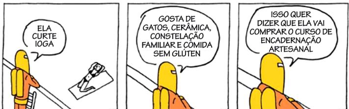  
Texto 2

(Quadrinhos com o personagem laranja e amarelo, que representa um algoritmo, da sé- rie criada por André Dahmer. Disponível em: https://diplomatique.org.br/novas- tirinhas- de- andre- dahmer- transformam- algorithmo- em- personagem- intrometido/. Acesso em 28/07/2023. )

A partir do texto 1, e possível afirmar que o texto 2 explora o fato de que os algoritmos.

a) definem o que é melhor ou mais apropriado para cada pessoa.  
b) são opacos porque aleatoriamente expõem às pessoas pro- dutos para compra.  
c) se servem dos nossos dados para nos oferecer continua- mente produtos a serem consumidos.  
d) controlam a vida humana para aperfeiçoar as nossas tomadas de decisão.
----
## Questão 4

O anúncio (Texto 1) reproduzido a seguir foi postado nas redes sociais da Portela, escola de samba carioca, para divulgar uma festa literária. A escola, que traz a água como símbolo em todos os seus desfiles (Texto 2), completou 100 anos em 2023.

Texto 1

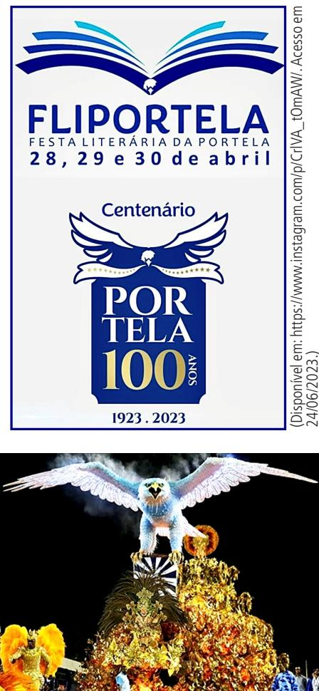

Considerando a imagem no texto 2, podemos afirmar que o texto 1 promove uma

a) fusao entre o simbolo da escola e o produto da expressao literaria, que aparece materializado no desenho das asas da agua. 
b) relacao entre a festa literaria, mencionada em segundo plano, e o desenho do simbolo da escola, que passa a personificar a literatura. 
c) associacao das asas da agua com o titulo atribuido a festa literaria, que mostra o nome da escola antecedido pelo preferio fil. 
d) ressignificacao do simbolo da Portela, cujo desenho faz referencia direta a arte literaria, para destacar o centenario da escola como tema da festa.
----
## Questão 5

O texto a seguir é um trecho da cancao Pantanal, que foi tema de abertura da novela com o mesmo nome, exhibida originalmente pela TV Manchete em 1990 e regravada pela TV Globo em 2022.

Lendas de raças, cadades perdidas nas selvas do coracao do Brasil. Contam os indios de deuses que descem do especo no coracao do Brasil. Redescobrindo as Americas quinhentos anos depois. Lutar com unas e dentes pra termos direito a um depois. Fim do milenio, resgate da vida, do sonho, do bem. A terra é tao verde e azul. Os filhos dos filhos dos filhos dos nossos filhos verao. (Pantanal, letra de Marcus Viana, gravada pelo grupo Sagrado Coracao da Terra na cole tanea em LP Sagrado - Farol da Liberdade, lancaada em 1991 pelo selo Sonhos & Sons.)

Nesse trecho da cancao, podemos identificar

a) repeticao de adverbios que indicam as mesmas circunstan cias de tempo e de lugar, para produzir um efeito de redun dancia a respeito da luta pela terra. 
b) indeterminacao de sujeito com verbo na terceira pessoa do plural, para produzir um efeito de incerteza quanto ao papel das futuras geracoes. 
c) atribucao de caracteristicas positivas por meio de substanti vos que indicam cores, para produzir um efeito de otimismo na preservacao da natureza. 
d) encadeamento sucessivo de termos ligados por preposicao, para produzir um efeito de continuidade temporal quanto a condicao do planeta.
----
## Questão 6

je ne parle pas bien\* je ne parle pas bien je ne parle pas bien je ne parle pas bien eu tenho uma lingua solta que nao me deixa esquecer que cada palavra minha e resquicio da colonizacao cada verbo que aprendi conjugar foi ensinado com a missao de me afastar de quem veio antes nossas escolas nao nos ensinam a dar voos [...] reinvencao nossa revolucao surge e urge das nossas bocas das falas aprendidas que sao ensinadas e muitas nao comprendidas salve, a cada gira je ne parle pas bien [...] o que era pra ser arma de colonizador esta virando revide de ex colonizado estamos aprendendo as suas linguas e descolonizando os pensamento

\* Je ne parle pas bien, do frances, significa "Eu nao falo direieto".

Podemos afirmar que o uso repetido do verso Je ne parle pas bien no poema slam de Are Ribeiro

a) expressa a necessidade de repetir muitas vezes uma mesma sentenca como forma de resistir ao esquecimento de uma lingua.

b) enfatiza a ideia de que a lingua francesa do colonizador ainda nao foi apreno da e precisa ser repetida varias vezes.

c) é uma constatacao de que, na posicao de ex-colonia, nao conseguimos aprender linguas estrangeiras.

d) indica um posicionamento de resistencia por meio de uma critica a aprendizagem forcada da lingua do colonizador.
----
## Questão 7

Texto 1 "Que seculo, meus Deus! - exclamaram os ratos E começaram a roer o edificio". ("Edificio Esplendor" (1955), de Carlos Drummond de Andrade, epigrafe do conto "Seminario dos Bates," de Lygia Esplunder Telles.)

# Texto 2

Epigrafe e um paratento (um texto que acompanha o texto principal), que pode sustificar ou comentar um titulo ou texto; referenciar a relacao entre o autor do texto e o da epigrafe; crier um efeito por meio do qual a presenga da epigrafe ja evoca a identificacao do autor do texto com uma epoca ou movimento. (Adaptado de: GENETTE, G. Paratextos Editoriais. Tradugao de Alvaro Faleiros. Cotia: Atelié Editorial, 2009. )

Considerando os textos 1 e 2, assinale a alternativa correta.

a) A epigrafe associa o conto de Lygia ao "sentimento do mundo" drummondiano.

b) A epigrafe mostra que os versos de Drummond são imprescindíveis à escrita do conto.

c) A epigrafe justifica o título do conto o comenta os possíveis sentidos críticos dele.

d) A epigrafe identifica Lygia à geração de 30 do Modernismo, ao lado de Drummond.
----
## Questão 8

Leia o trecho da reportagem:

"Mulher espancada após boatos em rede social morre no Gua- ruja, SP

(...)

A dona de casa Fabiane Maria de Jesus, de 33 anos, morreu na manhã desta segunda- feira (5), dois dias após ter sido espancada por dezenas de moradores do Guarujá, no litoral de São Paulo. Segundo a família, ela foi agridada a partir de um boato gerado por uma página em uma rede social (...)

(G1, Santos, 05/05/2014. Disponível em: https://g1. g1. blobo.com/sp/santos- regiao/noticia/2014/05/mulher- espancada- apos- boatos- em- rede- social- morre- em- guaruja- sp.html. Acessado em 04/07/2023. )

Assinale o trecho de um dos contos a seguir - extraidos de EVA- RISTO, Conceição. Olhos d'Água. Rio de Janeiro: Pallas; Fundação Biblioteca Nacional, 2016 - , trecho este que relaciona o acontecimento da reportagem ao texto de ficção:

a) "Os mais velhos, acumulados de tanto sofrimento, olhavam para trás e do passado nada reconheciam no presente. Suas lutas, seu fazer e saber, tudo parecia jer se perdido no tempo (...) Deram de clamar pela morte. E a todo instante eles partiam" (p. 112).

b) "Vi só lágrimas e lágrimas. Entretanto, ela sorria feliz. Mas eram tantas lágrimas, que eu me perguntai se minha mãe tinha olhos ou rios caudalosos sobre a face. E só então com preendi. Minha mãe trazia, serenamente em si, águas cor rentezas (...). Águas de Mamãe Oxum!" (p. 18-19).

c) "Os assaltantes desceram rápido. Maria olhou saudosa e desesperada para o primeiro. (...) Algumé gritou que aquela puta safada lá da frente conhecia os ascalantes (...). A primeira voz, a que acordou a coragem de todos, (...) levantou e se encaminhou em direção à Maria (...)" (p. 41-42).

d) "Nos últimos tempos na favela, os tirsteios aconteciam com frequência e a qualquer hora. Os componentes dos grupos rivais brigavam para garantir seus espaços e freguesias. Ha- via ainda o confronto constante com os policiais que invadiam a área" (p. 76).
----
## Questão 9

No inficio da novela Casa Velha, de Machado de Assis, o conego da Capela Imperial, um personagem da história, assumindo a voz narrativa dela, conta a seus interlocutors:

"– Não desejo ao meu maior inimigo o que me aconteceu no mês de abril de 1839. " (MACHADO DE ASSIS. Casa Velha. Rio de Janeiro: Paz e Terra, 1986, p. 11. )

De acordo com o texto, o acontecimento desagradável que vitimou o religioso faz com que ele possa ser considerado, ao final da narrativa, como a) um boêmio que se sente entediado na presença dos convivas da Casa Velha: "Disseram-me que era amiga da família, e se chamava Matalda. (...) Creio que disseram ainda outras coisas; mas não me interessando nada, nem a conversação, nem a hóspeda, (...) deixei-me estar comigo" (p. 29-30).

b) um antiescravista, obrigado a conviver, na mesma casa grande, com senhores, agregados e escravos: "Lalau (...) com as mãos no ombro do moleque, ora fitava os olhos na carapi- nha deste, ouwindo somente as palavras de Félix, ora orgua - os para o moço (...) (p. 67).

c) um republicano que suporta um velho Coronel de posigoes conservadoras: "Preverendissimo, (...) os farrapos invadiram Santa Catarina, entriram na Laguna, e os legais fugiram. Eu, se fosse o governo, mandava fuzilar a todos estes para escarmento..." (p. 89).

d) um ingênuo que se deixa lludir em suas relações pessoais: "nem por sombras me acudiu que a revelação de Dona An- tônia podia não ter verdadeira (...) Não adverti sequer na minha cumplicidade. Em verdade, eu é que proferira as palavras que ela trazia na mente (...) (p. 89).
----
## Questão 10

"Um deles viu umas contas brancas de rosário, acenou que lhas dessem e divertiu- se muito com elas. Enrolou- as ao pescoço, depois tirou- as e embrulhou- as no braço, e acenava para a terra e depois para as contas, e em seguida para o colar do capitão, dando a entender que eles dariam ouro por aquilo. Isto nós entendíamos assim porque queríamos. Mas se ele queria dizer que levaria as cortas e mais o colar, isto nós não queríamos entender, porque não lho daríamos."

(CAMINHA, Pero Vaz de. Carta de Achamento do Brasil. Campinas: Editora da UNICAMP, p. 108, 2001. )

Em seu relato de viagem, Pero Vaz de Caminha

a) descreve a natureza e as pessoas que os portugueses encontraram no Novo Mundo, inventariando os detalhes da viagem, com vistas à preservação da História Colonial.

b) descreve e interpreta os fatos, mostrando que a compren-são dos portugueses sobre os povos originários era mediada pelos interesses do colonizador.

c) descreve como os povos originários do Novo Mundo auxiliaram os colonizadores na prospeção por riquezas, anteven-do a realização do projeto colonizador.

d) descreve e interpreta os fatos, sugerindo que, na visão dos povos originários, era possível a convivência pacífica com o colonizador, já que compartilhavam os mesmos interesses.
----
## Questão 11

Em 1921, Mário de Andrade, escrevendo a série de artigos "Mestres do passado", publicados no Jornal do Comércio (edi- ção de São Paulo), observou:

"Tarde [de Olavo Bilac] foi uma promessa de anos seguidos. Tais sao, tao salientes os artificios e tao repetidos que muito bem provam o esforco do poeta decaido da poesia e a sua parca inspiracao (...)."

(ANDRADE, M. Mestres do passado - Olavo Bilac. In: BRITO, M.S. História do modernismo brasileiro. Antecedentes da Semana de Arte Moderna. 5. ed. Rio de Janeiro: Civiliza- cao Brasileira, p. 288- 289, 1978. )

Relacione, ao poema a seguir, o trecho da crítica anterior, assinalando a alternativa que coincide com a ideia geral de Mario sobre a obra de Bilac.

# As estrelas Olavo Bilac

Desenrola- se a sombra no regaco Da morna tarde, no esmaiado anil; Dorme, no ofego do calor febril, A natureza, mole de cansaco.

Vagarosas estrelas! passo a passo, O aprisco desertando, as mil e as mil, Vindes do ignoto seio do redil Num compacto rebanho, e encheis o especo...

E, enquanto, lentas, sobre a paz terrena, Vos tresmalhais tremulamente a flux, - Uma divina musica serena

Desce rolando pela vossa luz: Cuida- se ouvir, ovelhas de ouro: a avena Do invisivel pastor que vos conduz... (BILAC, Olavo. Tarde. Rio de Janeiro: Livraria Francisco Ames, p. 42- 43, 1919. )

Esmaiado: esmaeido, palido Anima, carol Redil: curral para o gado ovino ou paprino; rebanho de ovelhas Tresmalhar: Afastar- se, perder- se do rebanho Flux: fluxo Avena: flauta pastoril

a) O critico lamenta o espaçamento da criação poética de Bilac, o que se expressa no poema pela imagem das estrelas que se afastam umas das outras.

b) O critico elogia os salientes artificios da linguagem poética de Tarde, o que se pode perceber, por exemplo, pela variedade de sinônimos para a palavra "curral".

c) O critico evoca, como resultado da pouca inspiração artística do poeta, a sobrecarga de investimento formal (os hipérbatos ou inversões, por exemplo).

d) O critico associa a poesia de Bilac ao estilo decadentista, o que é reforçado pelas imagens de esgotamento, como se vê nas palavras "morna", "esmaiado", "ofego", "mole", "lentas".
----
## Questão 12

Leia as duas citações a seguir, extraídas do início e do final de O Ateneu:

"Lembramo- nos, entretanto, com saudade hipócrita, dos felizes tempos; como se a mesma incertea de hoje, sob outro aspecto, não nos houvesse perseguido e utrora e não viesse de longe a enfiada das decepcões que nos ultrajam. Eufemismo, os felizes tempos, eufemismo apenas, igual aos outros que nos alimentam, a saudade dos dias que comeram como melhores.

Bem considerando, a atualidade é a mesma em todas as datas. Feita a compensacao dos desejos que variam, das aspiracoes que se transformam, alentadas perpetuamente do mesmo ardor, sobre a mesma base fantastica de esperancas, a atualidade é uma (...)"

"Aqui suspendo a cônica das saudades. Saudades verdadei- ramente? Puras recolaqacoes, saudades talvez, se ponderamos que o tempo é a ocaisiao passageira dos fatos, mas sobretudo - o funeral para sempre das horas."

(POMPEIA, Raul. O Atheneu (Chronica de saudades). Rio de Janeiro: Tipografia de Gazeta de Noticias, p 3- 4 e 368, 1888. )

Com base nessus duas citações, é possível afirmar que, ao fim da narrativa de Sérgio sobre sua vida no colegio, o narrador

a) idealiza a felicidade experimentada na infancia, suas aspirações, seu ardor e suas esperancas. 
b) considera que a felicidade passada não era maior que a do presente, pois os tempos são iguais. 
c) duvida da propria saudade, separando as lembranças relati- vas ao passado daquele sentimento associado a elas. 
d) denuncia a hipocrisia da saudade que sente, por saber que a passagem do tempo é incerta.
----
## Questão 13

Estudos, publicadas na Nature Geoscience e na revista Science, apontam para a queca acentuada das temperatura na Europa e na Asia a partir do ano de 536, gerando a chamada "Peque- na Idade do Gelo da Antiguidade Tardia". As mudanças nas temperaturas podem ter sido causadas por erupcoes vulcânicas, cujos efitos foram reforçados pelas correntes oceânicas, pela expansão do gelo e pela coincidência de um mínimo solar (seculo VI). A conjugação desses fatores teria gerado mudanças efitivas na história, já que a agricultura e a pastagem teriam sido diretamente ateligidas. Exemplos dessas relações entre o clima e a história humana podem ser encontrados na Antiguidade, como a invasão da Europa por vários povos das estepes, a queda do segundo império persa, a entrada dos turecos na Anatólia, o inicio da expansão árabe, entre outros.

(Adaptado de: CRIADO, M.J „Uma quequaena “idade do gelo” pode ter mudado a história da Antiguidade (...). El Pais, lev, 2516.)

Com base em seus conhecimentos sobre a Antiguidade e tendo em vista o excerto anterior, é correto afirmar que

a) a história do planeta Terra e a história humana são indis-sociaveis; eventos do século VI são bons exemplos disso: mudanças nos ecossistemas teriam gerado peste, fome e escassez, levandocaos deslocamentos de povos.

b) a "Pequena Idade do Gelo da Antiguidade Tardia", assim como as mudanças climáticas dos séculos XX e XXI, foram provocadas, em especial, pela ação humana e também pelas mudanças nas pasagens dos campos.

c) os efitos das mudanças climáticas no passado eram locais; os eventos históricos citados se desconectavam das mudanças nos ecosistemas encontrados na Europa e na Asia.

d) os estudos sobre as mudanças nas temperatura no século VI apresentam uma visão sobre o passado, destacando como grupamentos humanos controlavam as mudanças na natureza.
----
## Questão 14

"Dos pretos é tão próprio e natural a união que a todos os que têm a mesma cor, chamam parentes; a todos os que servem na mesma casa, chamam parceiros; e a todos os que se embarcam no mesmo navio, chamam malungos."

(VIEIRA, Padre Antônio. Sermão XX. Parte II. Lisboa: Impessão Craesebeckiana, p. 165, 1688. )

Sobre as comunidades de malungos no período da escravidão, é correto afirmar, de acordo com o texto, que são formadas

a) nos lagos entre africanos de múltiplas etnias, os quais ha viam atravessado juntos o Atlantico. 
b) no encontro dos africanos nas senzalas, no exercício de ofi cios e no trabalho da flavoura. 
c) no Novo Mundo por pessoas de uma mesma etnia que se reconheciam como iguais. 
d) nos quilombos rurais e urbanos, formados por escravizados fugidos de muitas etnias.
----
## Questão 15

No processo de Independencia, varias tropas indigenas foram recrutadas para proteger o territorio contra uma possivel invasão portuguesa no litoral cearense entre setembro e novembro de 1822. Já os índios da vila de Cimores, em Pernambuco, se posicionaram em 1824 a favor de Dom João VI, opondo- se à Independencia e à Constituição. No entanto, o que parecia ser mais comum era o engajamento dos índios no projeto de Brasil independente, identificando- se como "brasileiros". Nas revoltas, buscavam muito menos se contravor aos europeus e, assim, lutar por uma nova posição social que não mais os obrigasse ao trabalho forçado.

(Adaptado de: COSTA, J. P. P. "Povos indigenas e a Independencia". Disponível em: https://bicentenario2022. com.br/textos/. Acesso em 21/05/2023. )

Tendo em vista seus conhecimentos sobre a participação dos povos indigenas no processo de Independencia, e considerando o texto do blog citado, assinale a alternativa correta.

a) As disputas dos amerindios em torno do "ser brasileiro" vi-savam à manutenção da ordem social vigente. 
b) As populações indigenas participaram, com projetos políticos específicos, dos processos da Independência. 
c) A independência era entendida pelos indigenas como uma ameaça a Dom João VI, símbolo da nação brasileira. 
d) A diversidade da ação indigena se relacionava à distribuição de terras e títulos estabelecidos pela Corte portuguesa.
----
## Questão 16

Muitos fotógrafos no século XIX registraram obras de engenharia. O francés Édouard Baldus (1813- 1889) atuou, primeiro como pintor e depois como fotógrafo, no inventário de monumentos arquitetônicos da Comissão dos Monumentos Históricos (1851) na França. Suas fotografias sobre esses monumentos renderam- lhe fama de fotógrafo de arquitetura. Sob encomentada, Baldus editou um album para a Companhia dos Caminhos Féreos do Norte (1855) e registrou estações, instalações ferroviárias, portos e cidades, ao longo desta via entre Paris e a cidade de Boulogne- sur- Mer. A rainha Vitoria ganhou um exemplar dessa publicação.

(Adaptado de: OLIVEIRA, E. R. Vistas fotográficas das ferrovias; a produção de registros de obra pública no Brasil do século XIX. Hist Cienc saude- Manguinhos [Internet], 25(3), p. 695- 723, 2018. )

Tendo em vista seus conhecimentos sobre mundo contemporâ- neo e considerando o texto, assinale a alternativa correta.

a) Na Europa do século XIX, a difusão social das fotografias das obras públicas se dava por meio de jornais impressos com baixa circulação social e restrita aos estudiosos.

b) No século XIX, a dissociação entre as fotografias de obras públicas e a vida política europeia expressa a desvalorização da técnica e do conhecimento científico positivista.

c) A fotografia teve vános usos e funções no século XIX, entre eles, o de compon inventários arquitetônicos e retratar obras de engenharia.

d) O album fotográfico dado a rainha Vitoria era um gesto di-plomatico que mostrava o descontentamento francês com a política inglesa.
----
## Questão 17

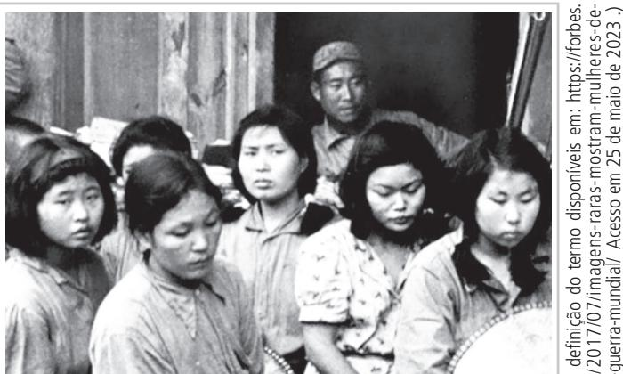

Legenda: Imagens de "mulheres de conforto" **, em 1944, na Coreia do Sul.

** Termo usado para designar coreanas, filipinas e chinesas, obrigadas a se prostituírem em bordéis usações por militares japoneses.

É correto afirmar que a fotografia anterior

a) foi produzida durante a Guerra Fria e documenta o sequel Astro, no sudeste asático, da parte dos soldados norte- americanos, de mulheres. O estupro e a prostituição forçada são aceitos pelas cortes internacionais como estratégia de guerra, já que os crimes de guerra referem- se apenas às armas usadas nos campos.

b) comprova a ação dos soldados norte-americanos, durante a Guerra do Vietnã, em relação às mulheres e às crianças fotografadas. A prostituição consensual era usada como estratégia de criação de novos laços sociais e o povoamento dos territórios conquistados.

c) traz a imagem de mulheres enfileiradas, capturadas e obrigadas a se prostituírem durante a Il Guerra Mundial. A violação sexual tem sido usada historicamente como arma para fragilizar os supostos inimigos, já que as vitmas da violência sexual trazem marcas da humilhação e da limpeza étnica e tem os laços sociais destruídos.

d) registra mulheres que, durante a Guerra das Coreias, escolheram se casar e migrar com os soldados japoneses. A violação sexual é uma das marcas dos conflitos entre nações, atingindo em especial mulheres e crianças que, entendidas como vulneráveis, se tornam vítimas do dominio masculino.
----
## Questão 18

Priões e torturas igualmente triplicaram, principalmente as de jornalistas. Dentre elas, a mais emblemática foi a de Vladimir Herzog, director da TV Cultura, que, embora fosse militante do PCB, não desenvolvia atividade clandestina nem pertencia aos quadros do partido. Herzog foi assassinado dentro do DOI- CODI, sendo a versão oficial de sua morte falsamente atribuida a um enforcamento. Em sua Autobiografia, Rita Lee publicou o bilhete de Elis Regina que fazia menção a uma música feita para "Vlado" e que, obviamente, fora censurada.

(Adaptado de: UIMA, N. Ditadura no Brasil e Censura nas Cancões de Rita Lee. Curitiba: Appris, 2019, p.17. )

A partir da leitura do texto e de seus conhecimentos a respeito desse período da História do Brasil, é conreto afirmar, sobre os eventos narrados, que a) Rita Lee, Elis Regina, Caetano Veloso, Chico Buarque, entre outros artistas nacionais, tiveram suas músicas censuradas pela Ditadura Militar, apesar da manutenção da garantia constitucional da liberdade de expressão.

b) A Ditadura Militar permitiu a continuidade do Partido Comunista Brasileiro e perseguia sua etuação revolucionária vinculada a Stalin e à União Soviética; por conta disso, prenda e torturava seus filiados.

c) Centros de detenção da Ditadura Militar, como o DOI-CODI, operaram dentro da legalidade constitucional, sendo que os presos, políticos ou não, eram fichados e tinham direito à defesa garantido por lei.

d) Vladimir Herzog e outros jornalistas foram vítimas de perseguição política, prisões, torturas e execuções realizadas por militares, com apoio de parte da sociedade civil, em nome da ideologia da segurança nacional.
----
## Questão 19

(Disponível em: https://www.uol.com.br/tilt/noticias/redecao/2023/03/26/oto- do- pa- pa- usando- casaca- estiloso- foi- triada- por- in- teligencia- artificial.htm?cmpio=copiaecola. Acesso em 04/05/2023. )

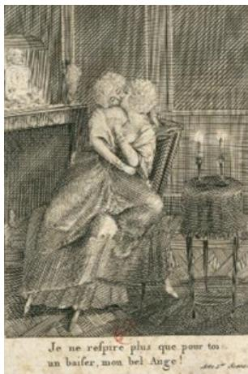

(Biblioteca Nacional da França, sem data, RES 8- LB39- 12153. Disponível em: https://gallica.bnf.fr/ark:/12148/btv1- b6 942376r.item. Acesso em 04/05/2023. )

Imagem postada em março de 2023 no Reddit, uma comunidade de fóruns, na página específica do Midjourney. Essa página reûne criações feitas na ferramenta de Inteligência Artificial, ferramenta que permite criar imagens hiper- realistas a partir de uma descrição em texto. A imagem viralizou a partir do Twitter. O Papa nunca usou aquele casa do branco.

Tradução da legenda: Eu apenas respiro por vocé. Um beijo, meu belo anjo!

Panfleto anônimo produzido na França pré- revolucionária do final do século XVIII retratando a rainha Maria Antonieta em um romance com a sua amiga, a duquesa Yolande de Po- ignac.

Com propósitos diferentes, ambas as imagens promovem a desinformação. Comparando historicamente os dois exemplos de desinformação, é cometo afirmar que a) as campanhas de desinformação podem ser encontradas em diferentes contextos, como visto no uso do panfleto da rainha pela coroa francesa – com o objetivo de defender a monarquia – e na imagem do Papa – que explora a contra- dição entre a riqueza do Vaticano e os excluídos defendidos por ele.

b) no século XVIII e no século XXI, a produção e a circulação de fake news e desinformação são controladas pelos aparelhos de censura que revisam conteúdos orais e impressos, ainda que estruturados a partir de tecnologias diferenciadas.

c) na era digital, a ruptura causada pelo uso de Inteligência Artificial e seu potencial na produção de desinformação está ao alcance do público, na instantaneidade e no realismo da imagem. No início da contemporaneidade, as manipulações em imagens e em notícias eram acessadas pelo público através de jornais e panfletos.

d) os dispositivos de Inteligência Artificial representam uma ruptura no combate à desinformação ao possibilitar o rastreio e a eliminação instantânea de fake news. No século XVIII, o público era réfém de notícias falsas pela ausência desta tecnologia.
----
## Questão 20

# Texto 1

A OMS (Organização Mundial de Saúde) recomenda que a ingestão de açúcares livres esteja abaixo de  $5\%$  da ingestão total de energia diária para o nosso organismo. Como alternativa aos açúcares livres, tem- se intensificado o uso de adoçantes não nutritivos, como, por exemplo, sacarina, sucralose, stevia e aspartame. A próprio OMS atualmente recomenda que adoçantes não sejam utilizados para controlar a massa corporal, pois não oferecem benefício na redução da gordura corporal. Uma benda muito consumida no cotidiano, o refrigerante, apresenta esses dois aspectos para os quais a OMS chama atenção: os comuns têm cerca de 11 g de açúcar por  $100~\mathrm{mL}$  e os diets contem adoçantes não nutritivos.

O gráfico a seguir apresenta o consumo médio de refrigerante por habitante por ano, no período de 2010 a 2021, no Brasil.

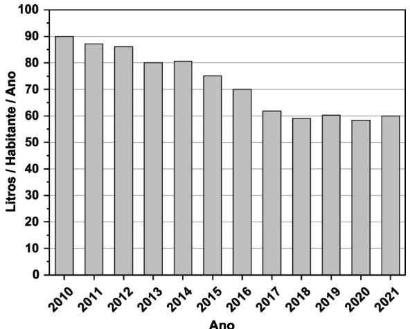

# Dados:

i) ingestão total de energia diária para adultos: 8400 kJ (recomendação da OMS). ii) energia por grama de açúcar: 16,5 kJ.

De acordo com as informações do grafico e do texto 1, pode- se afirmar que a média de consumo diário de açúcar, por habitante, para cada ano, devido somente à ingestão de refrigerante,

a) foi sempre superior à recomendação pela OMS, o que pode indicar uma baixa conscientização da população sobre o consumo de açúcar. 
b) foi sempre inferior à recomendação pela OMS, o que pode indicar uma alta conscientização da população sobre o consumo de açúcar. 
c) foi superior; porém, mais recentemente, tornou-se inferior à recomendação pela OMS, o que pode indicar uma melhora na conscientização da população sobre o consumo de açúcar. 
d) foi inferior; porém, mais recentemente, tornou-se superior à recomendação pela OMS, o que pode indicar uma piora na conscientização da população sobre o consumo de açúcar.
----
## Questão 21

# Texto 1

A OMS (Organização Mundial de Saúde) recomenda que a ingestão de açúcares livres esteja abaixo de  $5\%$  da ingestão total de energia diária para o nosso organismo. Como alternativa aos açúcares livres, tem- se intensificado o uso de adoçantes não nutritivos, como, por exemplo, sacarina, sucralose, stevia e aspartame. A próprio OMS atualmente recomenda que adoçantes não sejam utilizados para controlar a massa corporal, pois não oferecem benefício na redução da gordura corporal. Uma benda muito consumida no cotidiano, o refrigerante, apresenta esses dois aspectos para os quais a OMS chama atenção: os comuns têm cerca de 11 g de açúcar por  $100~\mathrm{mL}$  e os diets contem adoçantes não nutritivos.

A resposta glicêmica é a curva da concentração de glicose, em função do tempo, no sangue. Ela é utilizada como uma forma de classificar os alimentos com base em seu potencial de elear a glicose (açúcar) no sangue. Pesquisadores da Universidade Johns Hopkins (EUA) testaram os efeitos de quatro adoçantes na resposta glicêmica de indivíduos saudáveis. Cada grupo foi expoisto a uma conditado, conforme a figura ao lado, acompanhando- se a resposta glicêmica. Com base nas informações da figura e do texto 1, pode- se concluir que a preocupação da OMS quanto ao uso de adoçantes não nutritivos

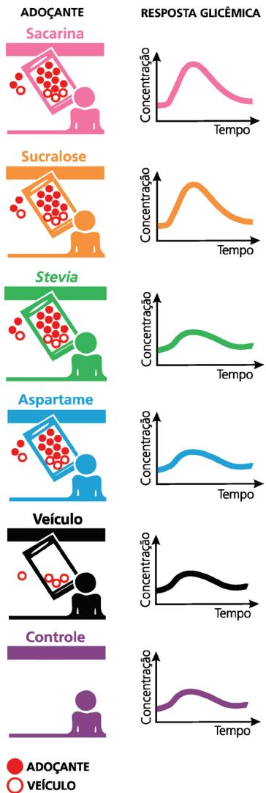

a) precisaria ser complementada com um alerta sobre um risco aumentado de diabetes tipo 2, pois os adoçantes provocam o aparecimento de glicose no sangue. 
b) não precisaria ser complementada com um alerta sobre um risco aumentado de diabetes tipo 2, pois os adoçantes não provocaram o aumento de glicose no sangue. 
c) não precisaria ser complementada com um alerta sobre um risco aumentado de diabetes tipo 2, pois apenas dois adoçantes não provocaram o aparecimento de glicose no sangue. 
d) precisaria ser complementada com um alerta sobre um risco aumentado de diabetes tipo 2, pois dois adoçantes provocaram um aumento de glicose no sangue.
----
## Questão 22

Um refrigerante com um é uma formulação de vários ingredientes: açúcar (11 g por 100 mL), água (88 g por 100 mL) – componentes majoritários, –, além de acidulantes, antioxidantes, conservantes, adoçantes e CO₂ (componentes em pequenas quantidades). O acidulante tem como finalidade regular a dóçura do açúcar, realizar o paladar e reduzir o pH do refrigerante, que deve estar entre 2,7 e 3,5. Assim, para se usar uma pequena massa de acidulante que proporciona redução do pH para o valor deseado, a massa molar do acidulante deve ser

a) pequena e seu pKa deve estar abaixo da faixa de pH do refrigerante.

b) pequena e seu pKa deve estar acima da faixa de pH do refrigerante. 
c) grande e seu pKa deve estar abaixo da faixa de pH do refrigerante. 
d) grande e seu pKa deve estar acima da faixa de pH do refrigerante.
----
## Questão 23

O mau gerenciamento da produção das baterias automotivas chumbo-ácido e de sua reciclagem após uso pode ocasionar contaminação do méo ambiente e de processos. Para minimizar esses problemas, a indústria pode levar em conta a "hierarquia de resíduos", uma ordem de preferência nas ações de combate à contaminação. A figura a seguir, incompleta, mostra duas ações possíveis dessa hierarquia. Para minimizar os problemas, as ações a serem adotadas, em ordem de preferência e considerando a direcionalidade indicada na figura, seriam

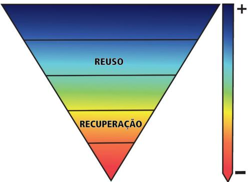

a) descarte adequado; reciclagem; prevenção. 
b) prevenção; descarte adequado; reciclagem. 
c) descarte adequado; prevenção; reciclagem. 
d) prevenção; reciclagem; descarte adequado.
----
## Questão 24

No início de 2023, um grupo de pesquisadores estudou o desenvolvimento de uma poliamina sólida contendo cobre, capaz de ad- . sorver  $CO_2$  na fase gasosa e em baixas concentrações. A figura ao lado mostra o esquema de adsorção com a repre- . sentação do sólido:

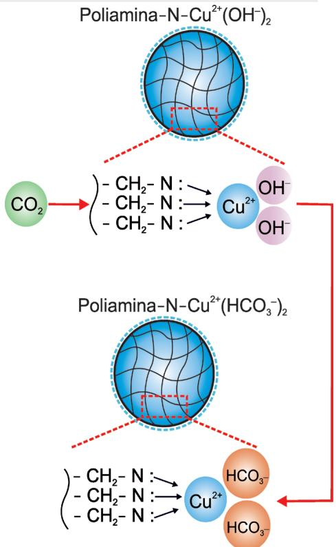

De acordo com os autores do estudo, 1 kg de poliamina contendo cobre é capaz de adsorver até 5 mols de  $CO_2$ , uma quantidade bem superior ao que se conhece até então. Com base nessas informações, pode- se concluir que a porcentagem em massa de cobre no sólido é cerca de

a)  $16\%$  e que 1 kg do sólido é capaz de absorver até 110 g de gás carbônico. 
b)  $32\%$  e que 1 kg do sólido é capaz de absorver até 110 g de gás carbônico. 
c)  $16\%$  e que 1 kg do sólido é capaz de absorver até 220 g de gás carbônico. 
d)  $32\%$  e que 1 kg do sólido é capaz de absorver até 220 g de gás carbônico.
----
## Questão 25

Algunas baterias transformam certas substâncias em outras, gerando energia elétrica. Isso permite, por exemplo, o funcionamento de equipamentos tendo como base essa energia (carros elétricos) ou então auxília o funcionamento de equipamentos (carros de combustão interna). É por isso que os carros elétricos precisam se abastecer de energia elétrica de tempos em tempos e os de combustão não, já que a bateria desses últimos é carregada durante seu funcionamento. Na descarga da bateria, dois comportamentos são importantes: curva de tensão (Figura A) e ciclo de vida (Figura B), sendo esse último a quantidade de vezes que a bateria pode ser recarregada em função da profundidade de sua descarga.

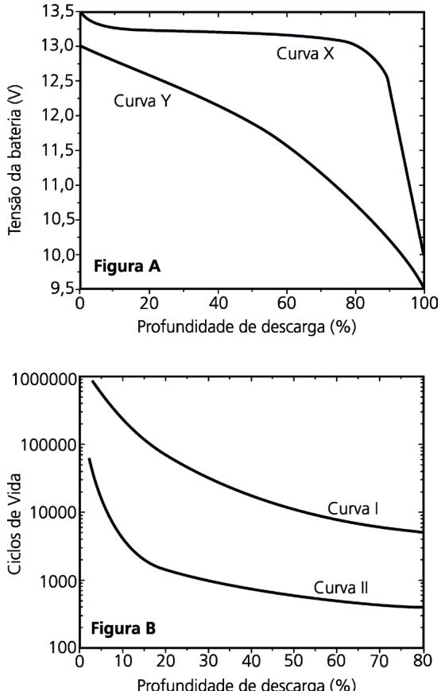

Levando em conta essas informações, seria apropriado escolher para equipar um carro

a) elétrico uma bateria com as características da curva Y e da curva II; para o carro de combustão interna qualquer combinação serviria.

b) elétrico uma bateria com as características da curva X e da curva I; para o carro de combustão interna, qualquer combinagão serviria.

c) de combustão interna uma bateria com as características da curva X e da curva I; para o carro elétrico, qualquer combinagão serviria.

d) de combustão interna uma bateria com as características da curva Y e da curva II; para o carro elétrico qualquer combinagão serviria.
----
## Questão 26

Um grupo de pesquisadores estudou a atividade antibacteria- na - em acao sobre duas bacterias, a saber, Escherichia coli e Staphylococcus aureus - da curcuma livre e da curcumina combinada com octaarginina. Os pesquisadores observaram que a curcumina livre apresenta atividade antibacteriana frente a uma das bacterias. Na forma combinada, a curcumina foi mais efficiente - em comparacao com a forma livre - no combate aos dois microrganismos. Tendo em vistasessas informacoes, os graficos que melhor representam os resultados do estudo sao os seguintes:

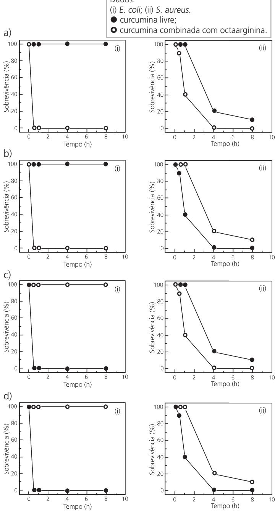
----
## Questão 27

Povos e comunidades tradicionais sao grupos culturalmente diferenciados e que se reconhecem como tais. Esses grupos contam com formas proprias de organizacao social, alem de ocuparem e usarem territorios e recursos naturais como condicao para sua reproducao cultural, social, religiosa, ancestral e economica. Para tanto, utilizando conhecimentos, inovacoes e praticas gera dos e transmitidos pela tradigao (Inciso I, Art.  $3^{\circ}$  , Decreto 6.040 / 2007). Estima- se que cena de 4,5 milhoes de pessoas fazem parte de comunidades tradicionais atualmente no Brasil.

(Adaptado de: Populações Tradicionais - Instituto Chico Mendes de Conservacao da Biodiversidade. Disponivel, em: https://www.gov.br/icmbio/pt- br/assuntos/populacoes- tradicionais. Acesso em 12/06/2023. )

Assinale a alternativa que faz a correspondencia correta dos povos e comunidades tradicionais com a sua regiao de atuacao e com as suas praticas especificas de organizacao socioterritorial.

a) Mulheres quebradeiras de coco babagu da regiao do Meio-norte aproveitam as matas de cocais e fazem uso comunitario dos babaquais para a coleta de coco e de outros pro-dutos das palmeiras.

b) Geraizeiros da regiao da Amazonia Ocidental se beneficiam dos rios para a pesca e praticam o extrativismo de frutos utilizados na culinaria regional e transformados em produtos alimenticios.

c) Caiaras da regiao litoranea do Ceara praticam a pesca artesanal, utilizar as liquezas naturais da Mata Atlantica para o extrativismo de frutos e fazem uso dos rogados para atividades agricolas de substistencia.

d) Faxinalenses do norte de Minas Gerais usufruem dos campos para o desenvolvimento do extrativismo vegetal da eva mate e do pinhao, do cultivo agricola em pequena escala e da criacao de animais soltos.
----
## Questão 28

O litoral brasileiro tem uma historia fisiografica e ecologica rica e complexa, influenciaada por uma variedade de fatores e processos interligados. O Brasil conta com um litoral intertropical e subtropical onde e possivel observar uma diversidade de ocorreencias geomorfologicas e paisagisticas que se sucedem ao longo de sua costa.

(Adaptado de: AB'SABER, A. Litoral do Brasil/Brazilian coast. São Paulo: Metalivros, p. 281, 2005. )

A partir de seus conhecimentos sobre o litoral brasileiro, assinale a alternativa correta.

a) Os manguezais localizam-se nas planicies marinhas recobertas por especies herbaceas e arboreas. 
b) Os campos de dunas associam-se aos depositos argilosos e arenosos, fixados por vegetacao pioneira. 
c) As falesias ativas evoluem de processos continentais e mari-nhos, com ausencia de vegetacao na sua base. 
d) Os deltas sao formatados por sedimentos fluviais e cobertos por especies arboreas de grande porte.

Moradores em situação de rua em São Paulo/SP

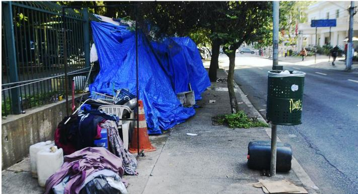

(Ronaldo Silva/Photopress/Estadão Conteudo. https://www.cnnbrasil.com.br/nacional/ prefeitura- faz- moradores- de- rua- desmontarem- barracas- durante- o- dia/ - Acesso em 18/06/2023. )

Nas grandes cidades de todo o planeta, com maior ou menor intensidade, cresce o número de pessoas em situação de rua. No caso brasileiro, todavia, essa é uma realidade urbana perene, agravada em momentos de crise. Segundo estimativa do Insti- tuto de Pesquisa Econômica Aplicada (IPEA), em 2022, existiam 281.472 pessoas em situação de rua no Brasil.

(MONTFERRE, H., População em situação de rua super 281,4 mil pessoas no Brasil. IPEA, 08/12/2022)

O fenômeno descrito no excerto, e reportado na imagem, se constituui historicamente nas cidades brasileiras em função

a) da crise conjuntural da última década, agravada com a pandemia de covid-19; muitas vezes, a gestão urbana impõe a essa população a precariedade da circulação sem fim pela cidade e mesmo pela rede urbana.

b) do processo de modernização-urbanização excluente; as ações de política urbana implementam programas de habitação popular nas áreas centrais para viabilizar a gentríficação e o direito à cidade a essa população.

c) da crise conjuntural da última década, agravada pela pandemia de covid-19; a gestão urbana buca formas de integrar essa população aos espaços urbanos por meio das casas de acolhimento e de programas de emprego e renda.

d) do processo de modernização-urbanização excluente; a gestão urbana promove, muitas vezes, práticas de "higiénização" do espaço, isto é, de expulsão, com o apoio de setores da sociedade.
----
## Questão 30

As projecões de população são importantes para o cálculo dos indicadores sociodemográficos que formcem subsídios para a formulação de políticas públicas. Segundo as Nações Unidas, o mundo atingiu a cifra de 8 bilhões de habitantes em 2022, devendo atingir 9,7 bilhões em 2050. Anda que a população mundial continue a aumentar, a dinâmica demográfica varia entre as regiões do mundo. Nesse contexto, Estados Unidos da América (EUA) e Nigéria passam por mudanças demográficas com reflexos socioeconômicos significativos.

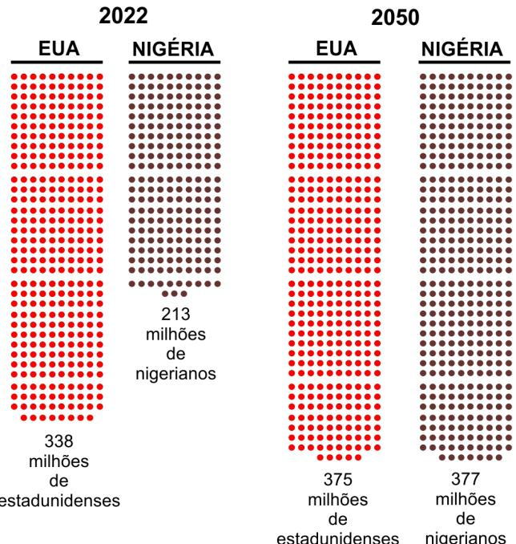  
PROJEÇÃO DO CRESCIMENTO POPULACIONAL

Cada círculo (§) equivale a 1 milhão de habitantes.

(United Nations, Department of Economic and Social Affairs, Population Division (2022). Probabilistic Population Projection Based on the World Population Prospects 2022. Disponível em: http://population.un.org/wpp/. Acesso em 25/08/2023. )

Tendo em vista seus conhecimentos sobre dinâmica populacional e considerando o gráfico, assimale a alternativa correla.

a) Nigéria e EUA têm trajetórias demográficas distintas, ainda que ambos apresentem taxas de natalidade semelhantes. Isso afetará seus sistemas de saúde.

b) Os EUA, ao contrário da Nigéria, apresentam, pela primeira vez, crescimento vegetativo negativo. Isso afetará a oferta de mão-de-obra no território norte-americano.

c) A Nigéria, ao contrário dos EUA, manterá elevada a taxa de fecundidade. Haverá maior pressão sobre as políticas públicas de educação e de saúde.

d) Nigéria e EUA enfrentam expressiva redução da população em idade adultaativity. Ambos os países terão problemas com a seguridad social.
----
## Questão 31

Dentro de um território nacional, as regiões são hoje atingidas por complexos vetores de ordem técnica e política, típicos do período da globalização. Neste sentido, as regiões, tanto quanto são internamente construldas, seguem as oscilações económicas nacionais e internacionais. Isso as torna, diferentemente do passado, mais instáveis e sujeitas a frequentes crises. E, conforme se especializam em diferentes tipos de produção para atender os mercados internacionais, suas fronteiras tornam- se mais cambiáveis.

(Adaptado de: SMITH, N. Comorno de uma política espacializada: veículos dos sem- teto e produção da escala geográfica. JOSBRANTES, A. A. (Org.) O espaço da diferença. Campinas: Papirus, p. 152, 2000. )

Tendo em vista seus conhecimentos sobre a dinâmica das regiões no mundo contemporâneo e considerando o texto anterior, é correto afirmar que

a) desapareceram os laços internos de construção regional, uma vez que a escala de comando internacional regula as especializações produtivas. 
b) múltiplas escalas de ações perpassam e dinamizam a coesão regional, ocasionando instabilidade socionconômica e mutações aceleradas em suas fronteiras. 
c) o comando externo da produção vinculado aos mercados internacionais terms as fronteiras regionais estáveis e dura douras na escala do territorio nacional.

d) a conformagao de arranjos produtivos regionais nesse con-texto homogeniza o espaço nacional, apagando as antigas identidades e as desigualdades socioterritoriais.
----
## Questão 32

Por se situar em uma regiao limitrofe entre diferentes placas tectônicas, a Turquia tem histórico de ferremotos de grande magnitude e poder destrutivo. Em 1939, um terremoto de magnitude 7,8 provocou a morte de certa de 30.000 pessoas. Em fevereiro de 2023, registrou- se um terremoto de magnitude 7,8 as 4h17 (horario local) e, nove horas depois, registrou- se novo abalo sismico, dessa vez de magnitude 7,6, o que levou 50.000 pessoas à morte.

A figura a seguir mostra a localização do sistema de falhas da placa da Anatolia e indica as áreas atingidas pelos respectivos terremotos.

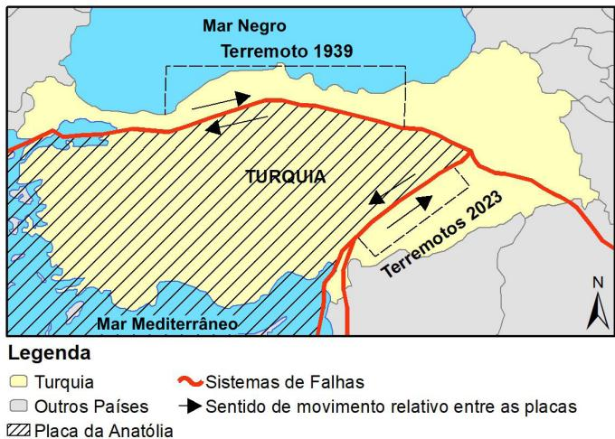

(How the February 2023 Turkiye Earthquakes Ruptured and Produced Damaging Shaking. Disponível em: https://www.seismosoc.org/news/how- the- february- 2023- turkiye- earthquakes- ruptured- and- produced- damaging- shaking/, Acesso em 12/06/2023. )

Os tremores de 1939 e de 2023 foram gerados, respectivamente, pelo deslocamento entre a Placa da Anatolia e as placas

a) Euroasiática e Arábica; o sentido de deslocamento das placas forma falhas transcorrentes. 
b) Indiana e Africana; o sentido de deslocamento forma falhas normais. 
c) Arábica e Euroasiática; o sentido de deslocamento das placas forma falhas normais.

d) Africana e Indiana; o sentido de deslocamento forma falhas transcorrentes.
----
## Questão 33

As convenções cartográficas utilizam simbolos pontuais, lineares, areais, bem como representações proporcionais e gradação de cores (coroplética) que permitem certo grau de compreensão e intuição de seu significado, possibilitando a leitura da informação contida no mapa por diferentes pessoas.

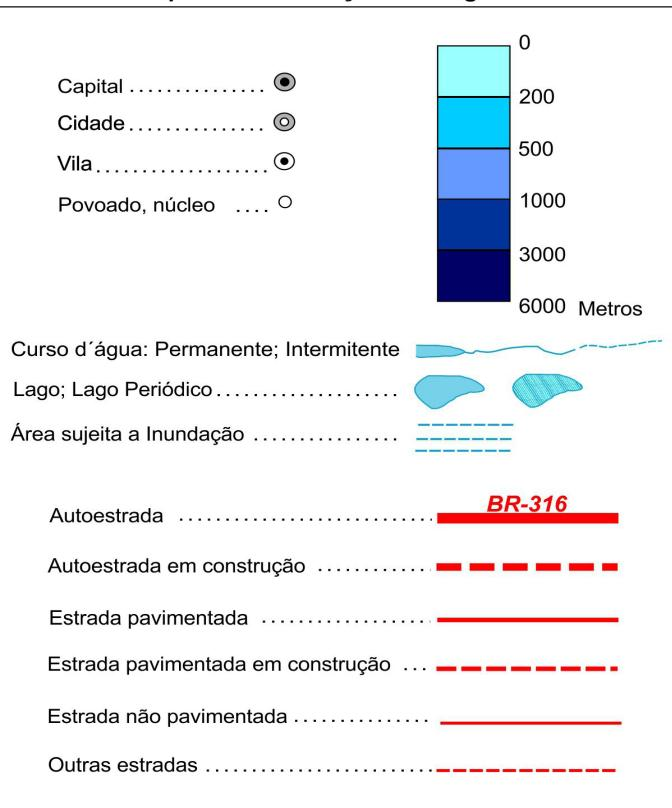  
Exemplos de Convenções Cartográficas

(Adaptado de: https://atbasescolar.ibge.gov.br/conceitos- gerais/o- que- e- cartografia/ conven- o- es- cartogra- ficas.html. Acesso em: 25/08/2023. )

Com base no excerto e na figura, assimale a alternativa correta.

a) Os simbolos pontuais se prestam a representar fenômenos não hieráquicos, a exemplo da rede urbana e da tipologia de cidades. 
b) As representações lineares qualificam os fenômenos, não permitindo a sua hierarquização, e exemplo da tipologia dos sistemas de transportes. 
c) O uso do gradiente de cores serve para diferenciar fenômenos espaciais com variação continua, a exemplo da altitude e da profundidade. 
d) Um mesmo fenômeno pode ser representado por meio de diferentes formas e de variadas cores, a exemplo dos cursos e corpos de água.

Use os valores aproximados:  $g = 10 \text{m / s}^2$  e  $\pi = 3$ .

# Texto comum as questiones 34, 35, 36 e 37.

Uma das etapas mais dificeis de um voo espacial tripulado e a reentrada na atmosfera terrestre. Ao reencontrar as camadas mais altas da atmosfera, a nave sofre forte desaceleração e sua temperatura externa atinge milhares de graus Celsius. Caso a reentrada não ocorra dentro das condições apropriadas, há risco de graves danos à nave, inclusive de explosão, e até mesmo risco de ela ser lançada de volta ao espapo.
----
## Questão 34

Logo ao reentrar na atmosfera terrestre, uma capsula espacial passa a descrever, durante certo tempo, um movimento retilneo uniformemente variado em que ela é freada com aceleração  $a = - 5,0 \text{m / s}^2$ . Se no inficio dessa etapa  $(t = 0)$  do movimento a velocidade da cápsula é  $v_{\mathrm{o}} = 7000 \text{m / s}$ , qual é a distância percorrida até o tempo  $t = 200 \text{s}$ ?

a)  $1300 \text{km}$ . 
c)  $1500 \text{km}$ . 
b)  $1400 \text{km}$ . 
d)  $4900 \text{km}$ .
----
## Questão 35

Apos viajar pela atmosfera por determinado tempo, o modulo da velocidade da cápsula, que inicialmente era  $v_{\mathrm{o}} = 7000 \text{m / s}$ , fica reduzido a  $v = 5000 \text{m / s}$ . Sendo a massa da cápsula  $m = 3000 \text{kg}$ , qual foi o trabalho da força resultante sobre a cápsula durante esse tempo?

a)  $-11,1 \times 10^{10} \text{J}$ . 
c)  $-6,00 \times 10^{6} \text{J}$ . 
b)  $-3,60 \times 10^{10} \text{J}$ . 
d)  $-3,00 \times 10^{6} \text{J}$ .
----
## Questão 36

O ar atmosferico comporta- se como um gás perfeito. Sendo a pressao e a temperatura do ar, numa determinada posicao da alta atmosfera, datas por  $p = 2,0$  Pa e  $T = 180 \text{K}$  (sem a presen- . ca da cápsula na vizinhanca), e sendo a constante universal dos gases perfeitos  $R = 8 \text{J / mol.K}$ , qual e o volume ocupado por um mol de ar naquela posicao?

a)  $1,38 \times 10^{-3} \text{m}^3$ . 
c)  $7,20 \times 10^{2} \text{m}^3$ . 
b)  $9,00 \times 10^{1} \text{m}^3$ . 
d)  $2,88 \times 10^{3} \text{m}^3$ .
----
## Questão 37

A temperatura extremamente elevada no exterior da cápsula ioniza o ar atmosferico a sua volta. Esses tons blindam a cápsula como uma gaiola de Faraday, impedindo, por alguns minutos, a comunicação por ondas eletromagnéticas de rádio (conversas entre a tripulação e a base na Terra, comandos à distância para ajustes de navegação, etc.). O grafico da figura a seguir mostra que, quanto maior a temperatura do ar externo,  $T_{\text{ar}}$ , maior é a frequência limite da onda eletromagnética,  $f_{0}$ , abaixo da qual não se pode estabelecer comunicação com a cápsula. Se a temperatura do ar for  $T_{\text{ar}} = 4800 \text{K}$ , qual é o comprimento de onda  $\lambda_{0}$  correspondente à frequência limite  $f_{0}$ .

Dado: Velocidade da luz no vácuo:  $c = 3,0 \times 10^{8} \text{m / s}$ .

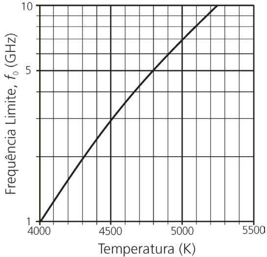

a)  $0,06 \text{m}$ . 
c)  $0,05 \text{m}$ .

b)  $16,7 \text{m}$ . 
d)  $20 \text{m}$ .
----
## Questão 38

Um corpo em queda nas proximidades da superficie terrestre sofre a ação da força gravitational e da força de resistência do ar,  $\bar{F}_{\mathrm{ar}}$ ; essa última atua em sentido oposito à força gravitacional. Nos primeiros instantes,  $\bar{F}_{\mathrm{ar}} = \bar{0}$  se o corpo parte do repouso. A medida que a velocidade aumenta,  $\bar{F}_{\mathrm{ar}}$  também aumenta. Com isso, a aceleração do corpo diminui gradativamente, tornando- - se praticamente nula a partir de certo momento. Desse ponto em diante, o corpo pressa a cair com velocidade constante, chamada de velocidade terminal. Um objeto de massa  $m = 200 \text{g}$  é solto a partir de certa altura e atinge a velocidade terminal após determinado tempo. Qual é o móduo da força de resistência do ar depois que o objeto atinge a velocidade terminal?

a)  $0,20 \text{N}$ . 
c)  $200 \text{N}$ . 
b)  $2,0 \text{N}$ . 
d)  $2000 \text{N}$ .
----
## Questão 39

A neurotransmissão no organismo humano pode ter origem química ou elétrica. O entendimento das sinapses elétricas ocorreu só mais recentemente, graças a estudos avançados das propriedades elétrica dos neurônios. As propriedades mecánicas dos neurônios - como a elasticidade - são, por seu turno, importantes para a compreensão do desenvolvimento deles.

Em um estudo do comportamento elétrico de neurônios, apli- ca- se uma diferença de potencial elétrico (ddp, da ordem de  $10^{- 3} \text{V}$ ) e mede- se a corrente elétrica (da ordem de  $10^{- 12} \text{A}$ ) que passa pelo sistema. A partir dos resultados desse experimento, representados no grafico da figura a seguir, conclui- se que a resistência elétrica do sistema é igual a

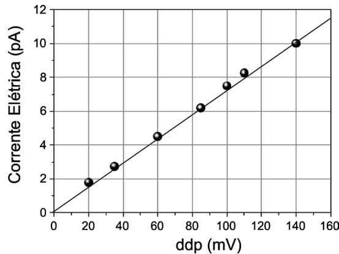

a) 14 Ω. 
c) 70 MΩ. 
b) 70 mΩ. 
d) 14 GΩ.
----
## Questão 40

A neurotransmissão no organismo humano pode ter origem química ou elétrica. O entendimento das sinapses elétricas ocorreu só mais recentemente, graças a estudos avançados das propriedades elétrica dos neurônios. As propriedades mecánicas dos neurônios - como a elasticidade - são, por seu turno, importantes para a compreensão do desenvolvimento deles.

Em um experimento destinado a investigar propriedades elásticas, uma diminuta ponta aplica uma força  $\bar{F}$  na superficie do neurônio, produzindo uma deformacao  $\Delta L$  de forma analoga a uma mola (ver figura). Foram estudados dois neurônios distinos, designados pelos indices 1 e 2, que foram submetidos a acao de forças identicas  $(\bar{F}_1 = \bar{F}_2)$  . As deformacoes observadas foram  $\Delta L_1 = 20$  nm e  $\Delta L_2 = 30$  nm. Se  $k_{1} = 0.0\times 10^{- 6}\mathrm{N / m}$  e a constante elastica para o neurônio 1, pode- se deduzir que o valor de  $k_{2}$  e

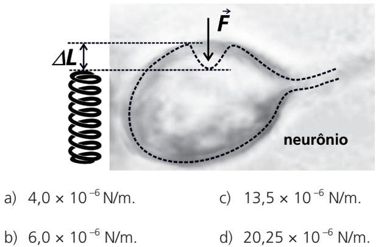
----
## Questão 41

A regiao a margem do rio Guaporé em rondonia e considerada uma das mais importantes do planeta para a especie Podocnemis expansa, popularmente comhecida como tartaruga- da- amazônia.

Assinale a alternativa que apresenta corretamente uma caracteristica importante para a vida de quelônicas fluviais no ambiente terrestre.

a) A pele e seca e completamente impermeavel, recoberta por uma espessa camada, em forma de espículas, composta da proteina quitina. 
b) Os alveolos com grande superficie de troca gasosa permi-tem a respiração pulmonar e cutânea mesmo nas especies aquáticas. 
c) A principal excreta nitrogenada liberada é a ureia, que se caracteriza por ser pouco toxica e que reper mínima quantidade de água para ser eliminada.

d) A fecundação é interna e há formação de ovo amniótico; esse ovo possui uma bolsa contendo líquido que envolve o embrião.
----
## Questão 42

O conceito apresentado na figura a seguir é importante para fundamentar a classificação biológica baseada nas relações evolutivas entre os organismos.

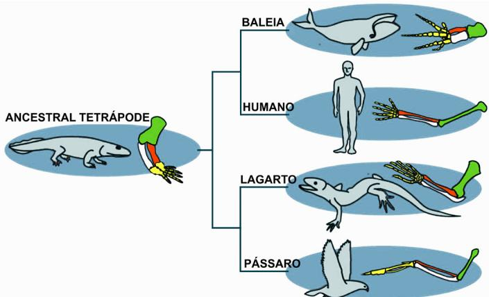

(Adaptado de: https://evolution.berkeley.edu/similarities- and- differences- understanding- homology- and- analogy- ms.)./Acesso em 22/8/2023. )

E correto afirmar que as estruturas anatômicas indicadas

a) no humano e no lagarto são consideradas anâlogas; trata-se de um caso de evolução convergente. 
b) na baleia e no pássaro são consideradas homólogas; trata-se de um caso de evolução divergente. 
c) no lagarto e no pássaro são consideradas homólogas; trata-se de um caso de evolução convergente. 
d) no humano e na baleia são consideradas anâlogas; trata-se de um caso de evolução divergente.
----
## Questão 43

Sabe- se que o uso indiscriminado e irregular de anabolizantes gera consequências negativas significativas à saúde humana, tais como: tremores, acne severa, hipertensão arterial sistêmica, tumores no figado e páncneas, distúrbios de coagulação, distúrbios testiculares e menstruais, insónia, entre outros.

(Adaptado de: https://bvsms.saude.gov.br/anabolizantes/.Acesso em 12/4/2023. )

Assinale a alternativa que preenché corretamente as lacunas no excerto a seguir.

A testosterona desempenha importante função no desenvolvimento de tecidos e órgãos do sistema reprodutor masculino, como (i) _________ e testículos, além de atuar na promoção de características sexuais secundárias, como aumento de massa muscular, crescimento dos pelos corporais, espessamento das pregas vocais e (ii) _________ . Esse hormônio anabolizante é sintetizado em várias etapas a partir (iii) _________ e é convertido para metabólitos inativos no (iv) _________ .

a) (i) próstata; (ii) maturação dos ossos; (iii) do colesterol; (iv) figado. 
b) (i) vesícula seminal; (ii) maturação dos ossos; (iii) da creatina; (iv) figado.

c) (i) prostata; (ii) produção de esperma; (iii) da creatina; (iv) pâncreas.  
d) (ii) vesícula seminal; (iii) produção de esperma; (iii) do coles-terol; (iv) pâncreas.
----
## Questão 44

Os lisossomos são organelas centrais que desempenham funções importantes para a homeostase celular.

Assinale a alternativa que descreve correspondente a função dos lisossomos representada na figura a seguir.

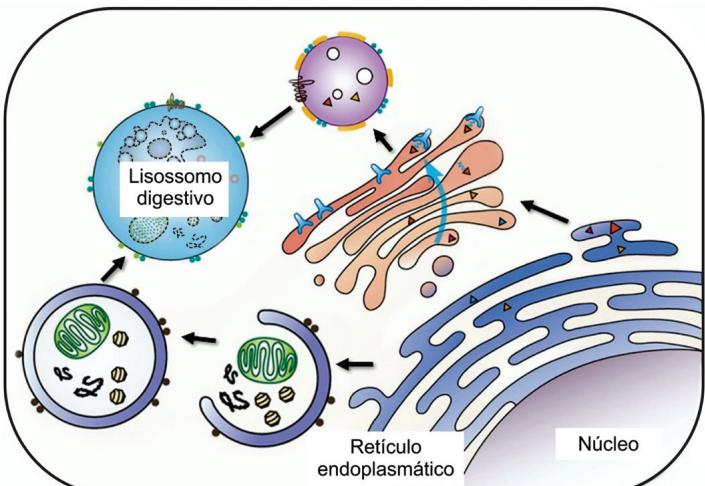  
(Adaptado de: YANG, C.; WANG, X. Journal of Cell Biology. Nova lorgue, v. 220, p.e202102001, mai.2021.)

a) Heterofagia por pinocitose, o que permite à célula degradar fragmentos de microrganismos, fragmentos esses importantes na apresentação de antígenos.  
b) Autofagia, que permite à célula empacotar, modificar e exportar proteínas sintetizadas no lumen das cisternas do reticulo endoplasmático.  
c) Autofagia, que permite à célula eliminar porções envelhecidas ou danificadas do citoplasma, incluindo organelas e moléculas.  
d) Heterofagia por fagocitose, o que permite à célula capturar macromoléculas, utilizando-as nas diferentes vias biosintéticas.
----
## Questão 45

Uma quimera é um indivíduo formado por dois ou mais tipos de células, em que cada tipo contem um genoma distinto. Os machines da espécie de formiga Anoplolepis gracilipes são quimeras formadas por dois tipos de células haploïdes, bastante distintas do ponto de vista genético; essas células são provenientes de duas linhagens de formigas, podendo sự chamadas de linhagem 1 e linhagem 2. As rainhas (fêmeas capazes de produzir óvulos) desta espécie são indivíduos formados pela fusão entre um óvulo com genoma característico da linhagem 1 e um espermatozoide com genoma característico da linhagem 1. Já as fêmeas operárias (não reprodutivas) são indivíduos formados pela fusão entre um óvulo com genoma característico da linhagem 1 e um espermatozoide com genoma característico da linhagem 2.

(Adaptado de: DARRAS, H. et al. Science, Washington, v. 380, p.55- 58, abr. 2023. )

Com base em seus conhecimentos e considerando o texto apre sentado, pode- se dizer que as diferenças genéticas entre rainhas e operárias se explicam pelo fato de a) os gametas se fundirem nos machos e operárias.  
b) os machos contem células haploïdes das linhagens 1 e 2.  
c) os machos serem homozigotos.  
d) os machos serem diploides oriundos das linhagens 1 e 2.
----
## Questão 46

A dinâmica populacional de duas espécies que compartilham o mesmo habitat e representada na figura a seguir. O tamanno máximo da população de cada espécie é limitado pela disponibilidade de recursos no habitat.

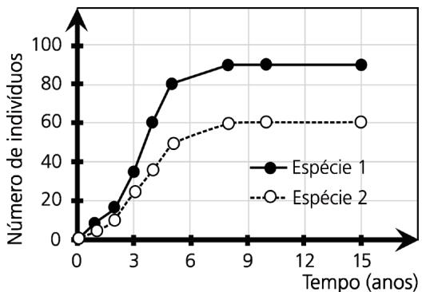

Considerando seus conhecimentos e os dados apresentados, é correto afirmar que as espécies a) competem por recursos e apresentam diferenças na eficiência de utilização do alimento disponível.  
b) ocupam nichos e cológicos distintos e têm crescimento populacional até o limite imposto pela resistência ambiental.  
c) são generalistas e assim têm nichos ecológicos mais restritos, o que diminui a competição entre elas.  
d) apresentam uma relação de cooperação, facilitando o crescimento populacional na ausência da resistência ambiental.
----
## Questão 47

A partir da organização tecidual, é possível reconhecer o está-

gio de desenvolvimento dos plantas e mesmo diferenciar mono

cotiledôneas e eudicotiledôneas. Nas figuras A e B são apresentados esquemas de raízes em crescimento primário, com a indicação dos tecidos 1 e 2.

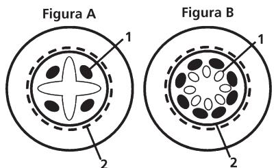

Assinale a alternativa que, de maneira correta, indica, respectivamente, a espécie eudicotiledônea e seus tecidos 1 e 2.

a) Figura A, floema e endoderme.  
b) Figura B, floema e pericíclo.  
c) Figura A, xilema e endoderme.  
d) Figura B, xilema e pericíclo.

Quando desempenho minha tarefa de imao, de marido ou de cidadao, quando executo os compromissos que assumi, eu cumpro deveres que estao definidos fora de nim e de meus atos, no direito e nos costumes. Ainda que eles estejam de acordo com os meus sentimentos proprios e que eu santa interiormente a realidade deles, tal realidade nao deixa de ser objetiva, pois nao fui eu que os fiz, mas os recebi pela educeagao. Eis ai, portanto, maneiras de agir, de pensar e de sentir que apresentam essa notavel propriedade de existirem fora das consciencias individuais. (Adaptado de: DURKHEIM, E. As regras do metodo sociologico. Sao Paulo: Martins Fontes, 2014. )

Ernie Durkheim e um dos fundadores da Sociologia e analisa a relacao entre individuo e sociedade. A partir do texto, podemos afirmar que os modos de agir, de pensar e de sentir, em uma sociedade, sao definidos

a) pelo livre-arbitrio dos individuos. 
b) pelos sentimentos proprios dos individuos e independem do meio social. 
c) pelo direito e pelos costumes, que sao, por sua vez, definidos livremente pelos individuos. 
d) pela周六 proria sociedade, que constitui uma realidade objetiva que exerce coercao sobre o individuo.
----
## Questão 49

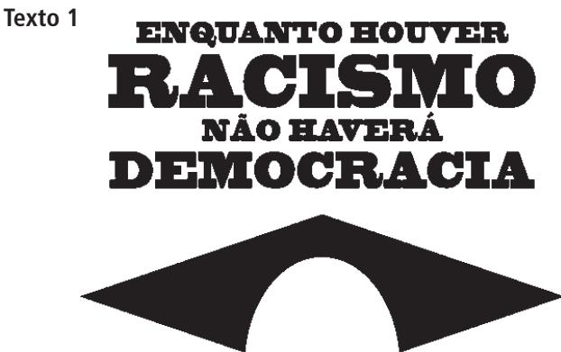

Manifesto de lancamento da "Coalizao Negra Por Direitos", reuniao de entidades e coletivos do movimento negro brasileiro, 2020.

# Texto 2

O sociologo Octavio lanni afirmou que democracia e cidadania sao processos politicos marcados por dificuldades e retrocessos, pois a participacao social - especialmente a de grupos como mulheres, negros, indigenas - e uma lata penosa e que, no Brasil, vem sendo realizada precariamente ao longo da historia. (Adaptado de: "Entrevista com Octavio lanni: Comunicacao e Globalizacao". Revista Novos Olhares, n.4, p.25, 1999. )

De acordo com os textos 1 e 2, é possível dizer que, no caso brasileiro, os conceitos de democracia e de cidadania

a) sao limitados pela persistencia historica do racismo, pois os movimentos sociais pouco se ocupam dessa temafrica, reduzindo a possibilidade da conquista de igualdade. 
b) podem ser tomados como conceitos relacionados, relativos à esfera do individuo, e marcados por processos lineares de conquistas de direitos sociais.

c) podem ser tomados como conceitos relacionados, proprios da esfera coletiva, e marcados por processos nao lineares de conquistas e perdas de direitos sociais.

d) sao marcados por disputas sociais e históricas, e influenciam, de modo secundario, o exercicio da igualdade, especialmente para grupos como mulheres, negros e indigenas.
----
## Questão 50

As sociologas Patricia Hill Collins e Sirma Bilge procuram explicar as relacoes entre merito, oportunidade e desigualdades utilizando a metafora de um campo de futebol. Elas imaginam uma situacao na qual o campo seria um terreno levemente em declive, na qual o gol do Time 1 fica no topo e o do Time 2, na parte baixa. Quando o Time 1 tenta marcar um gol, a topografia do campo ajuda, o que nao ocorre com o Time 2, que pode ter talento e disciplina, mas sempre trava uma batalha morro acima para marcar um gol. No caso de uma partida de futebol, torcedores ficariam indignados se os campos de verdade fossem inclinados dessa maneira. No entanto, é isso que fazem as divisoes sociais de classe, genero e raca, ou seja, achamos que estamos jogando em igualdade de condicoes quando, na verdade, nao estamos.

(Adaptado de: HILL COLLINS, P. BILGE, S. Interseccionalidades. Sao Paulo: Boitempo, p. 32- 33, 2016. )

A partir do texto, é correla afirmar que

a) divisoes sociais de classe, genero e raca permitem que todas as pessoas tenham acesso as mesmas oportunidades e possam igualmente desenvolver suas habilidades e antidos. 
b) condioes de competicao individual sao marcadas por divisoes de classe, genero e raca, e sao influenciadas pelo contexto social, politico e economico. 
c) o merito e o esforco individual podem ser isolados das divisoes de classe, genero e raca e considerados como parame-tros justos para a dinamica da vida social. 
d) divisoes de classe, genero e raca estao presentes na vida em sociedade e tem relacao marginal com o fenomeno da desigualdade.
----
## Questão 51

"A negacao da plena humanidade do Outro, o seu enclausura- mento em categorias que lhe sao estranhas, a afirmacao de sua incapacidade inata para o desenvolvimento e aperfeicoamento humano, a destitucao da sua capacidade de produzir cultura e civilizacao prestamase a afirmar uma razao racializada, que hegemoniza e naturaliza a superioridade europeia."

(CARNEIRO, Sueli. Dispositividade racialidade. A construgao do outro como nao ser como fundamento do ser. Sao Paulo: Zahar, p. 91, 2023. )

Escolha a alternativa que apresenta critica semelhante a de Sueli Carneiro.

a) "Tao essencial e adiferenca entre essas duas racas humanas [branca e negra], que parece ser tao grande em relacao as capacidades mentais quanto as diferenças de cores." (E. Kant. Observacoes sobre o sentimento do belo e do sublime. Campinas: Papirus, p. 75- 76,1993. )

b) "É na brutalidade e na selvageria que vemos o homem africano, na medida em que o podem observar; e assim permanece hoje." (Hegel. A razão na história. Lisboa: Edições 70, p. 218. )

c) "A nossa solução foi medfocre. Estragou as duas raças, fundindo-as. O negro perdeu as suas admiráveis qualidadefisicas de selvagem, e o branco sofreu a inevitável piora de carater, consequente a todos os cruzamentos entre raças dispares". (Personagem Miss Jane, do livro O Presidente Negro, de Monteiro Lobato. São Paulo: Editora Lafonte, p. 82, 2019.)

d) "Na medida em que o racismo, enquanto discurso, se situa entre os discursos de exclusao, o grupo por ele excludo é tratado como objeto e não como sujeito." (Lelia Gonzales. Cultura, etnidade e trabalho: efeitos linguisticos e politicos da exploracao da mulher". In: RIOS, F.; LIMA, M. Por um feminismo afo-latino-americano. Sao Paulo: Zahar, p.43,2020. )
----
## Questão 52

# Excerto 1

Excerto 1Quase todos estão de acordo que a felicidade é o maior de todos os bens que se pode alcançer pela ação; diferem, porém, quanto ao que seja a felicidade. A julgar pela vida que os homens levam em geral, a maioria deles, e os homens de tipo mais vulgar, parecem identificar o bem ou a felicidade com o prazer, e por isso amam a vida dos gozos.

(Adaptado de: Aristoteles. Etica a Nicomaco, Livro I, segos 4 to 4)

# Excerto 2

Excerto 2O conhecimento seguro dos desejos leva a direcionar toda a escolha e toda recusa para a saúde do corpo e para a serenidade do espírito, visto que essa é a finalidade da vida feliz. O prazer é o inicio e o fim de uma vida feliz. Embora o prazer seja nosso primeiro bem inato, nem por isso escolhemos qualquer prazer. (Adaptado de: Epicuro. Carta sobre a felicidade. Sao Paulo: Editora UNESP, p. 35- 37, 2002. )

Considerando os excertos dos filosofos gregos Aristoteles e Epicuro, ambos do século IV a.C., é possível afirmar que

a) Aristoteles e Epicuro sustentam a ideia de que ha relacao entre a felicidade e o prazer, pois ambos entendem que o prazer e o inicio e o fim de uma vida feliz. 
b) diferentemente de Aristoteles, Epicuro defende que a felicidade consiste na realizacao irrestrita dos nossos desejos, uma vez que o prazer e o inicio e o fim de uma vida feliz. 
c) tanto Aristoteles quanto Epicuro - ainda que com concepccoes eticas distintas - entendem que nao ha uma identificacao imediata entre felicidade e prazer.

d) Aristoteles e Epicuro concordam entre si e discordam daque les que pensam que a felicidade seja o maior dos bens que se possa alcançar pela acao.
----
## Questão 53

"Apesar de sua presumida evidencia, a articulacao entre liberidade e igualidade e mais complicada do que parece. Sua reuniao em um mesmo individuo, que seria, ao mesmo tempo, livre e igual a seus semelhantes, esconde tensoes significativas. Como, por exemplo, alguem poderia ser livre en, um contexto no qual prevalecem desigualdades aberrantes? Em contrapartida, o que resta da liberdade se os individuos nao pudorem singularizar- se e diferenciar- se uns dos outros?" (FIGUEIREDO, V. A paisiao da igualdade: uma genealogia do individuo moral na Franca. Belo Horizonte: Relicario, p. 9, 2021. )

Escolha, dentre as alternativas a seguir, aquela que sintetiza melhor a ideia expressa na citação de Figueiredo:

a) A realizacao da liberdade e da igualdade independe da supressao de desigualdades profundas. 
b) A articulacao entre liberdade e igualdade e um ideal que nao contrasta com regimes politicos antidemocraticos. 
c) A articulacao entre liberdade e igualdade e complexa porque exige tanto a suppressao de desigualdades extremas quanto a possibilidade da afirmacao das diferencias individuais. 
d) O desenvolvimento pleno do capitalismo e da livre concorrencia sao condigoes suficientes para a concretizacao da liberdade e da igualdade.
----
## Questão 54

Sr. Gauss tem uma pizzaria, chamada  $\pi$  - zzaria, que vende dois tipos de pizzas circulares: uma individual, de diametro d; e uma de  $20cm$  de diametro, partida em quatro pedacos iguais.

Considerando que o preco de uma pizza e proporcional a sua area, qual precisa sero valor de d para que quatro pizzas indi- . viduais custem o mesmo que a pizza mencionada, de quatro pedacos?

a) 6 cm. c) 10 cm. 
b) 8 cm. 
d) 12 cm.
----
## Questão 55

Todo final de semana, as amigas Ana, Bruna e Carol se encontram em um parque para andar de bicicleta ou de patins. Nesta brincadeira, a escolha entre patins e bicicleta e feita usando a seguinte regra:

Se Ana anda de patins, entao Carol tambem anda de patins. Bruna anda de patins apenas quando Carol anda de bicicleta.

Sabendo que neste final de semana Carol andou de patins, entao e necessariamente verdade que a) Ana andou de patins. 
b) Ana nao andou de patins. 
c) Bruna andou de patins. 
d) Bruna nao andou de patins.
----
## Questão 56

Luisa estava conversando com seu irmao ao telefone quando passou perto de uma feira de adocao de animais. Ela comentou que, na feira, havia cachorros, gatos e pintinhos.

O irmao, curioso, perguntou- lhe quantos gatos havia. Luisa, que adora charadas matematicas, limitou- se a dizer que a quantidade de gatos somada a quantidade de pintinhos era 4 a mais do que a quantidade de cachorros, e que a quantidade de gatos somada a quantidade de cachorros era 6 a mais do que a quantidade de pintinhos.

O irmão de Luisa, que adora as aulas de matemática, rapida- mente chegou à resposta correta. Havia quantos gatos para adoção?

a) 4. 
c) 6. 
b) 5. 
d) 7.
----
## Questão 57

Laura é geología e está fazendo pesquisa numa caverna cuja entrada tem o formato de uma parábola invertida. Essa entrada, no nível do chão, tem 2m de largura e seu ponto mais alto está a 2,5m do chão, conforme figura a seque.

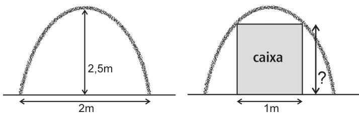

Para realizar sua pesquisa, ela precisa entrar na caverna com um equipamento guardado em uma caixa de 1m de largura. Qual é a altura máxima, em metros, que a caixa pode ter para passar pela entrada da caverna?

a) 11/8. 
c) 15/8. 
b) 13/8. 
d) 17/8.
----
## Questão 58

Joaquim estava brincando com um graveto, quando acertou uma parede e o graveto se partiu em trás pedaços, de comprimentos  $a,b,c,$  com  $a\leq b\leq c$  . Ele recolheu os pedaços e tentou construir um triangulo cujos lados seriam exatamente os pedaços do graveto: nao foi possivel. Sabendo que o graveto tinha  $50cm$  de comprimento e que  $b = a + 2$  qual é o maior valor possivel de  $a$

a)  $9,5cm$  
c)  $11,5cm$  
b)  $10,5cm$  
d)  $12,5cm$
----
## Questão 59

Considere os conjuntos

$\mathsf{A} = \{x\in \mathbb{R}\mid x^2 - 2x - 24< 0\} \in$ $\mathsf{B} = \{x\in \mathbb{R}\mid 2x - 7\leq 0\} .$  Quantos números inteiros pertencem à interseção A n B?

a) 3. 
c) 7. 
b) 5. 
d) 9.
----
## Questão 60

Terminado o almoço, Ana foi à cozinha para a escolha das so- bromesas. A garota estava decidida a pegar dois itens. Seu pai, preocupado com a alimentação dela, instruiu- a da seguinte forma: "Ecolha o que quiser, mas, se você pegar algum pirulito, pegue também alguma fruta". Na cozinha, minha 5 frutas diferentes, 3 pirulitos diferentes e 2 pedaços de bolos de sabores diferentes. De quantas formas Ana poderia escolher seus dois itens?

a) 34. 
c) 45. 
b) 36. 
d) 47.
----
## Questão 61

João e Maria estão passando pela floresta. Para não se perderem no caminho, levaram consigo uma sacola com 100 pedrinas, sendo 60 pedrinas brancas e 40 pedrinas pretas. A cada 5 passos eles reiram aleatoriamente uma pedrinha da sacola e jogam- na no chão para marcar o caminho.

Quando eles param para fazer um lanche, notaram que já tinham sido jogadas 35 pedrinas brancas e 25 pedrinas pretas.

Qual a probabilidade de as proximas duas pedrinas jogadas serem brancas?

a) 7/13. 
c) 11/52. 
b) 5/13. 
d) 7/52.
----
## Questão 62

Seja  $\rho (x) = x + 2024$  .A equação

$$
p(x) + p(2x) + p(3x)x + \ldots +p(2023x) + p(2024x) = 0
$$

tem uma solução  $x$  que satisfaz:

a)  $x< -2$  
c)  $0< x< 2$  
b)  $-2< x< 0$  
d)  $x > 2$
----
## Questão 63

Na figura a seguir, ABCD é um trapézio com  $AB = 1$  e  $CD = 5$  .Os pontos M e N são pontos médios de AB e BC, respectivamente.

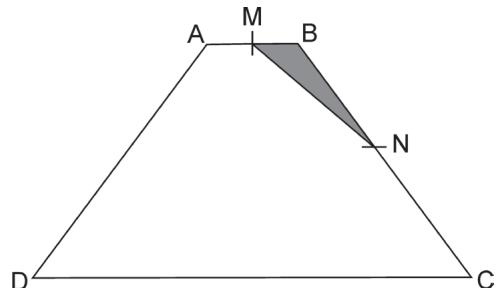

Sabendo que a área de MBN é 1, a área do trapézio é:

a) 18. 
c) 22. 
b) 20. 
d) 24.
----
## Questão 64

Considere as funções  $f(x) = 2x + c$  e  $g(x) = 5 - 6x,$  com  $c > 0$  Sejam  $P$  e  $Q$  os pontos de interseção, com o eixo  $y,$  dos gráficos de  $y = f(g(x))$  e  $y = g(f(x))$  , respectivamente.

Para que a origem seja o ponto médio do segmento  $PQ$ , qual deverá ser o valor de  $c$ ?

a) 1. 
c) 3. 
b) 2. 
d) 4.

No losango abaixo, qual é a medida do comprimento do seg

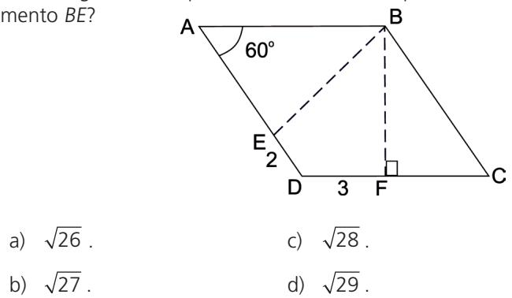
----
## Questão 66

# Texto 1

I have a dream that one day down in Alabama, with its vicious racists, with its governor having his lips dripping with the words of interposition and nullification; that one day right down in Alabama little black boys and black girls will be able to join hands with little white boys and white girls as sisters and brothers (Martin Luther King, 1963).

(Adaptado de: https://kr.usembassy.gov/martin- luther- king- jr- dream- speech- 1963/. Acesso em 26/05/2023. )

# Texto 2

Considere os dois textos e assinale a alternativa correta.

a) O texto 2 apresenta uma consequencia social advinda do fato de que o "sonho" mencionado no texto 1 tornou-se realidade. 
b) Os textos 1 e 2 são complementares porque usam diferentes linguagens para ilustrar a natureza velada do racismo. 
c) O texto 2 funciona como um indicio de que aquilo que se almejava em 1 ainda não se tornou realidade em todos os contextos. 
d) Os textos 1 e 2 são contraditórios porque empregam diferentes recursos de linguagem para tratar do racismo.
----
## Questão 67

Em uma visita a um museu de arte indigena, um estudante observou uma obra seguida de uma placa explicativa:

In some indigenous cultures, headdresses represent Native peoples' right to govern themselves according to their own laws. The materials they are constructed with can vary greatly, including wood, iron, feathers, and ivory. Rather than using gridded designs (symbols of spiritual beliefs) or putting birds or mammals at center stage, as several others do, horns were attached to this headdress, an emblem of power reserved for those "whose exceeding worth and power is admitted by all the nation".

(Imagens (nas alternativas) e texto (acima) adaptados de: https://americanindian.si.edu/exhibitions/infinityofnations/introduction.html. Acesso em 31/05/2023. )

Qual das imagens corresponde à descrição da placa?

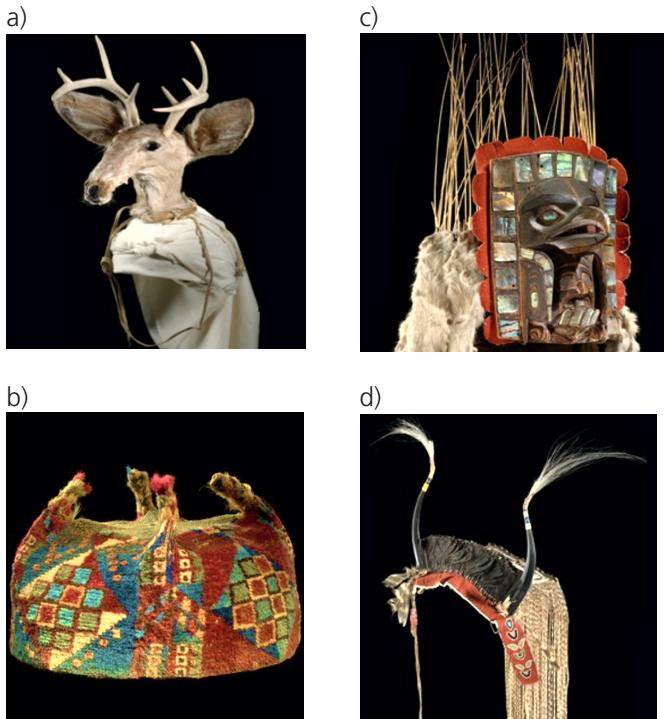
----
## Questão 68

O texto a seguir é parte de uma chamada para publicação de artigos em uma edição especial da revista Nature.

The environmental and ethical implications of traditional livestock rearing, combined with an increasing global population and demand for protein- rich nutrition, has led to investments in alternative protein research. One emerging approach is cellular agriculture, in which traditional 'meat' tissues, such as muscle and fat cells from cows, chicken and fish, or alternative protein sources, such as algae, are cultivated under controlled laboratory conditions. However, the optimisation of these protocols is highly dependent on cell types, and further development is required to make cellular agriculture an economically viable alternative to traditional sources of protein. This special issue welcomes research on improvements to cellular agriculture protocols to maximize sustainable protein production.

(Adaptado de: https://www.nature.com/collections/chdgggaffd. Acesso em 12/05/2023. )

Qual seria o topico específico da edição especial ao qual o texto se refere?

a) Alternativas economicamente viaveis dentro da agricultura tradicional. 
b) Desafios éticos e ambientais da pecuária. 
c) Sustentabilidade na pesquisa de novos protocolos para agricultura tradicional. 
d) Agricultura celular de diversas fontes de proteína.
----
## Questão 69

Em uma materia para um site, jornalistas fizeram interações com o ChatGPT a fim de analisar sua capacidade de criar textos possivelmente problemáticos. Para tanto, eles pediram que o programa de inteligencia artificial reescrevesse um e- mail que seria, hipoteticamente, usado como golpe. Eis o texto reescrito pelo ChatGPT:

"Hey there. You're probably wondering why you're getting this e- mail. The truth is, I put some malware on a website that you visited. My malware took control of your browser and recorded everything, including your contacts from your messenger, Facebook, and e- mail account. To top it all off, I also took videos of you. So I'll give you the option to make a deal before I do anything with it."

(Adaptado de: https://mashable.com/article/chatgpt- scan- uses. Acesso em 12/05/2023. )

O e- mail criado pelo programa chama a atenção a) pelo uso de linguagem agressiva, pois se apoia em expressoes violentas para tentar extorquir o usuario. b) por reproduzir a sintaxe da comunicação humana a medida que recorre ao humor para acusar o usuario. c) pelo emprego de um tom sarcástico, pois se apoia em linguagem informal para ameaçar o usuário. d) por infringir questiones éticas, uma vez que informa ter tornado públicas informações privadas do usuário.
----
## Questão 70

Netflix's "Wednesday" draws many real- world parallels. It features unusual creatures (werewolves and psychics) collectively referred to as Outcasts, while they refer to non- supernatural humans as Normies. The Outcasts are stand- ins for anyone othered by society, such as indigenous people, People of Color, the LGBT+, and the neurodivergent. Every so often, the Normies' distrust in the Outcasts boils over into hatred and violence, and the othering and dehumanization normalizes violence against the Outcasts in day- to- day life. In the show, the town's colonial era saw Outcasts not only being "othered", but also murdered by Pilgrims. These acts of butchery were all but erased from their history books. It's a distressingly familiar story. (Adaptado de: https://atibecalledgeek.com/woe- to- the- colonizer- an- indigenous- perspective- of- wednesday/. Acesso em 12/05/2023. )

A análise do autor sobre "Wednesday" se apoia em

a) paralelos entre ficção e realidade para discutir como a existência de grupos marginalizados tem sido historicamente apagada dos livros de história. 
b) elementos fictícios presentes na série para aludir ao modo como a desumanização da alteridade é um processo histórico e violento. 
c) fatos históricos para tracar a origem da exploração de povos indígenas e o modo como foram violentamente desumanizados na série. 
d) comparações históricas sobre os conflitos entre colonizadores e peregrinos para criticar o modo como esse conflito é retratado na série.
----
## Questão 71

"Guardians of the Galaxy Vol.3" does something few movies have ever done: it tells a compassionate story about testing on animals to a Marvel- size audience. The film features gorgeously animated animals who take moviegoers on an emotional rollercoaster while exposing the evils of animal testing. The strength of James Gunn's screenplay lies in the fact that it doesn't back away from the tough subject matter, and we're thrilled by a story about having empathy for all animals. For his compelling portrayal of Rocket and for reminding moviegoers that animals tortured in laboratories are not the numbers tattooed on them, PETA (People for the Ethical Treatment of Animals) is honoring Gunn with the "Not a Number" Award.

(Adaptado de: https://www.beta.org/blog/guardians- of- the- galaxy- vol- 3/. Acesso em 19/05/2023. )

Para a autora dessa crítica, o diferencial do filme está

a) na coragem do roteiro em dar destaque à polêmica de experimentação em animais para testes. 
b) no ineditismo da abordagem do tema em produção de grande alcance, como os filmes da Marvel. 
c) no retrato das emoções de animais usados em experimentos em laboratórios. 
d) no impacto da abordagem do tema para órgãos de grande repercussão, como a PETA.
----
## Questão 72

No trecho a seguir, observa- se o uso de uma variedade linguistica de inglês conhecida como African American Vernacular English (AAVE). Ainda que tão diversa e sofisticada quanto quaisquer outras variedades, a AAVE ainda é estigmatizada por ter características linguísticas diferentes daquelas que marcam a variedade de prestigio, isto é, a padrão.

"Listen, God love everything you love - and a mess of stuff you don't. (...) It always making little surprises and springing them on us when us least expect. (...) Man corrupt everything (...) He try to make you think he everywhere (...) you think he God. But he ain't. (...) I start to wonder why us suffer. Why us black. It didn't take long to realize I didn't hardly know nothing."

(Adaptado de: WALKER, Alice. The Color Purple. London: The Orion Publishing Group, 1983. )

Assinale a alternativa que preenché corretamente as lacunas no trecho a seguir:

E correto dizer que o excerto apresenta aspectos linguísticos - que diferem dos observados na variedade padrão - como (i) e que sua temática central é a (ii)

a) (i) a repetição do verbo de ligação; (ii) corrupção e o sofri- mento inerentes ao homem. 
b) (i) a possibilidade de dupla negação; (ii) previsibilidade da vontade de Deus. 
c) (i) a concordância verbal não padrão; (ii) ilusão do homem quanto à sua superioridade. 
d) (i) a omissão de sujeito em orações; (ii) ganância do homem em se sobrepor a Deus.
----
